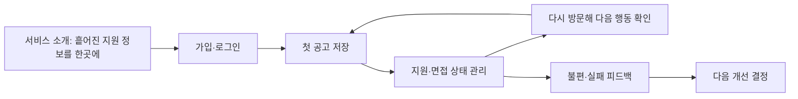

# 사례로 따라가는 ApplyFlow — 취업 준비 서비스

**가상의 서비스 사례입니다.** 취업 준비생이 채용 공고를 모으고 지원 진행 상황을 관리합니다. 실제 고객 조사·매출·성능 실적을 주장하지 않습니다. 학생의 주제는 자유이며 이 사례의 질문과 판단 방식을 자신의 프로젝트로 옮겨 씁니다.

<div class="figure-callout"><strong>직접 사용해 보기</strong><p>공고를 추가하고 지원 상태를 바꾼 뒤 새로고침해 보세요. 회사·직무에는 가상 자료만 사용합니다.</p><a href="course/examples/applyflow/index.html">ApplyFlow 실행 예제 열기 ↗</a> · <a href="https://github.com/TheMagicTower/korean-ai-dev-course/tree/main/course/examples/applyflow">예제 코드·실행 안내</a></div>

현재 실행 예제는 **브라우저에 저장하는 서비스 프로토타입**입니다. 로그인·서버의 사용자별 데이터 분리·마감 알림·자동 수집은 구현되어 있지 않습니다. 아래 제한 사용자 MVP 설계와 현재 구현 범위를 구분해 읽으세요. 이 프로토타입을 실제 다중 사용자 서비스라고 배포하면 안 됩니다.

## 시작부터 수행까지 따라가기

[프로젝트 실행 매뉴얼](../docs/playbooks/applyflow-runbook.md)에서 온보딩·계층별 작업 분해·복사용 프롬프트·상태 판단·인계를 연결합니다. [AF-104 수행 기록](../docs/playbooks/applyflow-af104-record.md)은 회사·직무 검색을 실제 구현한 증거입니다.

## 장면 1 — “공고는 저장했는데 어디에 있더라?”

가상의 취업 준비생 지민은 메신저에 공고를 보내고, 메모 앱에 마감일을 적고, 스프레드시트에 지원 여부를 기록합니다. 면접 준비를 시작할 때 어느 회사에 어떤 직무로 지원했는지 다시 찾습니다.

이 장면에서 출발하는 가설은 ‘공고가 한곳에 있고 다음 행동이 보이면 준비가 쉬워진다’입니다. ‘AI를 넣으면 시장성이 있다’는 가설이 아닙니다. 공고 사이트의 저장 기능이나 기존 스프레드시트로 충분한지도 조사합니다.

| 관찰하거나 물어볼 것 | 기능으로 성급하게 바꾸지 않을 것 |
|---|---|
| 최근 실제 지원 건을 어디에 기록했나요? | 처음부터 모든 채용 사이트 자동 수집 |
| 정보를 찾느라 어떤 행동을 반복했나요? | 모델이 제안한 기능 20개 |
| 다른 기기에서도 확인해야 하나요? | 요구 확인 없는 로컬 저장 확정 |
| 면접 일정 누락이 실제로 있었나요? | 동의·실패 처리 없는 자동 알림 |

**일상 비유:** 쇼핑할 물건을 기억하는 것과 실제로 장바구니에 넣고 주문 상태를 확인하는 것은 다릅니다. 채용 공고도 ‘저장’과 ‘지원 완료’는 다른 상태입니다.

## 장면 2 — 서비스 전체 흐름을 그립니다



위 그림은 목표 서비스의 흐름입니다. 실행 예제는 첫 공고 저장부터 상태 관리까지를 로컬에서 체험합니다. 고객 유입·가입 화면을 그렸다는 이유로 인증과 사용자 확보가 완료된 것은 아닙니다.

| 단계 | 사용자 질문 | 제품이 제공할 결과 | 확인할 증거 |
|---|---|---|---|
| 소개 | 내 문제와 관련 있나요? | 대상 사용자와 가치·제한 설명 | 설명을 읽고 쓰임을 이해하는가 |
| 첫 사용 | 어디서 시작하나요? | 공고 하나를 저장하는 짧은 동선 | 안내만 보고 첫 저장에 도달하는가 |
| 반복 사용 | 지금 무엇을 해야 하나요? | 상태별 보드·지원할 공고 | 다음 행동을 찾을 수 있는가 |
| 신뢰 | 내 지원 정보가 안전한가요? | 본인 데이터 접근·삭제·복구 정책 | 다른 계정 접근 거부와 실패 확인 |
| 개선 | 무엇이 불편한가요? | 피드백 접수·수정·재검증 | 실제 실패가 해결되었는가 |

유료화는 아직 검증하지 않은 사업 가설입니다. 첫 버전의 결제 기능보다 실제로 반복 사용되는지 확인합니다. 추후 내보내기·협업 같은 유료 후보가 생겨도 지불 의사를 조사하기 전에는 수익성이 입증됐다고 말하지 않습니다.

## 1주차 — 무엇을 만들고 어디까지 끝낼까요?

**지민의 요청:** “지원한 회사와 지금 상태를 한눈에 보고 싶어요.”

**초기 범위:** 공고 저장, 상태 변경, 상태별 조회. 공고 자동 수집·이력서 생성·AI 합격 예측·결제는 제외합니다. 이 서비스는 AI로 개발하는 서비스이며 제품 안에 AI 기능을 반드시 넣지는 않습니다.

| 구분 | 개인 검증용 프로토타입 | 제한 사용자 MVP |
|---|---|---|
| 사용자 | 제작자 본인, 가상 공고 | 동의한 소수의 실제 취업 준비생 |
| 데이터 | 같은 브라우저의 샘플 | 인증된 사용자별 서버 데이터 |
| 완료 증거 | 저장→상태 변경→재실행 | 계정 A/B 분리·새 세션·실사용 피드백 |
| 문서 | README 계약·작업 목록 | 계약·중요 ADR·접근 규칙·배포/복구 안내 |
| 생략 이유 | 계정 기능 없이 가치와 조작 검증 | 대규모 수집·결제는 가치 검증에 불필요 |

**목업과 나란히 할 기술 실험:** 프로토타입에서는 브라우저 저장 후 재실행, 서비스 MVP에서는 서로 다른 두 계정의 데이터 접근 분리를 가장 먼저 확인합니다. 로그인 화면만 만드는 것은 이 실험을 통과한 것이 아닙니다.

```text
ApplyFlow의 제한 사용자 MVP 계약을 작성해 주세요. 사용자는 취업 준비생이고 핵심 흐름은 공고 저장→지원 상태 변경→재방문 확인입니다. 사용자별 데이터 분리가 필수입니다. 목업과 함께 두 테스트 계정의 접근 분리 실험을 계획해 주세요. 개요·Spec·결정은 한 문서에 모으고 자동 수집·결제·AI 합격 예측은 제외해 주세요. 실제 실행 전에는 결과를 미확인으로 표시해 주세요.
```

**직접 해보기:** 실행 예제에서 샘플 3개를 추가하고, 어떤 정보가 더 필요한지 두 가지만 적습니다. 기능을 바로 추가하지 말고 누가 어떤 상황에서 필요로 하는지 설명합니다.

## 2주차 — 화면의 행동이 계약이 됩니다

지민이 ‘지원’으로 바꾸면 ‘관심’ 목록에서는 사라지고 ‘지원’ 목록에 보여야 합니다. 새로고침 후에도 지원 상태가 유지되어야 합니다. 잘못 눌렀다면 다시 고칠 수 있어야 합니다.

**이 사례의 상태 규칙:** 관심·지원·면접·합격·종료 중 하나를 선택하고 이전 상태로도 수정할 수 있습니다. 일정한 순서를 강제하지 않는 이유는 과거 지원을 나중에 입력하거나 잘못된 기록을 고칠 수 있기 때문입니다. 금융 거래나 결제의 상태 규칙에 그대로 적용하면 안 됩니다.

| 화면에서 한 행동 | 도출한 규칙 | 현재 데모 | 서비스 MVP에서 추가할 것 |
|---|---|---|---|
| 회사·직무 입력 | 공백만 있으면 거부, 길이 제한 | 브라우저 검증 | 서버에서도 같은 입력 검증 |
| 관심 공고 저장 | 저장 성공 후 목록 반영 | 로컬 저장 성공 시 갱신 | 사용자 소유권을 서버에서 부여 |
| 상태 변경 | 허용 상태만, 수정 가능 | 로컬 검증·저장 | 본인 공고인지 검사 |
| 새로고침 | 저장한 결과 유지 | 같은 브라우저 | 새 로그인·다른 기기에서도 확인 |
| 저장 실패 | 성공처럼 보이지 않기 | 이전 상태 유지·안내 | 응답 실패·재시도·중복 방지 |

목업이 정해진 후 아래 계약을 구체화합니다. 다음은 **설계 예시이며 실행 예제에 구현된 서버가 아닙니다.**

```text
POST /applications
입력: company, role
서버: 로그인 확인 → 입력 검증 → 로그인 사용자 ID를 소유자로 저장
출력: id, company, role, status

PATCH /applications/:id
입력: status
서버: 로그인 확인 → 본인 소유 공고 확인 → 상태 검증 → 저장
실패: 미인증·권한 없음/없는 공고·잘못된 값·저장 실패

데이터: application(id, owner_id, company, role, status)
원칙: 요청 본문에 들어온 owner_id를 신뢰하지 않습니다.
```

**작업 분해:** ‘DB 구축 완료’보다 ‘로그인한 사용자가 공고를 저장하고 다시 조회한다’를 첫 작업 묶음으로 잡습니다. 화면·API·데이터 변경은 그 아래에서 연결합니다.

**직접 해보기:** 회사 이름을 공백으로 입력해 보고, 정상 공고를 하나 저장한 후 새로고침합니다. 저장 성공 화면과 저장 증거의 차이를 설명합니다.

## 3주차 — 쉬운 변경도 위험할 수 있습니다

지민의 피드백이 세 가지 들어왔다고 가정합니다.

| 요청 | 판단 | 다음 행동 |
|---|---|---|
| ‘관심’ 버튼 문구가 어렵습니다 | 낮은 불확실성·쉽게 복원 | 문구 수정·화면과 클릭 확인 |
| ‘지원’ 상태를 두 종류로 나누고 싶습니다 | 기존 저장 자료에 영향 | 데이터 호환·상태 전이·필터 재검증 |
| 친구 계정에서 내 공고가 보입니다 | 접근 경계 실패·높은 영향 | 공개 사용 중단·원인/영향 확인·접근 분리 재검증 |

세 번째 문제는 ‘이슈 한 줄’이어도 단순 작업이 아닙니다. Jev 같은 분류기가 simple이라고 출력해도 위험 경계를 사람이 확인해야 합니다.

**검토 재사용 예:** 버전 A에서 저장·새로고침 검증을 통과했습니다. 버전 B에서 버튼 색상만 바꿨다면 관련 변경을 확인하고 화면 동작을 점검합니다. 버전 C에서 저장 스키마를 바꿨다면 A의 저장 결과만으로 C를 통과시키지 않습니다. 기존 자료 호환·신규 저장·실패 처리의 현재 증거를 남깁니다.

```text
변경 검토 스킬로 이번 변경과 이전 검증 기록을 비교해 주세요. 요구·저장·접근 경계에 영향이 있는지 먼저 판단하고, 유지 가능한 과거 증거와 현재 다시 확인할 조건을 분리해 주세요. 사용자별 데이터 유출은 블로커이고, 선택 개선은 필수 기능을 막지 않는 후속으로 남겨 주세요.
```

**직접 해보기:** 예제의 상태를 면접으로 바꾸고 면접 필터에서 확인한 뒤 새로고침합니다. ‘상태 변경, 필터, 저장’ 세 조건 중 무엇을 확인했는지 적습니다. 이 결과가 다른 사용자 접근 분리의 증거가 될 수 없는 이유도 설명합니다.

## 4주차 — 제작자 없이도 쓸 수 있나요?

가상의 사용자 수아에게 설명서만 전달했다고 가정합니다. 새 세션에서 로그인하고 첫 공고를 저장한 뒤 다시 방문해 지원 상태를 확인할 수 있어야 합니다. 실제 사용자 MVP를 선택했다면 이 확인을 수업 밖 계획으로 미루고 완료라고 부를 수 없습니다. 범위 조정 또는 미완료를 정직하게 기록합니다.

| 확인 | 프로토타입에서 해볼 것 | 서비스 MVP에서 반드시 추가할 것 |
|---|---|---|
| 실행 | 예제 주소·가상 데이터로 시작 | 배포 버전·인증된 새 세션 |
| 저장 | 추가→변경→새로고침 | 서버 저장·본인 계정에서 재조회 |
| 실패 | 빈 입력·저장 실패 안내 | 인증 만료·접근 거부·통신 실패 |
| 전달 | 사용법·JSON 백업·제한 | 환경 설정·복구·운영 담당·피드백 |
| 완료 판정 | 로컬 흐름 검증 | 사용자 A/B 분리와 실제 사용 증거 |

**실제 기록할 측정:** 첫 실행까지 시간, 검증된 전달까지 시간, 사람 수정시간, 표시된 도구 비용, 관찰 기간 내 다시 열린 결함. 아직 모집하지 않은 사용자의 수와 재방문율을 임의로 채우지 않습니다.

## 다른 아이디어로 바꾸는 법

| ApplyFlow의 요소 | 다른 서비스에서 찾을 대응 |
|---|---|
| 취업 준비생 | 처음 사용할 구체적인 사용자 |
| 공고 저장→지원→면접 | 사용자가 얻는 결과로 이어지는 핵심 행동 |
| 사용자별 공고 | 소유권·공유 범위를 정할 데이터 |
| 새로고침 후 유지 | 실제 사용에서 반드시 유지할 결과 |
| 친구 계정 접근 실패 | 절대로 깨지면 안 되는 위험 경계 |
| 재방문해 다음 지원 확인 | 반복 사용 이유와 확인할 피드백 |

예를 들어 프리랜서 견적 서비스라면 ‘공고’ 대신 ‘고객 요청’, ‘지원’ 대신 ‘견적 발송’을 놓아볼 수 있습니다. 다만 실제 발송은 외부 부작용이므로 임시 상태 변경보다 높은 확인 수준이 필요합니다. 명칭만 바꾸지 말고 규칙과 위험을 다시 판단합니다.
