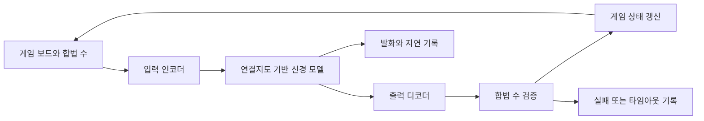

# FlyBlock Arena — 인간 대 초파리 신경회로 컨트롤러

**기획 장면:** “내가 연쇄를 만들면, 초파리의 신경 연결지도를 활용한 상대는 어떤 수를 둘까요?” 뿌요뿌요에서 착안한 2인 대전 블록 퍼즐을 만들고, 한쪽을 사람이, 다른 쪽을 연결지도 기반 시뮬레이션과 게임 어댑터가 조작합니다. 화면·이름·소리·캐릭터는 이 프로젝트의 자체 자산으로 만듭니다.

**현재 상태:** [실행 게임](https://themagictower.github.io/korean-ai-dev-course/projects/flyblock/)과 [실제 제작 기록](../build-lab.md)을 제공합니다. FlyWire v783의 실제12뉴런·13연결로 추출한 부분 회로이며 전뇌 모델이 아닙니다. 아래는 수업 설계이고 구현의 추가80라운드 제한·입출력 매핑·측정 결과는 프로젝트 README와 실행 기록을 따릅니다.

## 1. ‘초파리 뇌 소스 코드’는 무엇인가요?

FlyWire는 초파리 신경세포 사이의 연결을 재구성한 **커넥톰(연결지도)**을 제공합니다. 연결지도 자체가 게임 프로그램은 아닙니다. [FlyWire 공식 설명](https://flywire.ai/)

Shiu 연구진은 연결지도에 기반한 신경 계산 모델과 Python/Brian2 코드를 공개했습니다. 해당 코드는 신경 자극과 억제를 적용하고 발화 시점·빈도를 출력합니다. 게임 보드를 입력하고 조작 버튼을 돌려주는 기능은 별도로 연결해야 합니다. [연구 코드](https://github.com/philshiu/Drosophila_brain_model) · [논문](https://www.nature.com/articles/s41586-024-07763-9)

따라서 이 프로젝트의 정확한 설명은 **‘초파리 연결지도 기반 모델을 게임 컨트롤러에 연결하는 실험’**입니다. 게임 실력이 나온다면 입력 변환·출력 해석·추가 학습 중 무엇이 기여했는지도 살펴봅니다. 승리를 생물학적 지능 재현의 증거로 해석하지 않습니다.

## 2. 프로젝트 계약과 첫 목업

| 항목 | 기본 계약 |
|---|---|
| 사용자 | 신경회로와 게임 AI를 체험하고 싶은 플레이어 |
| 사용 범위·단계 | 로컬 실험용 PoC, 플레이 가능한 결과물 |
| 핵심 경험 | 사람과 모델 컨트롤러의 한 경기, 같은 기록의 재생 |
| 화면 | 좌우 보드, 현재 블록, 누적 공격, 승패, 모델 종류, 판단 시간 |
| 제외 | 온라인 매칭·랭킹·계정·유료 상품·전뇌 강화학습 |
| 핵심 선행 실험 | 고정 입력→실제 모델 출력→합법적인 수, 실행 시간 측정 |
| 완료 기준 | 모델 연결 확인, 사람과 경기 종료, 리플레이, 기준선 비교 |

**축소 규칙안:** 각 보드는6열×10행, 색3개, 두 칸짜리 블록입니다. 한 번에 열과 회전을 선택해 떨어뜨립니다. 같은 색이 상하좌우4개 이상 이어지면 동시에 지우고 중력을 적용하며 더 지워질 때까지 반복합니다. 한 수에서 지운 색 블록 수를4로 나눈 몫만큼 상대에게 방해 블록을 보냅니다. 공식 게임의 점수 체계 재현은 범위에 넣지 않습니다.

교육판은 사람이 한 수를 확정한 뒤 모델도 한 수를 확정하는 라운드 방식으로 시작합니다. 양쪽 해결 후 공격을 동시에 적용하며, 방해 블록은 왼쪽부터 낮은 열 우선으로 배치합니다. 방해 블록은 색 연결에 포함하지 않고, 제거되는 색 블록에 인접하면 함께 제거합니다. 다음 블록을 놓을 수 없으면 패배, 양쪽 모두 불가능하면 무승부입니다. 같은 라운드의 양쪽 색 쌍은 동일한 시드에서 생성합니다. 이 규칙은 구현 전에 고정 예제로 검토합니다.

## 3. 화면에서 인터페이스를 도출합니다



- **게임 엔진:** 상태·수·시드로 다음 상태를 계산합니다. 신경 모델을 몰라도 동작해야 합니다.
- **입력 인코더:** 열 높이·색 연결 후보 등 보드 특징을 지정 신경집단의 자극으로 바꿉니다. 연결 선택과 정규화는 사람이 만든 설계입니다.
- **출력 디코더:** 정해진 시간 구간의 발화량을 합법 수 점수에 연결합니다. 학습 여부·가중치·선택 규칙을 기록합니다. 현재 실행 예제는 서로 겹치지 않는 강한 흥분성 연결6쌍의 뉴런과 그 사이 실제 연결을 사용합니다. 해부학적 게임 기능을 부여한 선택은 아닙니다.
- **어댑터 계약:** `board, legal_moves, seed, model_revision` → `move, elapsed_ms, trace_id, controller_kind`입니다. 신경 출력이 없으면 실패입니다. 임의의 봇 출력을 신경 모델 출력으로 표시하지 않습니다.

타임아웃은 첫 실행으로 시간을 측정한 뒤 정합니다. 느리면 라운드당 대기 화면을 사용합니다. 기준선 봇으로 계속 플레이하는 모드는 별도로 제공할 수 있지만 혼합 경기를 신경 모델 성능 평가에 포함하지 않습니다.

## 4. 온보딩과 4주 작업 분해

강사는 수업 전에 연구 코드의 커밋·연결지도 버전·환경·데이터 크기·이용 조건·모델 실행 시간을 확인합니다. 연구 README는 기본 설정과 v783 사용 설정을 구분하므로 데이터 이름만 바꿔 동일 실행이라고 가정하지 않습니다. [설정 안내](https://github.com/philshiu/Drosophila_brain_model#version-783)

| 주차·마일스톤 | 스테이지·스프린트 | Task | 완료 증거 |
|---|---|---|---|
| 1주 M1: 실험 가능성 | S1 환경·계약 / SP1 | FB-101 모델 고정 입력 실행, FB-102 두 보드 목업·룰 계약 | 실제 발화 출력·실행 시간·버전 기록 |
| 2주 M2: 대전 연결 | S2 핵심 구현 / SP2 | FB-103 낙하·제거·승패, FB-104 모델 한 수 연결 | 고정 보드의 기대 결과와 실제 합법 수 |
| 3주 M3: 실험 검증 | S3 평가 / SP3 | FB-105 리플레이·시드, FB-106 기준선과 비교 | 동일 조건 경기 기록과 실패 포함 결과표 |
| 4주 M4: 체험 전달 | S4 전달 / SP4 | FB-107 시작 안내·모델 표시·실험 보고서 | 새 세션에서 사람 대 모델 한 경기 종료 |

FB-104는 FB-101과 FB-103에 의존합니다. 게임 화면부터 완성했더라도 실제 모델 출력이 없으면 모델 대전은 미완료입니다. 위 번호는 계획용 식별자이며 생성된 GitHub 이슈가 아닙니다.

### 시작·온보딩 프롬프트

```text
kdev-start로 FlyBlock Arena 계약을 작성해 주세요. 인간과 초파리 연결지도 기반 컨트롤러가 대전하는 로컬 블록 퍼즐입니다. 실제 연구 코드와 데이터의 버전·실행 환경·모델 입출력·사용 조건을 확인하고, 기존 준비물과 새로 만들 부분을 나누세요. 먼저 모델 고정 입력 한 번과 두 보드 목업을 확인하세요. 전뇌 실시간 실행이나 학습 성공을 가정하지 마세요. 기본 완료 조건은 모델 연결·한 경기·리플레이·기준선 비교입니다.
```

### FB-104 구현 프롬프트

```text
kdev-plan과 kdev-build로 FB-104를 수행해 주세요. 기존 게임 엔진과 실제 실행이 확인된 신경 모델 사이에 어댑터를 만듭니다. 입력 인코더·출력 디코더·모델 버전·합법 수 검사를 명시하고, 고정 보드 하나를 실제 모델에 전달한 기록을 남기세요. 실패·무응답·타임아웃은 각각 기록하세요. 무작위 봇은 명시적인 별도 모드이며 신경 모델 결과로 대체하지 마세요. 검토는 이 계약과 관련 증거에 한정하세요.
```

## 5. 재미있는 게임과 유효한 실험을 따로 평가합니다

플레이어에게는 조작·대기·승패·재시작이 이해되는지 확인합니다. 컨트롤러에는 무작위 합법 수, 낮은 열 우선의 단순 규칙, 실제 신경 모델을 같은 시드 목록·규칙·수 제한으로 비교합니다. 예를 들어20개 시드를 미리 정하되 이는 수업용 표본이며 통계적 우월성의 보장이 아닙니다.

보고할 값은 승·무·패, 무효 수, 타임아웃, 제거 블록 수, 수당 지연의 중앙값입니다. 실패 경기를 빼고 승률을 높이지 않습니다. 출력에 큰 역할을 하는 별도 탐색기가 있으면 그 사실을 표시하고, 신경 출력을 고정하거나 연결을 섞는 비교를 심화 실험으로 제안합니다. **측정 전 성능 그래프에는 가짜 승률을 채우지 않습니다.**

이 게임에서 Jev는 개발 Task의 복잡도·검토 경로 분류에 사용할 수 있습니다. 상대 플레이어의 수를 Jev가 결정하게 바꾸면 초파리 컨트롤러 사례와 별도의 실험입니다. 설계·모델 통합은 충분한 추론을, 룰 fixture와 링크 점검은 작은 작업에 맞는 모델을 사용합니다.

**인계할 것:** 게임 규칙, 코드·데이터·모델 버전, 인코더/디코더 설정, 실행 명령, 시드와 경기 로그, 결과표, 실패·미구현. 연구 결과가 좋지 않아도 재현 가능한 PoC는 완성할 수 있습니다. 핵심 통합이 안 된 상태는 구분합니다.
