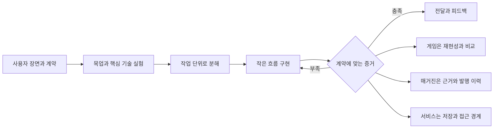

# 세 가지 프로젝트로 배우는 하나의 개발 체계

범용성은 예제 하나가 모든 사람에게 익숙하다는 뜻이 아닙니다. **서로 다른 프로젝트에서도 사용자·입출력·완료 조건을 정하고, 작은 작업을 수행해 증거로 다음 상태를 결정할 수 있어야 합니다.** 각 학생은 아래 사례 중 하나를 참고하거나 자신의 아이디어에 같은 질문을 적용합니다.

## 무엇을 만들어 보고 싶으신가요?

| 사례 | 사용자가 경험할 장면 | 핵심 학습 | 4주 목표 | 현재 제공 상태 |
|---|---|---|---|---|
| [ApplyFlow](../case-study.md) | 면접 연락을 받고 저장한 회사·직무를 찾습니다 | 데이터 저장·수정·검색, 서비스의 사용자 경계 | 개인용 지원 관리 도구 | 브라우저 실행 예제와 실제 AF-104 수행 기록 제공 |
| [FlyBlock Arena](flyblock.md) | 사람이 블록을 놓으면 초파리 연결지도 기반 컨트롤러가 상대편 수를 고릅니다 | 외부 연구 코드 연결·시뮬레이션·기준선 비교 | 사람 대 컨트롤러 대전과 재현 가능한 실험 기록 | 실제12뉴런 부분회로 대전·재생·40경기 실측 데모 제공 |
| [Signal Magazine](signal-magazine.md) | 아침에 AI가 만든 뉴스 초안을 확인하고 독자에게 한 호를 전달합니다 | 수집·중복 제거·근거 확인·발행·정정 | 한 주제의 작은 뉴스 매거진과 편집 흐름 | 실제 NASA/Jev/기사 응답 기록 + 로컬 편집·발행·정정 데모 |

세 사례의 **독립 실행 데모와 실제 제작 기록**을 [제작실](../build-lab.md)에 제공합니다. 아래 4주 설계의 모든 운영 확장이 구현된 것은 아니며 실제8시간 수업 검증과 구분합니다. 수강생이 세 프로젝트를 전부 만들 필요는 없습니다.

## 같은 질문, 서로 다른 완료 증거

| 공통 질문 | ApplyFlow | FlyBlock Arena | Signal Magazine |
|---|---|---|---|
| 누가 왜 쓰나요? | 지원 상태를 찾는 취업 준비생 | 사람과 신경회로 컨트롤러를 비교하는 플레이어 | 한 분야의 변화를 빠르게 읽는 독자 |
| 가장 먼저 만들 목업 | 저장→상태 변경→검색 | 두 보드·현재 수·승패·컨트롤러 표시 | 기사 카드→근거 보기→편집→발행 |
| 가장 큰 기술 불확실성 | 재실행 후 데이터 보존 | 실제 모델 실행·입출력 연결·응답 시간 | 원문 확보·주장과 출처 일치 |
| 끝까지 연결한 첫 작업 | 공고 한 건 저장하고 다시 찾기 | 보드 한 번 입력하고 합법적인 수 한 번 적용 | 자료 한 건으로 근거 있는 초안 만들기 |
| 완료 증거 | 저장·변경·검색·새로고침 | 대전 종료·리플레이·모델 호출 기록 | 출처 있는 한 호·중복 방지·정정 이력 |
| 잘못된 완료 주장 | 화면만 보고 서버 저장 완료 | 랜덤 봇을 초파리 뇌라고 표시 | 글이 생성됐으니 사실 확인 완료 |



## 4주 수업에서의 운영

1주차 계약 시간에 주제를 하나 선택하고 필수 범위를 정합니다. 2주차에는 한 흐름을 끝까지 연결하고, 3주차에는 실패와 평가를 다루며, 4주차에는 다른 사람이 사용할 결과물을 전달합니다. 기존 주차별120분, 전체480분 시간표를 유지하고 사례별 실습으로 대체합니다.

**선수 준비가 필요한 사례:** 초파리 모델은 강사가 먼저 특정 버전·데이터·환경에서 실행하고 게임 어댑터를 준비해야 합니다. 뉴스 매거진은 작은 자료 묶음과 사용 가능한 모델 연결을 먼저 준비해야 합니다. 이 준비가 없는 초급 수업에서는 두 사례의 8시간 완성을 약속하지 않습니다. 설치부터 신경과학 실험까지 수업 시간에 모두 넣는 것은 별도 심화 과정입니다.

**범위를 줄이는 순서:** 화면 장식·온라인 계정·자동 일정·추가 소스를 먼저 줄입니다. 게임의 실제 모델 연결이나 매거진의 출처 검증처럼 선택한 프로젝트의 핵심을 제거하고 같은 이름으로 완료 처리하지 않습니다. 모델 연결이 안 되면 ‘게임 프로토타입만 완료, 연구 통합 미완료’로 명시합니다.

## 공통 시작 프롬프트

```text
한국어 프로젝트 시작 스킬을 사용해 [프로젝트 이름]의 계약을 작성해 주세요. 사용자는 [한 사람과 구체적 장면], 핵심 결과는 [직접 체험할 결과]입니다. 사용 범위와 목표 단계(PoC/MVP/운영)를 구분하고, 4주 안에 유지할 핵심과 제외할 확장을 정하세요. 첫 목업과 가장 불확실한 기술 실험을 각각 하나 제안하세요. 실제 구현·설계 제안·미검증 가정을 나누고, 현재 사용 가능한 환경에서 달성할 수 있는지 확인하세요. 문서와 작업 분해는 프로젝트 규모에 맞춰 주세요.
```

[ApplyFlow 실행 매뉴얼](../../docs/playbooks/applyflow-runbook.md)의 온보딩·작업 카드·검토·인계 형식은 다른 두 사례에도 그대로 적용할 수 있습니다. 바뀌는 것은 프로젝트별 계약과 증거입니다.
