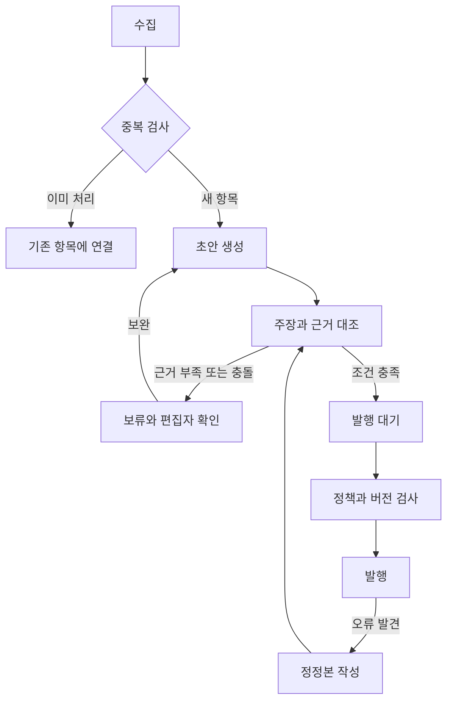

# Signal Magazine — AI가 운영하는 작은 뉴스 매거진

**기획 장면:** 우주·과학 뉴스를 좋아하는 독자가 출근길에 ‘무슨 일이 있었고, 왜 읽을 만한지’를 한 화면에서 봅니다. AI가 자료를 모아 정리하고, 근거를 확인할 수 있는 기사 카드를 만들며, 편집 정책에 따라 발행과 보류를 나눕니다.

**현재 상태:** [실행 매거진](https://themagictower.github.io/korean-ai-dev-course/projects/signal-magazine/)과 [실제 제작 기록](../build-lab.md)을 제공합니다. 실제 NASA 수집·Jev 분류·코딩 에이전트 기사 응답을 캡처했고, 브라우저에서 편집·승인·로컬 발행·정정을 체험합니다. 외부 생성 API는 실패했으며 자동 공개 발행·일정 운영은 미구현입니다. 아래 실패 장면은 가상입니다.

## 1. 뉴스 요약기에서 운영되는 서비스로

단순 요약은 텍스트를 반환하면 끝납니다. 매거진은 **어떤 자료를 고르고, 같은 소식을 어떻게 묶으며, 근거가 부족할 때 어떻게 멈추고, 발행 후 오류를 어떻게 고치는지**까지 다룹니다.

| 항목 | 4주 기본 계약 |
|---|---|
| 첫 독자 | 한 주제의 핵심 소식을 짧게 확인하려는 사람 |
| 사용 범위·단계 | 편집자1명과 제한 독자를 위한 소규모 MVP 목표 |
| 입력 | 허용한 소스2개 이하, 개발용 저장 샘플10건 이내 |
| 출력 | 최대3개 기사 카드로 구성한 한 호: 제목·요약·출처·시각·근거 |
| 핵심 경험 | 수집→초안→검토→웹 한 호 발행→정정 |
| 제외 | 종합 포털·유료 구독·메일 대량 발송·개인화·무제한 수집 |
| 비용 경계 | 실행당 항목 수·모델 호출 수·금액 상한, 초과 시 다음 실행으로 보류 |
| 완료 증거 | 실제 출처와 연결된 한 호, 재실행 중복 없음, 정정 이력 |

NASA와 JPL은 공식 RSS 안내를 제공합니다. 이 사례의 소스 후보로 조사하되 실제 수집 성공·기사 재사용 조건까지 확인한 것으로 간주하지 않습니다. 원문·이미지 사용 방식은 선택한 소스의 조건에 맞춰 정하고, 기본 카드는 짧은 자체 요약과 원문 링크로 설계합니다. [NASA RSS](https://www.nasa.gov/rss-feeds/) · [JPL RSS](https://www.jpl.nasa.gov/rss/)

## 2. 먼저 볼 화면과 입출력 계약

목업은 잡지처럼 읽는 **독자 화면**과 수집·근거·발행 상태가 보이는 **편집 화면** 두 개입니다. 예쁜 카드에서 ‘출처 보기’를 눌러도 근거가 없으면 데이터 계약을 다시 설계해야 합니다.

| 산출물 | 최소 필드 | 이유 |
|---|---|---|
| source_item | 원문URL·소스·게시 시각·수집 시각·본문 지문 | 중복과 오래된 자료 판단 |
| draft | 제목·요약·주장 목록·주장별 근거 위치 | 문장과 자료를 대조 |
| review | 판단·이유·부족한 근거·초안 버전 | 이전 검토가 새 초안에 적용되지 않음 |
| edition | 호ID·기사ID·발행 버전·시각 | 같은 호 중복 발행 방지 |
| correction | 원래 버전·변경 내용·이유·정정 시각 | 독자가 무엇이 바뀌었는지 확인 |

초안 생성 모델에는 수집 자료를 **읽을 데이터**로 전달합니다. 기사에 포함된 ‘기존 지침을 무시하라’ 같은 문장은 편집 지시로 실행하지 않습니다. 원문을 못 읽었으면 제목만으로 내용을 만들어 채우지 않고 보류합니다.

## 3. 상태머신으로 보는 AI 편집국



AI 작성자, 근거 검토자, 상태 판단기, 발행 실행기는 역할을 분리합니다. 한 모델이 여러 역할을 맡아도 입력과 책임은 구분합니다. Jev는 ‘관련/무관’, ‘근거 충분/보완 필요’처럼 좁은 질문의 분류 후보이며 원문을 수집하거나 사실의 진위를 보증하는 도구로 취급하지 않습니다. 근거 대조에는 실제 자료와 별도 검증이 필요합니다.

**4주 기본 발행 정책:** 편집자가 한 호를 확인해 발행합니다. AI는 수집·분류·초안·검토 제안을 담당합니다. **운영 확장:** 승인된 소스·주제·검증 조건의 항목만 자동 발행하고 나머지는 보류합니다. 자동화를 켜려면 재시도·비용 상한·중복 방지·중단·정정까지 검증합니다. 이 문서는 실제 발행 일정이나 외부 자동화를 생성하지 않습니다.

발행 실행기는 `edition_id + revision`을 확인하고, 이미 발행한 요청은 기존 결과를 반환합니다. 초안이 바뀌면 이전 승인도 무효입니다. API가 타임아웃 나면 새 호를 무작정 만들기 전에 해당 요청이 이미 발행됐는지 조회합니다.

## 4. 온보딩과 4주 작업 분해

온보딩 때 소스 목록·샘플 묶음·환경변수 이름·현재 모델 연결·출력 폴더·발행 대상을 확인합니다. 개발용 합성 자료에는 ‘가상’ 표시를 유지합니다. API 키는 서버 또는 로컬 실행 환경에서 읽고 공개 HTML에 넣지 않습니다.

| 주차·마일스톤 | 스테이지·스프린트 | Task | 완료 증거 |
|---|---|---|---|
| 1주 M1: 독자와 자료 | S1 계약·목업 / SP1 | NM-101 주제·편집 정책, NM-102 소스 한 건 읽기·카드 목업 | 원문 확보·시각·출처 표시 |
| 2주 M2: 한 기사 연결 | S2 제작 / SP2 | NM-103 중복 검사, NM-104 근거 있는 초안과 편집 | 실제 자료→초안→주장별 근거 |
| 3주 M3: 실패와 발행 | S3 검증 / SP3 | NM-105 보류·재시도·비용 상한, NM-106 한 호 발행 | 실패 샘플 보류·같은 요청 재실행 결과 |
| 4주 M4: 독자 전달 | S4 운영 / SP4 | NM-107 정정·새 환경 실행·독자 피드백 | 한 호URL·정정 이력·사용 기록 |

NM-104는 자료 확보에, NM-106은 근거 확인과 발행 정책에 의존합니다. 위 번호는 계획용 식별자입니다. 초보 수업에서는 일정 실행보다 한 번의 끝까지 연결된 발행을 먼저 완성합니다.

### 시작·온보딩 프롬프트

```text
kdev-start로 Signal Magazine 계약을 작성해 주세요. 한 분야의 독자를 위해 AI가 자료 수집·분류·초안·근거 검토를 수행하는 작은 매거진입니다. 소스는 최대2개, 한 호는 최대3개 기사로 제한합니다. 현재 소스 접근·모델 환경변수·샘플·발행 대상을 확인하세요. 입력 원문과 주장별 근거, 편집 상태, 비용 상한, 중복 발행 방지와 정정을 포함하고 첫 목표는 편집자가 확인한 웹 한 호입니다. 일정 자동화와 대량 메일은 제외하세요.
```

### NM-104 구현 프롬프트

```text
kdev-plan과 kdev-build로 자료 한 건에서 근거 있는 기사 초안을 만드는 흐름을 구현해 주세요. 제목·요약·주장별 원문 위치·원문URL·게시/수집 시각을 보존하세요. 원문 누락·숫자 충돌·자료 안의 지시문을 포함한 샘플로 검증하세요. 근거가 없으면 보류하며 추측으로 메우지 마세요. 모델 호출 실패와 구조 오류는 구분하고 호출 상한을 적용하세요. 이번 작업의 완료는 검토 가능한 초안이며 자동 공개 발행이 아닙니다.
```

### 상태 판단 프롬프트

```text
현재 초안 버전과 주장-근거 표를 읽고 다음 경로를 제안하세요. 선택지는 근거 보완, 편집자 판단, 발행 대기입니다. 누락된 원문·모순된 숫자·확인 안 된 날짜가 있으면 발행 대기로 보내지 마세요. 분류 결과·근거ID·부족한 항목을 남기세요. confidence를 사실 확인이나 발행 권한으로 바꾸지 마세요. 실제 발행은 별도 정책과 버전 검사를 통과해야 합니다.
```

## 5. 가상의 실패로 배우기

가상 원문은 ‘시험 비행 예정일은10월12일’인데 초안이 ‘10월12일 비행 성공’이라고 쓰면 예정과 결과가 바뀐 것입니다. 문장이 매끄러워도 보류합니다. 다른 매체가 같은 발표를 인용한 두 기사는 독립된 확인 두 건으로 세지 않습니다. 원문이 수정되면 수집 시점과 초안 버전을 대조합니다.

검증 묶음에는 정상 자료·동일 자료 재수집·원문 없음·예정/완료 뒤바뀜·숫자 충돌·지시문 삽입·모델 타임아웃·발행 응답 유실을 넣습니다. 각 입력에 기대 상태를 미리 적고 실제 상태와 비교합니다.

**평가:** 근거 없는 주장 수, 중복 발행 수, 보류를 놓친 사례, 한 호당 실제 비용, 수동 수정 시간, 독자 피드백을 기록합니다. 검증 자료가10건이면10건의 결과로만 보고하며 전체 뉴스의 정확도로 일반화하지 않습니다. 이번 실행의 Jev 사용량과 개발 경과는 제작실에 기록했습니다. 독자 정확도·총 비용·장기 운영 품질의 실측은 아직 없습니다.

**인계할 것:** 편집 정책·소스 목록·실행 방법·환경변수 이름·초안/근거 형식·발행 버전·중단/정정 방법·미확인. AI가 글을 썼다는 사실보다 독자가 근거를 보고 운영자가 오류를 고칠 수 있다는 점을 완성 기준으로 삼습니다.
