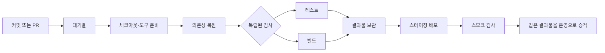

# CI/CD가 느려질 때: 먼저 재고, 안전하게 재사용하기

프로젝트가 커지면 설치할 의존성, 빌드할 모듈, 실행할 테스트, 배포 대상이 늘어납니다. CI가 느려지면 피드백을 기다리는 시간이 길어지고, CD가 느려지면 수정 사항이 사용자에게 도달하는 시간도 늘어납니다. 캐시는 반복해서 만드는 파일을 다시 써서 줄이는 방법입니다. 먼저 기다리는 구간이 어디인지 확인해야 알맞은 캐시와 최적화를 고를 수 있습니다.

## CI와 CD에서 시간을 나눠 봅니다

CI(지속적 통합)는 변경을 빌드하고 검사하여 통합할 수 있는지 확인합니다. CD(지속적 전달·배포)는 확인된 빌드 결과를 스테이징이나 운영 환경으로 전달합니다. 한 번의 파이프라인 총시간만 보면 원인이 가려집니다.



한 커밋부터 결과가 나올 때까지 걸린 실제 시간은 보통 의존 관계상 가장 긴 경로에 좌우됩니다. 서로 독립된 작업을 병렬로 실행하면 기다림은 줄 수 있지만, 러너 사용량과 비용은 늘 수 있습니다. 병렬 작업의 시간을 모두 더한 값은 사용자가 기다린 시간과 다릅니다.

## 캐시보다 측정이 먼저입니다

GitHub Actions 실행 기록에서 각 단계의 대기와 실행 시간을 나눠 확인합니다. 대표 PR 여러 건에서 체크아웃, 런타임 설치, 의존성 설치, 테스트, 빌드, 아티팩트 전송, 배포의 시간을 기록합니다. 중앙값과 느린 실행값을 함께 비교하면 한 번의 우연한 지연을 병목으로 오인하기 어렵습니다. 실행이 대기열에 머문 시간도 작업 내부 실행시간과 분리합니다.

관찰한 결과에 맞춰 해결 방법을 고릅니다.

| 확인한 병목 | 먼저 고려할 방법 | 주의할 점 |
|---|---|---|
| 매번 패키지를 새로 내려받음 | 언어·패키지 도구가 제공하는 의존성 캐시 | 고정(lock)된 의존성으로 매번 설치·검증은 계속 수행합니다. |
| 소스 일부만 바뀌어도 전체 이미지 재빌드 | 변경이 적은 잠금 파일·도구 설치를 앞에 두고 소스 복사는 뒤로 이동, 빌드 캐시 | 입력이 바뀐 빌드 계층은 다시 실행되어야 합니다. |
| 관련 없는 모듈까지 검사 | 의존성 그래프와 변경 영향 범위로 대상 선택 | 공통 라이브러리·워크플로 파일·잠금 파일 변경은 전체 검사로 연결합니다. |
| 독립 테스트가 차례로 실행 | 안전한 작업을 별도 job이나 test shard로 병렬화 | 러너 대기·시작 비용과 flaky test까지 측정합니다. |
| PR마다 전 행렬·모든 장시간 검사를 수행 | 빠른 필수 검사와 야간·릴리스 전체 검사를 구분 | 핵심 위험 검사를 PR에서 제거하지 않습니다. 전체 검사의 주기도 기록합니다. |
| CD에서 매 환경마다 새로 빌드 | 한 번 만든 식별 가능한 결과물을 테스트 후 같은 digest로 승격 | 스테이징과 운영에서 다른 소스를 다시 빌드하지 않습니다. |
| 낡은 PR 실행이 새 실행과 경합 | 같은 PR 검사끼리 중복 실행을 취소하거나 제한 | 배포·마이그레이션 작업을 무심코 취소하면 부분 상태가 남을 수 있습니다. |

## 캐시가 하는 일과 하지 않는 일

캐시는 설치 파일이나 중간 산출물을 **다시 만들 때 시간을 절약**합니다. 캐시가 없거나 무효여도 파이프라인은 정해진 의존성을 내려받고 결과를 다시 생성할 수 있어야 합니다. 캐시 적중은 성공적인 테스트나 빌드와 같지 않습니다.

아티팩트는 빌드 결과, 테스트 로그처럼 작업 뒤에 보관하거나 다음 작업으로 넘기는 **결과물**입니다. 캐시는 다음 실행에서 다시 써도 되는 **재생성 가능한 입력·중간 상태**입니다. 운영에 올릴 바이너리·컨테이너 이미지는 캐시가 아니라 식별 가능한 아티팩트로 전달하고, 스테이징에서 검사한 바로 그 결과물을 승격합니다.

### 캐시 키에는 재사용 조건을 넣습니다

키는 실행 환경과 캐시를 유효하게 만드는 입력을 반영해야 합니다. 예를 들면 운영체제·아키텍처, 언어 런타임 또는 컴파일러 버전, 패키지 잠금 파일의 해시, 빌드 설정이 있습니다. 잠금 파일의 해시가 달라지면 의존성 캐시를 새로 만들고 전체 빌드·검사를 수행합니다. 부분 복원 키는 호환되는 누적 캐시를 활용할 때만 사용하고, 결과 검증을 줄이는 근거로 쓰지 않습니다.

설정 전에는 복원 시간과 저장·압축 시간이 실제 절약 시간보다 짧은지도 확인합니다. 캐시는 오래 쓰지 않으면 만료되거나 새 실행 환경에서 적중률이 낮을 수 있습니다. 최초 실행(콜드 캐시)과 반복 실행(웜 캐시)을 구분하여 비교합니다.

### 보안 경계도 키 설계의 일부입니다

비밀키·토큰·운영 데이터는 캐시에 넣지 않습니다. 캐시 파일은 읽을 수 있는 작업에서 실행될 수 있으므로, 신뢰할 수 없는 외부 PR이 캐시를 수정할 수 있는지 확인합니다. 기본 브랜치 캐시를 읽는 권한과 캐시를 기록하는 권한을 분리하고, 신뢰된 실행만 쓰게 하는 구성을 검토합니다. 잠금 파일 변경이나 런타임 변경 때 캐시가 분리되는지 확인합니다.

### 테스트 캐시로 검사를 생략하지 않습니다

테스트 결과를 캐시해 코드가 바뀌었는데 검사가 통째로 건너뛰는 일은 피합니다. 변경된 모듈만 검사하려면 신뢰할 수 있는 의존성 그래프가 있어야 합니다. 영향 범위를 알 수 없거나 공통 경로·설정이 바뀌면 전체 검사로 돌아갑니다. PR의 빠른 검사는 신속한 피드백을 위한 층이고, 전체 검사는 예약된 주기와 릴리스 전에 실행하는 별도의 안전망입니다.

## 프로젝트 수준에 맞춰 도입합니다

| 프로젝트 수준 | 합리적인 시작점 |
|---|---|
| 개인용 | 검사 한두 개를 짧게 유지합니다. 설치가 반복해서 오래 걸릴 때 패키지 도구의 간단한 캐시부터 봅니다. |
| PoC | 전체 실행 흐름을 보존하면서 설치가 가장 오래 걸리는 한 구간만 측정하고 캐시합니다. 원클릭 실행이 캐시 없이도 가능하게 둡니다. |
| MVP | PR·기본 브랜치·배포에 필요한 검사와 결과물을 구분합니다. 잠금 파일 기반 의존성 캐시와 변경 범위 검사를 도입하되, 전체 회귀검사 주기를 정합니다. |
| 운영 서비스 | 실행 대기·단계 시간·캐시 적중·비용·실패율을 추적합니다. 원격 빌드 캐시, 테스트 분할, 변경 영향 분석, 아티팩트 승격을 검증 가능한 근거에 따라 적용하고 캐시 없는 복구도 정기적으로 확인합니다. |

모든 개인 프로젝트에 원격 캐시 서버, 복잡한 영향 분석, 다단계 승인 절차를 요구하지 않습니다. 최적화로 절약한 대기와 러너 비용이 설정·저장·보안 검토 비용보다 클 때 도입합니다.

## 저장소에서 찾아보는 작은 예

이 저장소의 Signal Magazine 후보 CI는 같은 Django 검사 작업을 `upgrade`와 `greenfield` 두 경로에 matrix로 실행합니다. 각 작업은 현재 `actions/setup-python@v5`로 Python을 준비하고 해당 경로의 버전이 지정된 직접 의존성 목록을 설치한 뒤 테스트와 릴리스 검사를 합니다. 2026-09-23의 `main` push 실행에서 두 job은 각각 약 20초·22초였고, workflow 생성부터 마지막 job 완료까지 약 25초였습니다. [해당 실행 기록](https://github.com/TheMagicTower/korean-ai-dev-course/actions/runs/35812537118)은 한 번의 관찰일 뿐 성능 기준선이 아닙니다.

현재처럼 파이프라인이 작으면 커스텀 캐시 설정을 늘리기 전에 여러 실행의 실제 설치·테스트 시간을 모읍니다. 설치 단계가 반복해서 병목일 때는 Python 설정 액션의 패키지 캐시 옵션을 검토할 수 있습니다. 예를 들어 아래 구성은 `requirements.txt`를 키 입력으로 삼아 pip 다운로드 캐시를 재사용하지만, 매 실행에서 고정된 의존성을 다시 설치합니다.

```yaml
- uses: actions/setup-python@v7 # 예시: 적용 때 저장소의 버전·SHA 정책 확인
  with:
    python-version: '3.13'
    cache: pip
    cache-dependency-path: path/to/requirements.txt
- run: python -m pip install -r path/to/requirements.txt
```

예제는 2026-09-23에 확인한 `setup-python@v7`을 사용하지만, 관찰한 workflow는 `@v5`였습니다. 두 버전을 혼동하지 말고 적용 시 저장소의 액션 버전·SHA 정책을 확인하세요. 의존성 입력 파일이 여러 개라면 각각을 키에 포함합니다. 이 설정은 설치를 생략하는 명령이 아니라 패키지를 매번 다운로드하지 않도록 돕는 캐시입니다. 경로가 늘어나면 변경된 앱만 테스트하고, 공통 코드·잠금 파일·CI 설정 변경은 전체 테스트로 연결하는 규칙을 먼저 문서화합니다. 이 문서는 최적화 방법을 설명하기 위해 추가했으며 현재 서비스 workflow 자체는 변경하지 않았습니다.

## 에이전트에 주는 진단·개선 프롬프트

```text
현재 저장소의 CI/CD가 느려진 원인을 진단하고, 근거가 확인되는 최적화를 제안해 주세요.
목표: [PR 피드백 대기 / 전체 검사 시간 / 배포 리드타임 / 러너 비용 중 우선순위]
대상: [워크플로 파일 또는 전체 저장소]
완료 기준: [예: 필수 검사를 유지하면서 중앙값 대기 20% 개선, 아직 미측정이면 목표를 먼저 제안]
제한: [예산, 배포 중단 허용 여부, 운영 승인 필요 여부]

1. 워크플로 정의, lockfile, 빌드 설정, 테스트 구성과 최근 실행 기록을 읽으세요.
2. 대기열 시간과 각 단계의 실행 시간을 구분하고, 한 번의 실행을 일반 성능으로 주장하지 마세요.
3. 캐시 키와 복원 경로, 병렬화 가능한 작업, 변경 영향 범위, 반복 설치·빌드,
   아티팩트 전달과 배포 경로를 점검하세요. 실행 데이터가 없으면 먼저 필요한 기준선을 적으세요.
4. 의존성 캐시와 결과 아티팩트를 구분하세요. 캐시를 지워도 빌드·테스트·배포가
   재현 가능해야 하며, 비밀정보를 캐시하지 말고 외부 PR의 캐시 읽기/쓰기 권한을 확인하세요.
5. 영향 범위가 확실하지 않은 변경은 전체 검사로 대체하고, PR 필수 검사나
   운영 배포 전 안전 검사를 없애지 마세요. 테스트 결과 캐시만으로 검사를 생략하지 마세요.
6. 빌드는 식별 가능한 결과물로 한 번 만들고, 스테이징 검사 후 같은 결과물을 승격하는지 확인하세요.
7. 최적화 전후 기준과 성공 판정 방법, 콜드/웜 캐시 검사, 캐시 무효화,
   실패 시 원상 복귀 방법을 제안하세요. 예상치는 측정값처럼 쓰지 마세요.

먼저 진단 요약과 최소 변경 계획을 작성하세요. 확인된 병목을 해결하는 작은 변경은
현재 브랜치에서 구현해도 됩니다. 운영 배포, 비밀 권한 변경, 필수 검사 제거,
데이터베이스 마이그레이션 또는 되돌릴 수 없는 설정 변경은 실행하지 말고 이유와
필요한 승인 절차를 보고하세요. 적용 후 변경 전후 실행을 비교하고 증거를 남기세요.
```

### 수업에서의 짧은 연습

4주차 전달·회고 실습의 선택 과제로 활용합니다. 최근 CI 실행 한 건을 열어 가장 오래 걸린 단계와 대기 시간을 분리하고, 캐시·병렬화·범위 선택 중 하나를 고릅니다. 결정 기록에는 ‘무엇을 재사용하는가, 어떤 입력이 바뀌면 무효화되는가, 캐시가 없을 때도 어떻게 통과하는가, 시간을 얼마나 줄였다고 확인할 것인가’를 적습니다. CI가 없는 프로젝트라면 도입보다 수동 검증을 기록하고 완료 조건을 맞추는 데 집중합니다.

## 참고 자료

- [GitHub Actions 의존성 캐시 개념](https://docs.github.com/en/actions/concepts/workflows-and-actions/dependency-caching) 및 [보안·키·복원 동작 참조](https://docs.github.com/en/actions/reference/workflows-and-actions/dependency-caching)
- [GitHub Actions 아티팩트 개념](https://docs.github.com/en/actions/concepts/workflows-and-actions/workflow-artifacts)
- [GitHub Actions matrix 병렬 실행](https://docs.github.com/en/actions/how-tos/write-workflows/choose-what-workflows-do/run-job-variations)
- [Docker 빌드 캐시 최적화](https://docs.docker.com/build/cache/optimize/)

공식 문서 확인일: 2026-09-23. 액션 이름·기본 보안 정책·캐시 한도는 바뀔 수 있으므로 실제 적용 시 해당 저장소의 플랫폼 문서를 다시 확인합니다.
