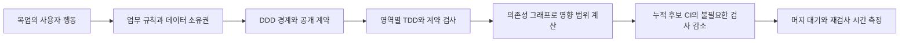
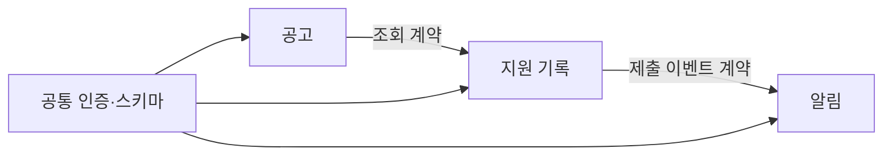

# DDD 경계와 TDD: 독립 검사가 가능해지는 조건

업무 영역을 나누는 설계와 작은 행동을 테스트로 고정하는 습관은 병렬 개발의 출발점입니다. 이 단원에서는 **DDD의 경계가 실제 의존성 격리로 이어지는 조건과 영역별 TDD·계약 검사가 선택 검사와 연결되는 과정**을 연습합니다. 이슈 정리와 PR 단위는 [이슈·PR 관리](issue-pr-management.md)에서, 누적 후보의 검사와 머지트레인은 [병렬 AI 개발과 머지트레인](parallel-ai-merge-train.md)에서 이어집니다.

여기서 ApplyFlow는 공고·지원 기록·알림으로 확장한다고 가정한 **설계 연습**입니다. 현재 저장소의 ApplyFlow 데모가 아래 모듈 구조, 서버, 이벤트, 테스트 또는 머지큐를 구현했다는 뜻이 아닙니다. 공식 문서 확인일은 2026-09-28입니다.

## DDD는 경계를, TDD는 행동의 피드백을 만듭니다

DDD는 **Domain-Driven Design, 도메인 주도 설계**입니다. 사용자의 업무 언어와 규칙을 모델에 반영하고, 같은 말이 일관된 의미를 가지는 범위인 bounded context를 구분합니다. 예를 들어 ‘상태’가 공고에서는 공개·마감, 지원 기록에서는 작성 중·제출·면접을 뜻할 수 있습니다. 모두를 하나의 상태 열거형으로 묶기 전에 서로 다른 규칙인지 확인합니다. [Fowler의 DDD 설명](https://martinfowler.com/bliki/DomainDrivenDesign.html), [Bounded Context](https://martinfowler.com/bliki/BoundedContext.html)

TDD는 **Test-Driven Development, 테스트 주도 개발**입니다. 작은 행동의 실패 테스트를 먼저 확인(Red)하고, 통과할 최소 구현을 작성(Green)한 뒤, 행동을 유지하며 구조를 정리(Refactor)하는 반복입니다. DDD가 업무를 이해하는 방법이라면 TDD는 그 규칙을 구현하며 짧게 피드백받는 방법입니다. [Fowler의 TDD 설명](https://martinfowler.com/bliki/TestDrivenDevelopment.html)



DDD를 도입하거나 폴더 이름만 나누면 자동으로 독립 검사가 가능해지는 것은 아닙니다. 다른 영역의 내부 파일 import를 제한하고, 데이터를 소유한 영역을 통해 수정하며, API·이벤트 의존성을 그래프에 기록해야 합니다. 테스트마다 독립 DB·픽스처를 쓰거나 외부 연동을 명시된 계약으로 대체해야 영역 검사도 따로 실행할 수 있습니다. 단위 테스트가 모두 통과해도 영역 사이의 실제 연결은 깨질 수 있으므로 계약·통합 검사가 필요합니다. 작은 프로젝트에서는 마이크로서비스 대신 한 프로그램 안의 모듈로 충분합니다.

## ApplyFlow의 경계를 가정해 봅니다

| 영역 | 소유하는 데이터와 규칙 | 다른 영역에 제공하는 계약 | 독립 검사와 경계 검사 |
|---|---|---|---|
| 공고 | 공고 ID·URL·마감일, 중복 URL 거부 | 공고 조회 응답, 존재 여부 | 중복 규칙 단위 검사 + 조회 응답 계약 |
| 지원 기록 | 공고 ID 참조·지원 단계, 허용된 단계 전환 | `ApplicationSubmitted` 이벤트 | 단계 전환 단위 검사 + 공고 조회 소비자 계약 |
| 알림 | 전송 예약·재시도·중복 전송 방지 | 지원 제출 이벤트 소비 | 가짜 전송기를 쓴 단위 검사 + 이벤트 소비자 계약 |

아래 화살표는 **공급자가 바뀌면 영향을 살펴볼 소비자 방향**입니다. 코드의 import 방향과 반대일 수 있습니다. 지원 기록이 공고 DB 테이블을 직접 고치거나 알림이 지원 내부 객체를 그대로 읽으면 이 경계는 지켜지지 않습니다.



## 작은 TDD 예: 이미 제출한 지원은 다시 제출할 수 없습니다

다음은 Python 표준 라이브러리로 실행할 수 있는 **독립 학습 예시**이며 데모 앱에 적용된 코드는 아닙니다. `transition_test.py` 파일에 저장합니다. 처음에는 함수가 항상 `"submitted"`를 반환하도록 놓고 `python3 transition_test.py`를 실행하세요. 첫 테스트는 통과하지만 이미 제출한 상태를 거부하는 테스트는 실패해야 합니다. 이어서 아래 구현으로 바꾸면 두 테스트가 통과합니다.

```python
import unittest


def submit(status):
    if status != "draft":
        raise ValueError("작성 중인 지원만 제출할 수 있습니다.")
    return "submitted"


class SubmissionTests(unittest.TestCase):
    def test_draft_can_be_submitted(self):
        self.assertEqual(submit("draft"), "submitted")

    def test_submitted_cannot_be_submitted_again(self):
        with self.assertRaises(ValueError):
            submit("submitted")


if __name__ == "__main__":
    unittest.main()
```

Refactor 단계에서는 중복이나 의미가 불분명한 이름이 실제로 생겼을 때 정리하고 같은 테스트를 다시 실행합니다. 이 두 테스트는 저장 성공이나 알림 전송을 입증하지 않습니다. 저장 후 발행되는 이벤트의 필드·버전, 소비자의 해석, 재전송 때 중복 방지까지 별도의 계약·통합 테스트로 확인해야 합니다.

## 경계에서 선택 검사까지: 다섯 가지 연결

DDD는 업무 경계를 설계하는 데 도움을 줍니다. 선택 검사를 안전하게 하려면 실제 의존성 격리와 신뢰할 수 있는 영향 분석이 필요합니다. 아래 다섯 가지가 갖춰질 때 비로소 영역별 검사를 따로 돌리고 CI 시간을 줄일 수 있습니다. 각 연결의 전체 절차와 예시는 [병렬 AI 개발과 머지트레인](parallel-ai-merge-train.md)에서 다룹니다.

| 연결 | 핵심 조건 |
|---|---|
| 실제 의존성 격리 | 폴더 이름이 아니라 접근 규칙으로 경계를 지킵니다. 다른 영역의 내부 모듈 import를 제한하고, 데이터 수정은 소유 영역을 통해서만 수행합니다. API 호출·이벤트 구독은 의존성 그래프나 계약 목록에 명시적으로 기록하고, 영역 테스트는 독립 DB·픽스처나 가짜 구현·계약으로 대체합니다. |
| 전이적 영향 분석 | 기본 규칙은 **변경 영역 + 전이적 소비자 + 관련 경계 계약 검사**입니다. 위 ApplyFlow 그래프에서 공고 조회 응답이 바뀌면 지원 기록을 거쳐 알림까지 살펴봅니다. 비교 기준 base·검증 후보 head·실제 체크아웃 SHA를 기록합니다. |
| 계약 테스트 | 영역별 단위 검사가 모두 통과해도 경계 사이 연결은 깨질 수 있습니다. 조회 응답의 필드·버전, 이벤트 해석·재전송 시 중복 방지 같은 약속을 계약 검사로 고정하고, 소비자 관점에서 계약 위반을 실패로 잡습니다. |
| 전역 변경은 전체 검사(full suite)로 전환 | 공통 인증·DB 스키마·lockfile·빌드/CI 설정이 바뀌면 전체 필수 검사를 선택합니다. 그래프가 불명확하거나 소유자·비교 SHA를 확정하지 못해도 ‘영향 없음’으로 추측하지 않고 전체 검사 또는 후보 차단으로 돌립니다. |
| 누적 후보 검증 | PR 통과를 큐에서 그대로 복사하지 않습니다. 각 후보는 앞선 PR까지 포함한 미래 상태이므로 변경 합집합에서 영향 범위를 다시 계산하고 그 후보 head 자체를 검사합니다. 실패 PR이 빠지면 새 후보를 만들어 다시 검증합니다. |

처음에는 소비자를 넓게 포함합니다. 계약이 유지된다는 증거와 신뢰할 수 있는 그래프가 쌓여야 더 줄일 수 있습니다. 경계를 나누어도 CI의 대상 선택에 그래프를 연결하지 않으면 검사량은 줄지 않습니다. [Nx affected 공식 설명](https://nx.dev/docs/features/ci-features/affected)

이 연습은 2주차의 기존 선택 실습 5분 안에서 이슈 분류 연습을 **대체하여** 사용할 수 있습니다. 내 프로젝트의 업무 영역·데이터 소유자·공개 계약을 적고 규칙 하나를 Red–Green–Refactor로 구현합니다. 둘을 필수 과제로 추가하지 않으며 주차별 120분을 유지합니다. 별도 서비스나 CI 구축을 추가하지 않습니다.

## 다음 읽기

- [이슈·PR 관리](issue-pr-management.md): 경계를 넘나드는 변경을 원자적 PR 단위로 묶거나 나눕니다.
- [병렬 AI 개발과 머지트레인](parallel-ai-merge-train.md): 전이적 영향 분석과 누적 후보 검증의 전체 절차를 연습합니다.
- [CI/CD 시간과 캐시 최적화](ci-cd-optimization.md): 측정·캐시·병렬화로 기다림을 줄이는 방법을 함께 읽습니다.

위 본문의 Fowler 개념 설명과 Nx 영향 분석 링크가 이 단원의 출처이며, 전체 확인 목록과 확인 범위는 [머지트레인 부록의 참고 자료](parallel-ai-merge-train.md)를 함께 보세요.
