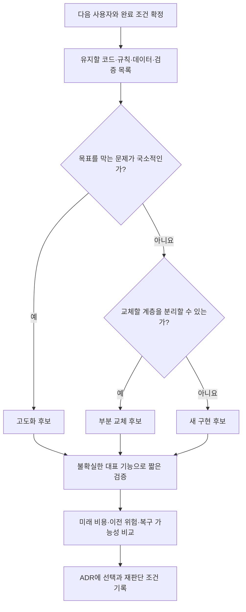

# 계속 고칠까요, 일부를 바꿀까요, 새로 만들까요?

**매번 새로 만들 필요는 없습니다. 앞으로 필요한 완료 조건을 가장 적은 총비용으로 충족하는 경로를 선택합니다.** AI가 코드를 빨리 생성해도 사용자 데이터, 검증된 업무 규칙, 배포와 복구까지 저절로 이전되지는 않습니다.

집을 고칠 때도 도배, 배관 교체, 재건축은 서로 다른 선택입니다. 프로그램에서도 파일이 마음에 들지 않는다는 이유와 기반 구조가 목표에 맞지 않는다는 이유를 구분합니다. 먼저 유지할 자산과 바꿔야 할 경계를 찾습니다.

## 세 경로의 트레이드오프

| 경로 | 적합한 상황 | 얻는 것 | 지불하는 비용과 위험 | 먼저 확인할 증거 |
|---|---|---|---|---|
| 기존 구현 고도화 | 핵심 구조와 데이터가 목표에 맞고 부족한 기능이 국소적 | 검증된 동작·사용 흐름·운영 지식 유지 | 누적된 결합 때문에 작은 수정의 영향이 커질 수 있음 | 대표 변경 하나를 구현하고 기존 핵심 흐름이 유지되는지 확인 |
| 부분 교체 | 규칙·화면 등은 쓸 만하지만 저장소·인증·실행 엔진 등 특정 계층이 한계 | 유효한 자산을 살리면서 병목 해소 | 구형·신형 사이 계약, 이중 운영, 데이터 전환 관리 | 교체 경계의 입력·출력 계약과 되돌리는 절차 |
| 새 구현 | 목표가 크게 달라졌거나 기반을 수선하는 비용이 더 크고 이전 위험을 감당 가능 | 새 목표에 맞는 일관된 구조 | 숨은 요구 재발견, 기능 누락, 데이터 이전, 전환 후 안정화 | 기존 사용 시나리오 목록과 새 구현의 동일 인수 검사 |

개인용 도구는 본인이 다시 실행하고 데이터를 보존하면 충분할 수 있습니다. 다수 사용자의 서비스는 계정·권한·동시 수정·백업 복구까지 필요할 수 있습니다. **코드의 크기나 ‘프로덕션’이라는 단어가 아니라 실제 사용자의 실패 비용으로 완료 조건을 정합니다.**

## 판단 순서



이 그림은 정답을 자동 판정하는 규칙이 아닙니다. 구조를 아직 모르면 분석이나 작은 실험으로 확인합니다. 계층을 분리할 수 있어도 유지·이전 비용이 지나치면 새 구현을 선택할 수 있습니다. 반대로 새 구현이 깔끔해도 운영 중인 데이터의 안전한 이전이 불가능하면 전환을 보류합니다.

## 실제 실험의 시간을 올바르게 읽기

[Signal Magazine 실험](production-comparison.md)은 다음의 **시작부터 최초 인계까지**를 관찰했습니다. 출시 완료 시간이나 순수 코딩 시간은 아닙니다.

| 관찰 | 경과 | 해석 |
|---|---:|---|
| 과거 PoC | 7분 14초 | 문제와 데모를 탐색한 별도 수행 |
| 기존 PoC를 고도화 | 11분 51초 | 기존 자산을 활용한 서비스 후보 구현 |
| 동일 계약으로 새 구현 | 13분 36초 | 공통 계약과 자료를 받은 서비스 후보 구현 |

**이미 PoC가 있는 시점에서 최초 인계까지의 추가 경과를 비교하면, 이번 관찰값은 11분 51초와 13분 36초입니다.** 과거 PoC의 7분 14초는 어느 길을 택해도 되돌릴 수 없는 비용입니다. ‘PoC+고도화 19분 5초’와 ‘새 구현 13분 36초’를 비교하여 지금 새로 만드는 편이 더 빠르다고 결론 내리면 출발점을 섞은 것입니다.

같은 PoC 이력을 가진 뒤 새로 만든다는 가상 경로에 과거 시간을 더하면 약 20분 50초입니다. 이는 **서로 다른 관찰의 합산 예시이며 실제 연속 수행 측정이 아닙니다.** 두 경로에서 과거 비용을 모두 제외하거나 모두 포함해야 합니다.

반대로 처음 프로젝트를 시작하는 순간에는 무엇을 만들지도 불확실합니다. 이번 새 구현자는 이미 정리된 공통 계약을 받았습니다. 이 결과만으로 ‘PoC를 생략하면 빠르다’고 판단할 수 없습니다. 두 구현 모두 추가 검토·수정·통합 검증을 거쳤고 외부 운영 출시는 미측정입니다. 단일 병렬 실험이므로 일반적인 속도 우열도 입증하지 않습니다.

## 세 프로젝트에 적용하면

### Signal Magazine: 규칙은 유지하고 서비스 계층을 바꿉니다

혼자 쓰던 출처 확인·승인 데모를 여러 편집자가 쓰게 되었습니다. 화면에 로그인 버튼만 붙여서는 서버 권한이나 수정 충돌을 해결하지 못합니다. 기사 출처, 승인·정정 규칙, 디자인은 유지할 자산이고 저장·인증·발행 트랜잭션은 재설계 대상입니다.

실제 실험의 ‘고도화’도 JS PoC를 Python 서버로 옮겼습니다. 모든 코드를 그대로 확장한 것이 아니라 자산을 재사용하면서 구현 일부를 새로 만든 경로입니다. 별도의 세 번째 부분 교체 실험을 측정한 것은 아닙니다. 수업에서는 작업 이름보다 **무엇을 유지하고 무엇을 교체했는지**를 확인합니다.

### FlyBlock: 조작이 불편하다고 신경회로까지 다시 만들 필요는 없습니다

실제 업데이트에서는 키보드 입력과 실시간 진행을 추가했습니다. 초파리 부분회로 자료와 제어 규칙은 유지하면서 입력·시간 진행·화면을 개선하는 접근입니다. 조작 불편이라는 문제를 해결할 때 검증된 회로까지 재작성하면 새로운 오류의 범위도 커집니다.

다만 다음 목표가 원격 2인 대전이라면 네트워크 지연과 상태 동기화라는 새 계약이 필요합니다. 이는 **가상 확장 사례**이며 현재 구현된 기능이 아닙니다. 그때는 게임 규칙을 유지하고 세션·통신 계층을 교체할 수 있는지 먼저 검증합니다.

### ApplyFlow: 사용자가 바뀌면 판단도 달라집니다

**가상 요구 변경:** 본인만 쓰는 지원 현황 도구라면 필터와 내보내기를 보강하는 것으로 충분할 수 있습니다. 팀이 함께 채용 기록을 관리한다면 계정별 접근, 개인정보 범위, 공동 수정, 복구 조건이 달라집니다. 기존 데이터 구조가 새 계약을 표현하는지 점검하고 저장 계층 교체와 새 구현을 비교합니다. 팀용 서비스는 현재 개인용 데모의 완료 사실로 주장하지 않습니다.

## 미래 비용을 비교하는 워크시트

`앞으로의 총비용 = 조사 + 구현 + 검증 + 데이터 이전 + 전환·복구 준비 + 안정화`

시간과 토큰·요금은 별도 열에 기록합니다. 사람의 검토시간과 에이전트 경과시간을 섞지 않습니다. 동시에 수행한 작업 시간을 더한 값은 실제 달력상 소요 시간과 다릅니다. 개인정보 유출이나 복구 불가 같은 허용할 수 없는 위험은 점수로 상쇄하지 말고 필수 통과 조건으로 둡니다.

| 작성 항목 | 고도화 | 부분 교체 | 새 구현 |
|---|---|---|---|
| 유지할 자산 / 버릴 자산 | 직접 작성 | 직접 작성 | 직접 작성 |
| 같은 완료 조건까지 남은 작업 | 직접 작성 | 직접 작성 | 직접 작성 |
| 예상 시간·비용 범위와 근거 | 미측정이면 미측정 | 미측정이면 미측정 | 미측정이면 미측정 |
| 가장 불확실한 가정과 확인 실험 | 직접 작성 | 직접 작성 | 직접 작성 |
| 데이터 이전·되돌리기 방법 | 직접 작성 | 직접 작성 | 직접 작성 |
| 선택을 다시 검토할 조건 | 직접 작성 | 직접 작성 | 직접 작성 |

검증 실험의 시간·토큰 예산을 먼저 정합니다. 예산을 초과하거나 필수 조건이 불가능해지면 자동으로 계속 만들지 말고 범위·경로를 다시 판단합니다. 구체적인 예산은 프로젝트 규모에 맞게 정하고 모든 프로젝트에 같은 제한을 강제하지 않습니다.

## 복사해서 쓰는 판단 프롬프트

```text
현재 프로젝트를 고도화할지, 일부 계층을 교체할지, 새로 구현할지 판단해 주세요.
대상 사용자: [작성]
현재 수준 / 다음 완료 조건: [작성]
유지해야 할 데이터·공개 API·사용 흐름: [작성]
시간·비용 한도와 허용할 수 없는 실패: [작성]

먼저 저장소와 실제 실행·검증 기록을 확인하세요. 기존 코드라는 이유로
유지하거나 AI가 빠르다는 이유로 재작성을 선택하지 마세요.
세 경로 각각에 대해 유지/교체 자산, 남은 구현·검증·이전·전환·복구 작업,
예상 비용 범위와 근거, 불확실한 점을 비교하세요. 과거 비용은 별도로 표시하세요.
근거가 부족한 핵심 가정에는 예산을 제한한 확인 실험을 제안하세요.
추천 경로, 다른 경로를 선택할 조건, 재판단 조건을 짧은 ADR로 작성하세요.
측정과 추정을 구분하고 확인하지 않은 결과를 완료로 기록하지 마세요.
이 요청은 판단과 계획까지이며 실제 데이터 이전이나 서비스 전환은 실행하지 마세요.
```

Jev 같은 분류 도구는 증거를 바탕으로 경로 후보를 분류하는 데 사용할 수 있습니다. 분류 결과만으로 데이터 삭제·운영 전환을 허용하지 않습니다. 상태머신에는 판단 근거와 불확실성을 남기고 전환 직전 계약 검사·권한·복구 조건을 별도로 확인합니다.

## 4주차 실습: 내 프로젝트의 다음 한 걸음

기존 회고·다음 계획 시간 중 10분을 사용합니다. 추가 수업이나 세 프로젝트 구현 과제가 아닙니다. 2분 동안 다음 사용자를 정하고, 3분 동안 유지/교체 자산을 나누고, 3분 동안 세 경로를 비교한 뒤, 2분 동안 선택과 재판단 조건을 발표합니다.

제출물은 한 문단 ADR입니다. ‘현재는 ○○ 때문에 고도화를 선택한다. △△는 유지하고 □□만 바꾼다. 핵심 검증은 ○○이며, 이 조건이 실패하면 부분 교체를 다시 검토한다.’처럼 구체적으로 씁니다. 아직 확인하지 못했다면 확정 대신 다음 확인 실험을 적는 것이 올바른 결과입니다.
