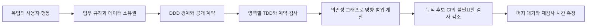
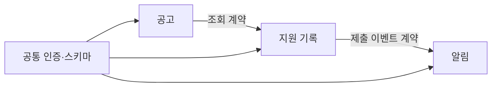
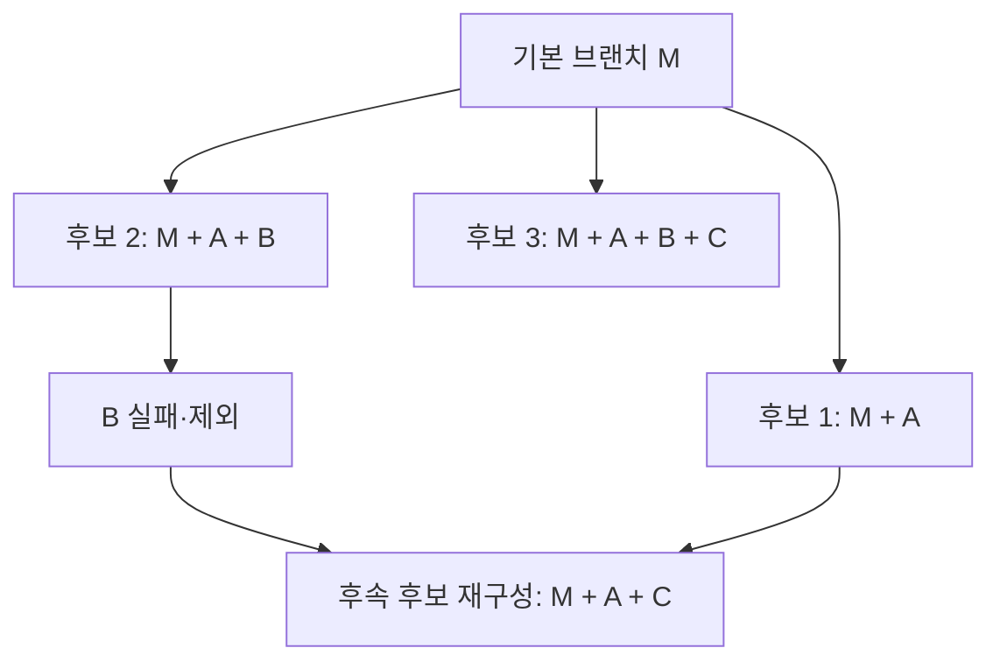

# 병렬 AI 개발: DDD·TDD로 머지트레인의 검사 범위를 줄입니다

AI 에이전트 여섯 개가 코드를 동시에 작성해도 검토와 통합이 한 줄로 밀리면 완성품은 빨리 나오지 않습니다. 이 부록에서는 **업무 경계와 계약을 분명히 하고, 영역별 행동을 테스트한 뒤, 누적 통합 후보에 영향을 받는 검사만 빠짐없이 고르는 방법**을 연습합니다. 기존 [CI/CD 최적화 부록](ci-cd-optimization.md)의 캐시·단계별 측정과 함께 읽으세요.

여기서 ApplyFlow는 공고·지원 기록·알림으로 확장한다고 가정한 **설계 연습**입니다. 현재 저장소의 ApplyFlow 데모가 아래 모듈 구조, 서버, 이벤트, 테스트 또는 머지큐를 구현했다는 뜻이 아닙니다. 설정도 운영 CI에 적용하지 않았습니다. 공식 문서 확인일은 2026-09-28입니다.

## 1. 에이전트 수와 PR 수를 같게 만들지 않습니다

에이전트는 작업자, 세션은 작업 맥락을 이어가는 실행 구간, 커밋은 변경 이력, PR은 함께 검토하고 통합할 변경 묶음입니다. 한 PR을 여러 세션·커밋으로 완성할 수 있고, 두 에이전트가 같은 PR의 코드와 테스트를 나누어 맡을 수도 있습니다. 에이전트를 늘릴 때마다 PR을 만들면 대기와 재검사가 구현 시간보다 커질 수 있습니다.

작은 PR은 줄 수가 적은 PR보다 **한 가지 행동을 설명하고 검증·되돌리기 쉬운 PR**입니다. 예를 들어 ‘중복 공고 저장을 거부합니다’는 규칙·호출부·테스트를 함께 담습니다. 테스트만 뒤 PR로 미루거나 API를 먼저 깨뜨린 뒤 소비자를 나중에 수정하면 각 PR이 안전하지 않습니다. 큰 계약 변경은 이전·새 형식을 함께 지원 → 소비자 전환 → 이전 형식 제거로 나누고 중간 상태도 동작하게 만듭니다.

WIP는 진행 중인 작업 수입니다. 팀의 출발 규칙으로 ‘검토 대기 PR은 최대 2개, 넘으면 새 구현보다 검토·수정 우선’을 시도할 수 있습니다. 숫자는 정답이 아니며 검토자 수와 실제 처리량에 맞춥니다. 대기 중 PR 수, 검토 시작까지 시간, 첫 성공 CI까지 시간, 큐 재실행 횟수를 함께 기록하세요.

### 중복·겹침·연관 이슈를 한 PR로 묶을지 판단합니다

아래는 GitHub의 추적 기능과 작은 변경 원칙을 바탕으로 한 **권장 작업 절차**입니다. 모든 팀에 통용되는 공식 표준은 아니며, 문제의 수용 조건과 출시 위험에 맞게 적용합니다. 먼저 다음 세 결정을 구분합니다.

| 결정 | 바꾸는 대상 | 완료의 의미 |
|---|---|---|
| 중복 이슈 정리 | 같은 문제를 추적할 대표 이슈 | 추적 창구를 정리한 것이며 버그 수정 완료는 아닙니다. |
| 여러 이슈를 해결하는 한 PR | 함께 검토·출시·되돌릴 코드와 테스트 | 포함한 각 이슈의 수용 조건을 충족해야 합니다. |
| 머지큐 배치·누적 후보 | 승인된 PR들을 검증하고 통합할 조합 | 이슈를 합치거나 서로 다른 PR을 하나로 만드는 작업은 아닙니다. |

#### 제목보다 재현 조건·원인·수용 조건을 비교합니다

| 관계 | 확인할 근거 | 추적과 PR 처리 |
|---|---|---|
| 완전 중복 | 같은 원인·행동이며 수용 조건도 동일합니다. | 대표 이슈로 고유 증거를 옮기고 중복 표시합니다. 같은 구현을 두 번 만들지 않습니다. |
| 부분 중첩 | 일부 조건만 같고 나머지 요구가 다릅니다. | 공통·고유 조건을 나누어 기록하고 미완료 조건을 보존합니다. 전체를 중복으로 닫지 않습니다. |
| 같은 원인, 다른 증상 | 재현·로그·실패 테스트로 같은 원인이 입증됩니다. | 이슈는 별도 유지할 수 있습니다. 하나의 수정으로 모두 충족하면 한 PR 후보입니다. |
| 선행 의존 | B가 A의 계약 또는 결과를 필요로 합니다. | 순서를 명시하고 호환 가능한 단계나 의존 PR로 나눕니다. |
| 단순 연관 | 같은 화면·도메인·파일이지만 별도로 완료할 수 있습니다. | 일반 참조로 연결하고 각각 독립 PR을 우선합니다. |
| 상위·하위 작업 | 하나의 목표를 여러 완료 단위로 나눕니다. | 상위 추적 이슈에서 자식의 진척을 모읍니다. 하나의 PR을 강제하지 않습니다. |

‘저장이 두 번 됩니다’라는 문장이 같아도 더블 클릭, 재시도, 동시 요청은 원인이 다를 수 있습니다. 유사도 검색은 후보를 찾는 보조 수단입니다. 증거가 없으면 **중복 의심·원인 미확인**으로 두고 조사합니다.

**대표 이슈(canonical issue)**는 같은 문제의 재현과 해결 조건을 모으는 기준입니다. 먼저 만들어졌다는 이유만으로 고르기보다 설명·증거·담당 상태가 명확한 이슈를 선택합니다. **상위 추적 이슈(umbrella/parent)**는 서로 다른 자식 작업의 전체 목표를 추적합니다. 대표 이슈를 상위 이슈처럼 써서 모든 연관 작업을 흡수하지 않습니다. GitHub의 하위 이슈는 작업 계층을 표현하는 기능입니다. [GitHub 하위 이슈](https://docs.github.com/en/issues/tracking-your-work-with-issues/using-issues/adding-sub-issues)

#### 분류 → 이관 → 구현 단위 결정 → 검증 순서로 진행합니다

1. 후보 이슈의 재현 환경·기대/실제 결과·수용 조건·기존 PR·담당자를 나란히 읽습니다.
2. 완전 중복이면 대표 이슈를 정하고 고유 로그·재현 입력·수용 조건·논의 링크를 이관합니다. 원문과 작성자 이력을 삭제하지 않습니다.
3. 이관을 확인한 뒤 원본에 `Duplicate of #201` 같은 댓글과 판단 이유·이관 위치를 남깁니다. 중복 표시 자체는 수정 완료나 자동 종료를 뜻하지 않습니다. 필요하면 **중복 정리 사유로** 닫되, 해결되었다고 기록하지 않습니다. GitHub의 중복 타임라인 표시에는 저장소 쓰기 권한이 필요합니다. [GitHub 중복 표시](https://docs.github.com/en/issues/tracking-your-work-with-issues/administering-issues/marking-issues-or-pull-requests-as-a-duplicate)
4. 남은 이슈는 아래 기준으로 한 PR, 독립 PR, 의존 PR을 선택하고 담당자와 경계를 기록합니다.
5. PR에 이슈별 수용 조건 → 변경 → 테스트 → 증거를 연결합니다. 머지 후에는 기본 브랜치 결과와 실제 종료 상태를 확인합니다.

| 한 PR로 묶기 적합한 경우 | 나누기 적합한 경우 |
|---|---|
| 같은 수정이 여러 증상을 해결하며 하나의 행동을 설명합니다. | 같은 파일을 만져도 서로 다른 기능·문제입니다. |
| 함께 검토·출시·롤백하는 것이 자연스럽고 변경 전체가 이해 가능합니다. | 독립 출시·롤백이 필요하거나 서로 다른 담당·승인 경로가 필요합니다. |
| 우선순위·보안/데이터 위험·배포 시점이 양립합니다. | 긴급 수정이 큰 기능을 기다리거나 변경이 여러 도메인에 넓게 퍼집니다. |
| 각 이슈의 수용 조건을 같은 후보에서 빠짐없이 검증할 수 있습니다. | 검사·검토 범위가 커져 실패 원인과 되돌릴 범위를 분리하기 어렵습니다. |

판단 기준은 **응집된 하나의 검토·출시·롤백 단위**입니다. 같은 도메인·파일, 같은 에이전트, PR 수 감소만으로 묶지 않습니다. 작은 변경은 이해·검토·롤백하기 쉬워야 한다는 원칙을 적용합니다. [Google의 작은 변경 지침](https://google.github.io/eng-practices/review/developer/small-cls.html)

#### 의존 PR은 중간 상태도 동작하도록 설계합니다

큰 변경은 A에서 구형·신형 계약을 함께 지원하고, B에서 소비자를 옮긴 뒤, C에서 구형 계약을 제거하는 방식으로 나눌 수 있습니다. 각 PR이 머지된 기본 브랜치는 실행·검증 가능해야 합니다. 깨진 A를 B가 고칠 예정이라는 이유로 먼저 넣지 않습니다.

의존 PR을 쌓는 방식(stacked PR)을 쓴다면 B의 base를 A 브랜치로 두어 차이를 검토할 수 있습니다. A가 머지되면 B의 base를 기본 브랜치로 바꾸고, 특히 squash/rebase로 커밋 이력이 달라졌다면 반영된 변경을 중복 적용하지 않도록 B의 이력을 정리합니다. 변경된 diff·충돌·base/head·검토 유효성을 확인하고 CI를 다시 실행합니다. 자동 retarget에만 의존하지 않습니다.

GitHub의 `blocked by`/`blocking` 의존 관계는 선행 작업을 표현합니다. 의존 관계나 라벨을 붙였다는 이유로 머지큐가 원하는 순서를 자동 강제한다고 가정하지 않습니다. 실제 브랜치 보호·큐 동작과 작업 순서를 별도로 확인합니다. [GitHub 이슈 의존 관계](https://docs.github.com/en/issues/tracking-your-work-with-issues/using-issues/creating-issue-dependencies)

#### 이미 여러 PR이 진행 중이면 먼저 작업을 보존합니다

- 통합 책임자 한 명과 남길 PR을 정하고, 관련 작업자에게 중복 구현을 멈출 범위를 공유합니다.
- 각 PR의 diff·커밋·실패/성공 테스트·리뷰 논의를 비교합니다. PR 제목만 보고 하나를 버리지 않습니다.
- 고유 코드·회귀 테스트·리뷰 결론·기여자 출처를 남길 PR에 이관합니다. 필요한 커밋만 선별 cherry-pick하거나 수정 사항을 옮기고, 중복 변경과 새 충돌을 확인합니다.
- 합친 후보에서 이슈별 수용 조건과 이관된 회귀 테스트의 검증을 마칩니다. 누락이 있으면 대체 완료로 처리하지 않습니다.
- 대체되는 PR에 남긴 PR·이관 내용·검증 근거를 연결하고 **대체되어 종료함(superseded)**을 명시한 뒤 닫습니다. 보존이 필요한 브랜치·커밋 링크와 기여 이력을 남깁니다.

검토하지 않은 force push로 다른 작업을 덮거나 브랜치를 무조건 삭제하지 않습니다. 필요한 이력 정리는 통합 책임자가 보존 상태와 공유 브랜치 영향을 확인한 후 수행합니다. 이 절차는 머지하지 않은 PR을 정리하는 것이며, 이미 머지된 변경은 별도의 후속 수정·되돌리기로 다룹니다.

#### 수용 조건을 매핑하고 종료 대상을 제한합니다

PR의 매핑 표에는 대표 이슈 외에 함께 해결할 이슈와 **부분 반영·미반영 조건**도 적습니다. 필수 조건을 새 이슈로 옮기기만 하고 원래 이슈를 완료로 닫지 않습니다. 범위를 재합의했다면 변경 이유·남은 조건·담당·연결을 명시하고, 이를 원래 요구의 구현 완료와 구분합니다. 상위 추적 이슈도 필수 자식이 남아 있으면 완료로 닫지 않습니다.

GitHub PR 본문의 종료 키워드는 기본 브랜치를 대상으로 할 때 해석됩니다. 여러 이슈를 모두 해결했다면 `Closes #201`과 `Closes #203`처럼 **이슈마다 키워드를 반복**합니다. 다른 브랜치에 머지한 것만으로 자동 종료되었다고 판단하지 않습니다. 머지 전 종료 대상과 기본 브랜치를 확인합니다. [GitHub PR과 이슈 연결](https://docs.github.com/en/issues/tracking-your-work-with-issues/using-issues/linking-a-pull-request-to-an-issue)

단순 연관·부분 반영은 본문의 `Related: #204` 같은 일반 참조로 남깁니다. 이 문구 자체는 자동 종료하지 않습니다. 반면 사이드바 **Development에서 수동 연결한 이슈는 머지 시 자동 종료될 수 있으므로** 무해한 연관 링크처럼 사용하지 않습니다. PR 본문뿐 아니라 사이드바 연결과 커밋 메시지의 종료 키워드도 확인합니다. [GitHub 연결과 자동 종료 조건](https://docs.github.com/en/issues/tracking-your-work-with-issues/using-issues/linking-a-pull-request-to-an-issue)

종료 직전에는 이슈의 역할별로 다음을 확인합니다.

| 대상 | 종료 전 확인 |
|---|---|
| 중복 원본 | 고유 증거 이관·활성 대표 링크·중복 정리 사유가 있습니다. |
| 구현 이슈 | 고유 수용 조건을 모두 검증했고, 해당 후보의 통합 결과를 확인합니다. |
| 부분 반영 이슈 | 남은 필수 조건이 있으므로 열어 두고 구현된 범위만 기록합니다. |
| 상위 추적 이슈 | 필수 자식과 상위 자체의 완료 조건이 모두 충족되어야 합니다. |

머지 후 되돌리면 수정이 사라진 이슈를 수동으로 다시 열어야 하는지 확인하고 상태·증거·재작업 링크를 맞춥니다. 자동 재개를 가정하지 않습니다. 중복으로 닫은 이슈는 계속 현재 활성 대표 이슈를 가리키도록 유지하고, 대표가 바뀌면 링크를 갱신합니다.

#### ApplyFlow 예시: 하나의 원인, 서로 다른 확인 조건

다음 번호와 테스트 이름은 **가상의 교육 예시**이며 실제 GitHub 이슈·PR 또는 구현된 테스트가 아닙니다. 조사 결과 공고 URL의 정규화 규칙 누락이 원인이라고 확인했다고 가정합니다.

| 이슈 | 재현·수용 조건 | 분류와 처리 |
|---|---|---|
| #201 | 앞뒤 공백이 있는 동일 URL을 다시 저장하면 거부해야 합니다. | 대표 이슈로 유지합니다. |
| #202 | #201과 같은 입력·행동이며 특정 브라우저 로그가 추가됩니다. | 로그와 출처를 #201에 이관하고 중복 정리로 닫습니다. |
| #203 | JSON 가져오기에서도 동일한 정규화 규칙으로 중복을 거부해야 합니다. | 같은 원인이지만 가져오기 고유 조건이 있어 별도 이슈로 유지합니다. |
| #204 | 저장 버튼 오류 안내 개선과 키보드 초점 복구를 요구합니다. | 오류 안내 일부만 겹칩니다. 초점 복구는 별도이며 부분 반영으로 열어 둡니다. |

#201·#203은 공통 정규화 규칙과 두 진입 경로의 회귀 검사를 한 PR에서 검토·출시·되돌릴 수 있다고 판단합니다. 기존 데이터 손상이나 별도 마이그레이션이 필요하다면 이 가정을 다시 검토합니다. #204의 초점 복구는 독립 작업이므로 이 PR의 종료 대상에 넣지 않습니다.

| 이슈·수용 조건 | 변경과 검증 계획 | 후보에서 확인할 증거·상태 |
|---|---|---|
| #201: 수동 저장의 동일 URL 거부 | 공통 정규화·저장 호출부, `save_duplicate_url` | 실행 SHA·테스트 결과 링크: 확인 전입니다. |
| #202: 추가 브라우저 재현 | #201의 회귀 입력에 이관, `save_browser_fixture` | 이관 위치·출처: 확인 전입니다. 중복 종료는 수정 증거가 아닙니다. |
| #203: 가져오기 중복 거부·기존 기록 보존 | 가져오기 호출부, `import_duplicate_preserves_records` | 실행 SHA·테스트 결과 링크: 확인 전입니다. |
| #204: 오류 안내 / 초점 복구 | 안내만 부분 반영, 초점 복구 미구현 | 안내 검사 필요 / 초점 조건 미충족입니다. 종료하지 않습니다. |

한 PR의 검사 범위는 **포함한 모든 변경의 영향 집합을 합친 범위**입니다. 대표 이슈의 수동 저장 검사만 돌리지 않고 가져오기·데이터 보존·관련 소비자와 계약도 확인합니다. 큐에 들어가면 이 PR에 앞선 PR들까지 포함한 누적 후보의 합집합을 다시 계산합니다. PR을 크게 합치면 영향 영역과 CI 재실행 범위가 오히려 커질 수 있으므로 PR 개수만으로 최적화를 평가하지 않습니다.

#### 복사해서 쓰는 최소 PR 서식

```text
목표: [함께 검토·출시·롤백할 행동]
통합 근거: [같은 원인의 증거, 우선순위·위험의 양립]
대표 이슈: [번호] / 중복 정리·이관: [번호와 증거 링크]
이슈 | 수용 조건 | 변경 | 테스트·후보 SHA·결과 | 완료/부분/미반영
[각 이슈의 고유 조건까지 한 줄씩 작성합니다.]
남은 필수 조건·담당: [번호·내용, 완료로 닫지 않습니다.]
의존 PR·대상 브랜치·머지 순서: [해당할 때 작성합니다.]
검사 범위: [전체 영향 합집합, 관련 계약·통합 검사]
출시·롤백 방법: [한 단위로 가능한 근거]
종료 대상: [수용 조건을 모두 확인한 이슈만 키워드로 작성합니다.]
Related: [단순 연관·부분 반영·상위 추적 이슈]
```

[워크북의 이슈 정리·PR 통합 서식](../docs/templates.md)에서 중복 정리 댓글과 이관 기록을 함께 복사할 수 있습니다. 예시 번호를 실제 PR에 그대로 붙이지 말고, 검증을 마친 종료 대상만 입력합니다.

**문제:** #201·#203을 함께 수정했지만 #203의 기존 기록 보존 검사는 실패했습니다. #202의 고유 로그는 아직 이관하지 않았고, #204는 안내 문구만 바뀌었습니다. (1) 무엇을 닫을 수 있습니까? (2) #203을 후속 이슈로 복사하고 이 PR을 완료 처리해도 됩니까? (3) #204를 Development로 연결해도 됩니까?

**해설:** (1) 현재 통합 후보는 필수 검증 실패로 머지할 수 없습니다. #202도 먼저 로그를 이관해야 중복 정리로 닫을 수 있습니다. #204는 미완료입니다. (2) 필수 조건을 옮기는 것만으로 완료가 되지 않습니다. 수정하거나 범위를 명시적으로 재합의하고 원래 조건의 미완료 상태를 보존합니다. 독립적으로 안전한 변경만 분리하려면 후보와 매핑을 다시 검증합니다. (3) 자동 종료될 수 있으므로 단순 연관은 본문의 일반 참조로 남깁니다.

이 연습은 2주차의 기존 선택 실습 5분 안에서 경계/TDD 연습을 **대체하여** 사용할 수 있습니다. 둘을 필수 과제로 추가하지 않으며 주차별 120분을 유지합니다.

## 2. DDD는 경계를, TDD는 행동의 피드백을 만듭니다

DDD는 **Domain-Driven Design, 도메인 주도 설계**입니다. 사용자의 업무 언어와 규칙을 모델에 반영하고, 같은 말이 일관된 의미를 가지는 범위인 bounded context를 구분합니다. 예를 들어 ‘상태’가 공고에서는 공개·마감, 지원 기록에서는 작성 중·제출·면접을 뜻할 수 있습니다. 모두를 하나의 상태 열거형으로 묶기 전에 서로 다른 규칙인지 확인합니다. [Fowler의 DDD 설명](https://martinfowler.com/bliki/DomainDrivenDesign.html), [Bounded Context](https://martinfowler.com/bliki/BoundedContext.html)

TDD는 **Test-Driven Development, 테스트 주도 개발**입니다. 작은 행동의 실패 테스트를 먼저 확인(Red)하고, 통과할 최소 구현을 작성(Green)한 뒤, 행동을 유지하며 구조를 정리(Refactor)하는 반복입니다. DDD가 업무를 이해하는 방법이라면 TDD는 그 규칙을 구현하며 짧게 피드백받는 방법입니다. [Fowler의 TDD 설명](https://martinfowler.com/bliki/TestDrivenDevelopment.html)



DDD를 도입하거나 폴더 이름만 나누면 자동으로 독립 검사가 가능해지는 것은 아닙니다. 다른 영역의 내부 파일 import를 제한하고, 데이터를 소유한 영역을 통해 수정하며, API·이벤트 의존성을 그래프에 기록해야 합니다. 테스트마다 독립 DB·픽스처를 쓰거나 외부 연동을 명시된 계약으로 대체해야 영역 검사도 따로 실행할 수 있습니다. 단위 테스트가 모두 통과해도 영역 사이의 실제 연결은 깨질 수 있으므로 계약·통합 검사가 필요합니다. 작은 프로젝트에서는 마이크로서비스 대신 한 프로그램 안의 모듈로 충분합니다.

### ApplyFlow의 경계를 가정해 봅니다

| 영역 | 소유하는 데이터와 규칙 | 다른 영역에 제공하는 계약 | 독립 검사와 경계 검사 |
|---|---|---|---|
| 공고 | 공고 ID·URL·마감일, 중복 URL 거부 | 공고 조회 응답, 존재 여부 | 중복 규칙 단위 검사 + 조회 응답 계약 |
| 지원 기록 | 공고 ID 참조·지원 단계, 허용된 단계 전환 | `ApplicationSubmitted` 이벤트 | 단계 전환 단위 검사 + 공고 조회 소비자 계약 |
| 알림 | 전송 예약·재시도·중복 전송 방지 | 지원 제출 이벤트 소비 | 가짜 전송기를 쓴 단위 검사 + 이벤트 소비자 계약 |

아래 화살표는 **공급자가 바뀌면 영향을 살펴볼 소비자 방향**입니다. 코드의 import 방향과 반대일 수 있습니다. 지원 기록이 공고 DB 테이블을 직접 고치거나 알림이 지원 내부 객체를 그대로 읽으면 이 경계는 지켜지지 않습니다.



### 작은 TDD 예: 이미 제출한 지원은 다시 제출할 수 없습니다

다음은 Python 표준 라이브러리로 실행할 수 있는 **독립 학습 예시**이며 데모 앱에 적용된 코드는 아닙니다. `transition_test.py` 파일에 저장합니다. 처음에는 함수가 항상 `"submitted"`를 반환하도록 놓고 `python3 transition_test.py`를 실행하세요. 첫 테스트는 통과하지만 이미 제출한 상태를 거부하는 테스트는 실패해야 합니다. 이어서 아래 구현으로 바꾸면 두 테스트가 통과합니다.

```python
import unittest


def submit(status):
    if status != "draft":
        raise ValueError("작성 중인 지원만 제출할 수 있습니다.")
    return "submitted"


class SubmissionTests(unittest.TestCase):
    def test_draft_can_be_submitted(self):
        self.assertEqual(submit("draft"), "submitted")

    def test_submitted_cannot_be_submitted_again(self):
        with self.assertRaises(ValueError):
            submit("submitted")


if __name__ == "__main__":
    unittest.main()
```

Refactor 단계에서는 중복이나 의미가 불분명한 이름이 실제로 생겼을 때 정리하고 같은 테스트를 다시 실행합니다. 이 두 테스트는 저장 성공이나 알림 전송을 입증하지 않습니다. 저장 후 발행되는 이벤트의 필드·버전, 소비자의 해석, 재전송 때 중복 방지까지 별도의 계약·통합 테스트로 확인해야 합니다.

## 3. 폴더 필터에서 의존성 그래프로 넘어갑니다

‘`jobs/`가 바뀌었으니 공고만 검사합니다’는 출발점일 뿐입니다. 조회 응답에서 필드 하나가 사라지면 지원 기록과 그 뒤의 알림도 영향을 받을 수 있습니다. 기본 규칙은 **변경 영역 + 전이적 소비자 + 관련 경계 계약 검사**입니다. 전이적 소비자는 직접 소비자뿐 아니라 그 결과를 이어받는 영역까지 포함합니다. Nx의 affected 기능도 Git 변경 파일과 프로젝트 의존성 그래프를 함께 사용합니다. 런타임 API·이벤트 관계는 자동 import 분석만으로 빠질 수 있으므로 명시적 의존성이나 별도 계약 목록이 필요합니다. [Nx affected 공식 설명](https://nx.dev/docs/features/ci-features/affected)

| 변경 | 이 설계 연습에서 선택할 검사 | 이유 |
|---|---|---|
| 알림 내부 문구 처리 | 알림 단위·관련 계약 검사 | 그래프상 뒤에 다른 소비자가 없다는 전제입니다. |
| 지원 단계 규칙 또는 제출 이벤트 | 지원 기록·알림, 연결 계약·관련 통합 검사 | 알림이 지원 이벤트의 소비자입니다. |
| 공고 조회 응답 | 공고·지원 기록·알림, 두 경계의 계약·관련 통합 검사 | 소비자 관계를 끝까지 따라갑니다. |
| 공통 인증·DB 스키마·lockfile·빌드/CI 설정 | 전체 필수 검사 | 여러 영역의 실행 조건이 함께 바뀔 수 있습니다. |
| 그래프 누락·소유자 불명·비교 SHA 누락 | 전체 필수 검사 또는 후보 차단 | ‘영향 없음’으로 추측하지 않습니다. |

경계를 나누어도 CI가 매번 전체 검사를 선택하면 검사량은 줄지 않습니다. 실제 CI의 대상 선택에 그래프를 연결해야 합니다. [Nx의 CI 낭비 줄이기](https://nx.dev/docs/kb/reduce-waste)

처음에는 소비자를 넓게 포함합니다. 계약이 유지된다는 증거와 신뢰할 수 있는 그래프가 쌓여야 더 줄일 수 있습니다. 그래프의 변경 자체, 파일 삭제·이동, 생성 코드, 공용 설정도 분석 입력입니다. 정상적인 문서 전용 변경을 제외하려면 문서가 빌드·코드 생성에 쓰이지 않는다는 규칙과 근거를 명시합니다.

### 무엇과 무엇을 비교하는지가 검사 범위를 결정합니다

영향 계산의 `base`는 비교 출발 커밋, `head`는 검증할 후보 커밋입니다. **실제로 체크아웃하여 테스트한 SHA를 별도로 기록**하세요. PR 원본 head와 플랫폼이 만든 합성 후보 SHA는 같지 않을 수 있습니다.

| 단계 | 비교와 실행 원칙 |
|---|---|
| PR | 최신 대상 브랜치를 반영한 검증 후보를 정하고 그 후보와 대응하는 base를 기록합니다. 원본 PR만 검사했다면 대상 브랜치와의 통합은 아직 미검증입니다. |
| 머지큐·트레인 | 플랫폼이 만든 누적 후보 head와 그 후보의 대상 브랜치 base를 비교하고 후보 head 자체를 검사합니다. 마지막 PR 파일 목록만 사용하지 않습니다. |
| 머지 후 | 실제 기본 브랜치 SHA를 확인합니다. 이전 성공 기준부터 놓친 변경이 없도록 비교 범위를 정하거나 전체 검사합니다. |

얕은 checkout 때문에 비교 커밋이 없으면 필요한 이력을 fetch하고 두 SHA가 실제 Git 객체로 존재하는지 확인합니다. 필요한 경우 전체 이력을 받아도 됩니다. 그래도 base를 확정하지 못하면 후보 head를 확보한 상태에서 전체 검사합니다. **테스트할 후보 head 자체가 없으면 작업을 실패시켜 차단**해야 합니다. 마지막 성공 기본 브랜치를 base로 쓰는 정책은 누락된 변경을 포함하도록 범위를 넓히되 후보와 같은 이력인지 확인해야 합니다.

아래는 구현 의도를 설명하는 **의사코드**입니다. 저장소에 이런 함수나 CI 스크립트가 이미 있다는 뜻이 아닙니다.

```text
후보 head를 확보하지 못함 → 필수 게이트 실패
base/head와 실제 checkout SHA를 기록
비교 이력 없음 → 필요한 이력을 fetch
그래프 불명 또는 공통 변경 또는 base 미확정 → 전체 필수 검사 선택
그 외 → 변경 영역 + 전이적 소비자 + 경계 계약·관련 통합 검사 선택
선택 목록과 선택 이유를 결과에 보관
선택한 검사를 실행
분석 실패, 테스트 실패, 취소, 예상하지 않은 누락 → 필수 게이트 실패
정상 분석과 모든 필수 결과를 확인한 경우에만 → 통과
```

## 4. 머지트레인은 앞 PR을 포함한 미래 상태를 검사합니다

기본 브랜치가 M일 때 A·B·C를 차례로 합친다고 가정합니다. 각 PR을 M에만 붙여 검사하면 모두 통과해도 A와 B를 함께 넣은 상태가 실패할 수 있습니다. 머지트레인은 순서대로 들어갈 누적 후보를 미리 검사합니다. GitLab은 이를 Merge Trains라고 부르며 Premium·Ultimate에서 제공합니다. GitHub의 Merge Queue도 최신 대상 브랜치와 큐 앞 변경을 반영한 후보 검증을 사용하지만 제품 설정·이벤트는 다릅니다. [GitLab Merge Trains](https://docs.gitlab.com/ci/pipelines/merge_trains/), [GitHub Merge Queue 관리](https://docs.github.com/en/repositories/configuring-branches-and-merges-in-your-repository/configuring-pull-request-merges/managing-a-merge-queue)



GitLab 예에서 A=공고 응답 변경, B=지원 단계 변경, C=알림 문구 변경이라면 후보 3의 영향 범위는 C만이 아니라 **A+B+C 전체**에서 구합니다. A 때문에 공고·지원·알림 검사가 모두 필요할 수 있습니다. B가 실패하여 빠지면 기존 후보 3의 성공 결과를 그대로 재사용할 수 없습니다. 새 후보 `M+A+C`를 만들고 다시 검사합니다. A가 이미 머지되었다면 새로운 기본 브랜치 `M′=M+A`를 바탕으로 C를 검사합니다. 삭제·재정렬로 후보 조합이 바뀌어도 해당 후보를 다시 검증해야 합니다. [GitLab 후보와 실패 처리](https://docs.gitlab.com/ci/pipelines/merge_trains/)

그러므로 검사 범위 축소는 트레인에 직접 도움이 됩니다. 경계가 실제로 분리되어 있다면 재구성된 후보에서도 불필요한 영역 검사를 줄일 수 있습니다. 반대로 여러 후보에 공통 라이브러리 변경이 계속 포함되면 전체 검사가 반복되어 절약이 작을 수 있습니다. 머지큐는 충돌 해결기나 검토 대체물이 아니며, 러너가 부족하거나 실패가 잦으면 대기가 늘 수도 있습니다.

### GitHub에 적용할 때 빠뜨리기 쉬운 설정

GitHub Merge Queue는 조직 소유 공개 저장소와 Enterprise Cloud 조직의 비공개 저장소에서 제공됩니다. 이용 가능 여부와 브랜치 보호·ruleset 설정은 적용 시 다시 확인하세요. Actions로 필수 검사를 보고한다면 `pull_request`만으로 부족하고 **`merge_group` 이벤트도 처리**해야 합니다. 아래는 **트리거 발췌이며 완성된 workflow가 아닙니다.** 실제 job·권한·checkout·범위 분석·필수 결과 집계는 별도로 구현하고 검증해야 합니다. [GitHub 공식 설정 안내](https://docs.github.com/en/repositories/configuring-branches-and-merges-in-your-repository/configuring-pull-request-merges/managing-a-merge-queue)

```yaml
on:
  pull_request:
  merge_group:
    types: [checks_requested]
```

- 필수 검사 workflow 전체를 `paths` 필터로 생략하면 필요한 상태가 보고되지 않아 큐가 기다릴 수 있습니다. 진입·분석·최종 게이트는 실행하고 내부 작업만 선택하는 구조를 검토하세요.
- 최종 게이트는 의존 작업이 실패해도 결과를 확인하도록 실행되어야 합니다. 그러나 ‘항상 실행’은 ‘항상 성공’이 아닙니다. 분석 성공, 선택 목록의 유효성, 필요한 결과의 성공을 확인하며 실패·취소·예상 밖 skip을 통과로 바꾸지 않습니다. 검사 대상 0건도 분석이 정상이며 허용된 제외 사유가 있을 때만 인정합니다.
- 같은 PR의 오래된 실행은 새 실행으로 대체할 수 있습니다. 하지만 모든 큐 후보를 같은 `concurrency` 그룹에 넣고 취소하면 서로 다른 후보가 서로의 필수 검사를 끊습니다. PR 번호와 큐 후보 식별자를 구분하고 배포 작업도 별도로 다룹니다.
- GitHub의 build concurrency는 동시 후보 빌드 수에 관계합니다. merge limits는 함께 머지할 PR 수의 제어이며 **여러 `merge_group` 빌드를 하나로 합치는 설정이 아닙니다.** ‘최대 3개’만 설정해 CI 비용이 3분의 1이 된다고 계산하지 않습니다. [GitHub 큐 설정의 의미](https://docs.github.com/en/repositories/configuring-branches-and-merges-in-your-repository/configuring-pull-request-merges/managing-a-merge-queue)

## 5. 빠른 PR 검사와 안전한 통합·전달을 함께 유지합니다

| 층 | 확인할 대상과 목적 | 생략하면 안 되는 점 |
|---|---|---|
| PR | 변경 영역·소비자·계약의 빠른 피드백, 정적 검사·관련 빌드 | 이미 알려진 영향 검사를 야간으로 미루지 않습니다. |
| 큐·트레인 | 최신 누적 후보의 영향 검사와 필요한 통합 시나리오 | PR 성공만으로 후보 성공을 대신하지 않습니다. |
| 머지 후 | 실제 기본 브랜치 결과·핵심 스모크, 예약/릴리스 전체 회귀 | 실패 시 배포 차단·복구하고 누락된 영향 규칙을 수정합니다. |
| CD | 검증된 아티팩트의 식별자·환경 설정·배포 후 핵심 동작 | CI 성공과 운영 사용자 흐름 성공을 구분합니다. |

머지할 때마다 CI가 반복되는 원인도 구분해야 합니다.

| 반복 원인 | 처리 방향 |
|---|---|
| 같은 PR 커밋에 `push`와 `pull_request`가 동등한 검사를 중복 실행 | 이벤트 설계로 불필요한 중복을 줄입니다. 이벤트 이름만 같거나 SHA만 같다는 이유로 검증 입력까지 같다고 가정하지 않습니다. |
| 대상 브랜치 또는 누적 후보가 변경됨 | 새 조합의 재검증이 필요합니다. 이전 PR 성공을 근거로 무조건 억제하지 않습니다. |
| 머지 후 기본 브랜치 `push`에서 CD·아티팩트 전달·스모크 실행 | PR 검사와 목적이 다릅니다. 동일한 전체 재빌드가 불필요한지는 검증 입력과 아티팩트 식별자가 정확히 일치한다는 증거를 확인한 뒤 판단합니다. |

예약 전체 회귀는 예상하지 못한 결합을 발견하는 안전망입니다. 배포 위험에 따라 전체 회귀를 출시 전에 요구할 수 있으며, 어떤 경우에도 알려진 위험을 의도적으로 뒤로 보내는 허가가 아닙니다. 영향 분석이 틀렸다면 먼저 해당 변경의 전체 검사로 복귀하고 그래프·계약 누락을 고칩니다.

| 프로젝트 수준 | 적절한 출발점 |
|---|---|
| 개인·PoC | 한두 개 전체 검사를 짧게 유지하고 TDD로 핵심 규칙을 연습합니다. 큐 운영 자체가 목표일 필요는 없습니다. |
| MVP | PR 대기가 실제 문제일 때 WIP 제한·경계 계약·영향 선택을 도입합니다. 큐 비용과 재실행을 관찰합니다. |
| 운영 서비스 | 경계 강제·그래프 정확성·필수 게이트·누적 후보·전체 회귀·배포 복구를 함께 검증합니다. |

## 6. 기다린 시간과 러너 사용량을 따로 계산합니다

아래는 제품 실측이나 성능 보장이 아닌 **교육용 가정**입니다. A·B·C 후보가 모두 성공하고 준비·큐 대기·머지 시간이 0이며 후보마다 러너 1개를 쓴다고 가정합니다. 실제 누적 후보의 영향 분석으로 각각 5·7·9분이 나왔다고 놓습니다. 이 값은 마지막 PR만의 검사 시간이 아닙니다.

| 방식 | 마지막 후보까지 벽시계 시간 | 총 러너 사용량 |
|---|---|---|
| 전체 검사 12분씩, 러너 1개 | 12 + 12 + 12 = 36분 | 36 러너·분 |
| 전체 검사 12분씩, 러너 3개 | 최대값 12분 | 36 러너·분 |
| 영향 검사 5·7·9분, 러너 1개 | 5 + 7 + 9 = 21분 | 21 러너·분 |
| 영향 검사 5·7·9분, 러너 3개 | 최대값 9분 | 21 러너·분 |

병렬화만 하면 이 예의 대기는 줄지만 러너·분은 줄지 않습니다. 범위 축소는 두 값을 함께 줄일 가능성이 있습니다. B가 실패해 C 후보를 다시 9분 검사하면 취소 시점까지의 낭비 시간과 새 9분을 더해야 합니다. 실제 비용은 러너 종류·과금 단위·준비 시간·캐시 전송·재시도에 따라 다릅니다. 개선 전후에는 같은 변경 유형에서 PR 대기, 후보 실행, 재실행, 머지 완료까지의 전체 시간과 러너 사용량을 나누어 비교하세요.

## 7. 수업 안에서 하나씩 연습합니다

전체 부록을 한 번에 구현하는 추가 과제가 아닙니다. 2주차에는 기존 목업·설계/구현 시간 중 5분, 3주차에는 기존 검증 실습 중 5분, 4주차에는 기존 회고 중 5분을 선택적으로 대체합니다. 매주 120분과 필수 완료 기준을 유지하며, 필수 기능이 늦으면 그 작업을 우선합니다.

**문제:** 위 ApplyFlow 그래프에서 A는 공고 조회 필드 변경, B는 지원 단계 변경, C는 알림 내부 문구 변경입니다. (1) C만 단독 변경할 때와 누적 후보 `M+A+B+C`의 검사 범위를 적어 보세요. (2) B가 빠졌을 때 무엇을 다시 검사할까요? (3) 공용 lockfile도 바뀌었다면 어떤 모드로 전환할까요? (4) 모든 큐 후보에 `ci-main`이라는 concurrency 그룹과 실행 취소를 적용하면 어떤 문제가 생길까요?

**해설:** (1) C 단독은 알림과 관련 계약을 검사합니다. 누적 후보는 A부터 소비자 관계를 따라 공고·지원·알림과 두 계약, 관련 통합 검사를 포함합니다. (2) 새 `M+A+C` 또는 A가 이미 머지된 `M′+C`의 base/head를 기록하고 그 새 후보 전체에서 영향 범위를 다시 구합니다. 이전 성공 표시를 복사하지 않습니다. (3) 이 수업의 보수적 정책에서는 전체 필수 검사로 전환합니다. (4) 서로 다른 후보의 실행을 취소해 필수 상태가 완료되지 않을 수 있습니다. 후보별로 구분해야 합니다.

### 내 프로젝트 워크시트

| 적을 항목 | 내 프로젝트의 답 |
|---|---|
| 한 PR이 완성할 사용자 행동과 되돌리는 단위 | [ ] |
| 진행·검토 대기 WIP 상한과 병목 관찰값 | [ ] |
| 업무 영역·데이터 소유자·공개 API/이벤트 | [ ] |
| 직접·전이적 소비자와 그래프에 없는 런타임 관계 | [ ] |
| 첫 Red 테스트·Green 결과·필요한 계약 검사 | [ ] |
| PR/큐의 base·head·실제 테스트 SHA 기록 위치 | [ ] |
| 전체 검사 전환 조건·분석 실패 시 차단 방법 | [ ] |
| 필수 게이트 이름·정상 0건과 실패/누락의 구분 | [ ] |
| 후보별 concurrency·러너 수·재실행 예산 | [ ] |
| PR/큐/머지 후/CD 검사와 전체 회귀 시점 | [ ] |
| 개선 전후 벽시계 시간·러너 사용량·실패율 | [ ] |

### 에이전트에게 복사할 프롬프트

```text
현재 저장소의 병렬 개발과 통합 대기를 진단해 주세요.
목표 수준: [개인/PoC/MVP/운영], 병목: [관찰값 또는 미측정], 예산: [시간/러너]

1. 업무 규칙·데이터 소유권·공개 계약을 읽고 실제 구현된 경계와 제안을 구분하세요.
   폴더 분리나 DDD라는 이름만으로 독립성이 확보되었다고 주장하지 마세요.
2. 영역별 TDD에 적합한 작은 행동 하나와 소비자 계약·통합 검사를 제안하세요.
3. 코드·런타임 의존성을 확인하고 변경 영역 + 전이적 소비자 + 관련 계약 검사를
   구하세요. 공통 코드·스키마·lockfile·CI 변경, 불명확한 그래프는 전체 검사로 돌리세요.
4. PR과 큐 후보를 구분하고 base/head/실제 테스트 SHA를 기록하세요.
   필요한 이력을 확보하고 후보 전체를 분석하세요. head를 확보하지 못하면 차단하세요.
5. 필수 게이트 누락·실패 은폐·서로 다른 후보의 concurrency 취소를 점검하세요.
   GitHub이면 merge_group 지원과 플랫폼 이용 조건도 확인하세요.
6. WIP 제한과 검토·롤백 가능한 PR 크기, PR/큐/머지 후/CD의 책임을 제안하세요.
   알려진 영향 검사를 야간 회귀로 미루지 마세요.
7. 벽시계 시간·러너 사용량·실패와 재실행을 구분하고 실측과 예상치를 분리하세요.

먼저 근거와 최소 변경안을 보고하세요. 현재 요청은 진단과 설계까지이며 운영 CI,
브랜치 보호, 배포 설정은 변경하지 마세요. 실제 도입 요청을 받으면 작은 범위부터
구현·검증하고, 그래프 오류와 검사 실패 시 전체 검사/차단이 작동하는 증거를 남기세요.
```

## 참고 자료와 확인 범위

2026-09-28에 아래 공식 제품 문서와 개념 설명을 확인했습니다. 제품 요금제·제약·설정은 변경될 수 있으므로 실제 적용 때 원문을 다시 확인하세요. ApplyFlow 경계·검사 정책·시간 계산은 이 교재의 설계 예시이며 공식 제품의 기본 설정 또는 이 저장소의 성능 측정값이 아닙니다.

- [Martin Fowler: Domain-Driven Design](https://martinfowler.com/bliki/DomainDrivenDesign.html)
- [Martin Fowler: Bounded Context](https://martinfowler.com/bliki/BoundedContext.html)
- [Martin Fowler: Test-Driven Development](https://martinfowler.com/bliki/TestDrivenDevelopment.html)
- [Nx: Run Only Tasks Affected by a PR](https://nx.dev/docs/features/ci-features/affected)
- [Nx: Reduce Wasted Time in CI](https://nx.dev/docs/kb/reduce-waste)
- [GitLab: Merge Trains](https://docs.gitlab.com/ci/pipelines/merge_trains/)
- [GitHub: Managing a Merge Queue](https://docs.github.com/en/repositories/configuring-branches-and-merges-in-your-repository/configuring-pull-request-merges/managing-a-merge-queue)
- [GitHub: Workflow syntax — filters and concurrency](https://docs.github.com/en/actions/reference/workflows-and-actions/workflow-syntax)
- [GitHub: Marking issues or pull requests as a duplicate](https://docs.github.com/en/issues/tracking-your-work-with-issues/administering-issues/marking-issues-or-pull-requests-as-a-duplicate)
- [GitHub: Linking a pull request to an issue](https://docs.github.com/en/issues/tracking-your-work-with-issues/using-issues/linking-a-pull-request-to-an-issue)
- [GitHub: Adding sub-issues](https://docs.github.com/en/issues/tracking-your-work-with-issues/using-issues/adding-sub-issues)
- [GitHub: Creating issue dependencies](https://docs.github.com/en/issues/tracking-your-work-with-issues/using-issues/creating-issue-dependencies)
- [Google Engineering Practices: Small CLs](https://google.github.io/eng-practices/review/developer/small-cls.html)
