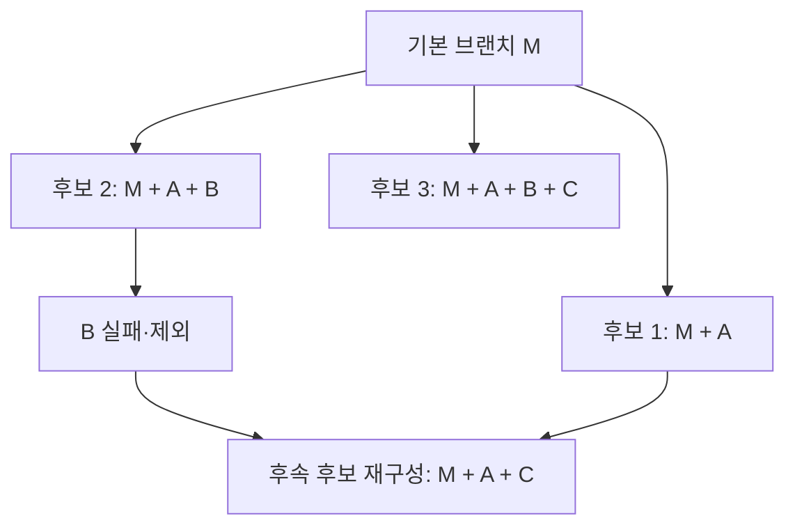

# 병렬 AI 개발: DDD·TDD로 머지트레인의 검사 범위를 줄입니다

AI 에이전트 여섯 개가 코드를 동시에 작성해도 검토와 통합이 한 줄로 밀리면 완성품은 빨리 나오지 않습니다. 이 부록에서는 **업무 경계와 계약을 분명히 하고, 영역별 행동을 테스트한 뒤, 누적 통합 후보에 영향을 받는 검사만 빠짐없이 고르는 방법**을 연습합니다. 기존 [CI/CD 최적화 부록](ci-cd-optimization.md)의 캐시·단계별 측정과 함께 읽으세요.

여기서 ApplyFlow는 공고·지원 기록·알림으로 확장한다고 가정한 **설계 연습**입니다. 현재 저장소의 ApplyFlow 데모가 아래 모듈 구조, 서버, 이벤트, 테스트 또는 머지큐를 구현했다는 뜻이 아닙니다. 설정도 운영 CI에 적용하지 않았습니다. 공식 문서 확인일은 2026-09-28입니다.

## 읽는 순서

이 주제는 세 단원으로 나뉩니다. 처음 읽는다면 아래 순서로 진행하세요.

1. [이슈·PR 관리](issue-pr-management.md): 중복·겹침·연관 이슈를 정리하고 원자적 검증·출시·롤백 경계로 PR을 묶거나 나눕니다.
2. [DDD·TDD와 테스트 경계](domain-testing.md): 업무 경계와 실제 의존성 격리, 영역별 TDD와 계약 검사가 선택 검사와 연결되는 조건을 연습합니다.
3. 이 단원: 의존성 그래프로 영향 범위를 계산하고 누적 후보를 검증하며 머지트레인·머지큐를 운영합니다.

## 이슈 정리와 PR 단위 (요약)

관련 이슈를 무조건 합치지 않습니다. 완전 중복은 대표 이슈로 고유 증거를 이관한 뒤 추적 창구만 정리하고, 부분 중첩·단순 연관은 고유 조건을 보존한 채 별도로 둡니다. 여러 이슈를 한 PR에 담는 기준은 **응집된 하나의 검토·출시·롤백 단위**이며, 각 이슈의 수용 조건을 같은 후보에서 빠짐없이 검증할 수 있어야 합니다. 분류 표·이관 절차·PR 서식·종료 규칙의 전체 내용은 [이슈·PR 관리](issue-pr-management.md)를 보세요.

## DDD·TDD와 검사 조건 (요약)

DDD의 경계는 선택 검사를 가능하게 하는 출발점이지, 그 자체로 독립 검사를 보장하지 않습니다. 다른 영역의 내부 접근을 제한하고 데이터를 소유 영역을 통해 수정하며, API·이벤트 의존성을 그래프에 기록해야 합니다. 영역별 TDD로 작은 규칙을 고정하고, 경계 사이의 약속은 계약·통합 검사로 확인합니다. 전이적 소비자 분석·전역 변경의 전체 검사 전환·누적 후보 검증과 이어지는 전체 내용은 [DDD·TDD 단원](domain-testing.md)과 아래 각 절을 보세요.

## 1. 폴더 필터에서 의존성 그래프로 넘어갑니다

‘`jobs/`가 바뀌었으니 공고만 검사합니다’는 출발점일 뿐입니다. 조회 응답에서 필드 하나가 사라지면 지원 기록과 그 뒤의 알림도 영향을 받을 수 있습니다. 기본 규칙은 **변경 영역 + 전이적 소비자 + 관련 경계 계약 검사**입니다. 전이적 소비자는 직접 소비자뿐 아니라 그 결과를 이어받는 영역까지 포함합니다. Nx의 affected 기능도 Git 변경 파일과 프로젝트 의존성 그래프를 함께 사용합니다. 런타임 API·이벤트 관계는 자동 import 분석만으로 빠질 수 있으므로 명시적 의존성이나 별도 계약 목록이 필요합니다. [Nx affected 공식 설명](https://nx.dev/docs/features/ci-features/affected)

| 변경 | 이 설계 연습에서 선택할 검사 | 이유 |
|---|---|---|
| 알림 내부 문구 처리 | 알림 단위·관련 계약 검사 | 그래프상 뒤에 다른 소비자가 없다는 전제입니다. |
| 지원 단계 규칙 또는 제출 이벤트 | 지원 기록·알림, 연결 계약·관련 통합 검사 | 알림이 지원 이벤트의 소비자입니다. |
| 공고 조회 응답 | 공고·지원 기록·알림, 두 경계의 계약·관련 통합 검사 | 소비자 관계를 끝까지 따라갑니다. |
| 공통 인증·DB 스키마·lockfile·빌드/CI 설정 | 전체 필수 검사 | 여러 영역의 실행 조건이 함께 바뀔 수 있습니다. |
| 그래프 누락·소유자 불명·비교 SHA 누락 | 전체 필수 검사 또는 후보 차단 | ‘영향 없음’으로 추측하지 않습니다. |

경계를 나누어도 CI가 매번 전체 검사를 선택하면 검사량은 줄지 않습니다. 실제 CI의 대상 선택에 그래프를 연결해야 합니다. [Nx의 CI 낭비 줄이기](https://nx.dev/docs/kb/reduce-waste)

처음에는 소비자를 넓게 포함합니다. 계약이 유지된다는 증거와 신뢰할 수 있는 그래프가 쌓여야 더 줄일 수 있습니다. 그래프의 변경 자체, 파일 삭제·이동, 생성 코드, 공용 설정도 분석 입력입니다. 정상적인 문서 전용 변경을 제외하려면 문서가 빌드·코드 생성에 쓰이지 않는다는 규칙과 근거를 명시합니다.

### 무엇과 무엇을 비교하는지가 검사 범위를 결정합니다

영향 계산의 `base`는 비교 출발 커밋, `head`는 검증할 후보 커밋입니다. **실제로 체크아웃하여 테스트한 SHA를 별도로 기록**하세요. PR 원본 head와 플랫폼이 만든 합성 후보 SHA는 같지 않을 수 있습니다.

| 단계 | 비교와 실행 원칙 |
|---|---|
| PR | 최신 대상 브랜치를 반영한 검증 후보를 정하고 그 후보와 대응하는 base를 기록합니다. 원본 PR만 검사했다면 대상 브랜치와의 통합은 아직 미검증입니다. |
| 머지큐·트레인 | 플랫폼이 만든 누적 후보 head와 그 후보의 대상 브랜치 base를 비교하고 후보 head 자체를 검사합니다. 마지막 PR 파일 목록만 사용하지 않습니다. |
| 머지 후 | 실제 기본 브랜치 SHA를 확인합니다. 이전 성공 기준부터 놓친 변경이 없도록 비교 범위를 정하거나 전체 검사합니다. |

얕은 checkout 때문에 비교 커밋이 없으면 필요한 이력을 fetch하고 두 SHA가 실제 Git 객체로 존재하는지 확인합니다. 필요한 경우 전체 이력을 받아도 됩니다. 그래도 base를 확정하지 못하면 후보 head를 확보한 상태에서 전체 검사합니다. **테스트할 후보 head 자체가 없으면 작업을 실패시켜 차단**해야 합니다. 마지막 성공 기본 브랜치를 base로 쓰는 정책은 누락된 변경을 포함하도록 범위를 넓히되 후보와 같은 이력인지 확인해야 합니다.

아래는 구현 의도를 설명하는 **의사코드**입니다. 저장소에 이런 함수나 CI 스크립트가 이미 있다는 뜻이 아닙니다.

```text
후보 head를 확보하지 못함 → 필수 게이트 실패
base/head와 실제 checkout SHA를 기록
비교 이력 없음 → 필요한 이력을 fetch
그래프 불명 또는 공통 변경 또는 base 미확정 → 전체 필수 검사 선택
그 외 → 변경 영역 + 전이적 소비자 + 경계 계약·관련 통합 검사 선택
선택 목록과 선택 이유를 결과에 보관
선택한 검사를 실행
분석 실패, 테스트 실패, 취소, 예상하지 않은 누락 → 필수 게이트 실패
정상 분석과 모든 필수 결과를 확인한 경우에만 → 통과
```

## 2. 머지트레인은 앞 PR을 포함한 미래 상태를 검사합니다

기본 브랜치가 M일 때 A·B·C를 차례로 합친다고 가정합니다. 각 PR을 M에만 붙여 검사하면 모두 통과해도 A와 B를 함께 넣은 상태가 실패할 수 있습니다. 머지트레인은 순서대로 들어갈 누적 후보를 미리 검사합니다. GitLab은 이를 Merge Trains라고 부르며 Premium·Ultimate에서 제공합니다. GitHub의 Merge Queue도 최신 대상 브랜치와 큐 앞 변경을 반영한 후보 검증을 사용하지만 제품 설정·이벤트는 다릅니다. [GitLab Merge Trains](https://docs.gitlab.com/ci/pipelines/merge_trains/), [GitHub Merge Queue 관리](https://docs.github.com/en/repositories/configuring-branches-and-merges-in-your-repository/configuring-pull-request-merges/managing-a-merge-queue)



GitLab 예에서 A=공고 응답 변경, B=지원 단계 변경, C=알림 문구 변경이라면 후보 3의 영향 범위는 C만이 아니라 **A+B+C 전체**에서 구합니다. A 때문에 공고·지원·알림 검사가 모두 필요할 수 있습니다. B가 실패하여 빠지면 기존 후보 3의 성공 결과를 그대로 재사용할 수 없습니다. 새 후보 `M+A+C`를 만들고 다시 검사합니다. A가 이미 머지되었다면 새로운 기본 브랜치 `M′=M+A`를 바탕으로 C를 검사합니다. 삭제·재정렬로 후보 조합이 바뀌어도 해당 후보를 다시 검증해야 합니다. [GitLab 후보와 실패 처리](https://docs.gitlab.com/ci/pipelines/merge_trains/)

그러므로 검사 범위 축소는 트레인에 직접 도움이 됩니다. 경계가 실제로 분리되어 있다면 재구성된 후보에서도 불필요한 영역 검사를 줄일 수 있습니다. 반대로 여러 후보에 공통 라이브러리 변경이 계속 포함되면 전체 검사가 반복되어 절약이 작을 수 있습니다. 머지큐는 충돌 해결기나 검토 대체물이 아니며, 러너가 부족하거나 실패가 잦으면 대기가 늘 수도 있습니다.

### GitHub에 적용할 때 빠뜨리기 쉬운 설정

GitHub Merge Queue는 조직 소유 공개 저장소와 Enterprise Cloud 조직의 비공개 저장소에서 제공됩니다. 이용 가능 여부와 브랜치 보호·ruleset 설정은 적용 시 다시 확인하세요. Actions로 필수 검사를 보고한다면 `pull_request`만으로 부족하고 **`merge_group` 이벤트도 처리**해야 합니다. 아래는 **트리거 발췌이며 완성된 workflow가 아닙니다.** 실제 job·권한·checkout·범위 분석·필수 결과 집계는 별도로 구현하고 검증해야 합니다. [GitHub 공식 설정 안내](https://docs.github.com/en/repositories/configuring-branches-and-merges-in-your-repository/configuring-pull-request-merges/managing-a-merge-queue)

```yaml
on:
  pull_request:
  merge_group:
    types: [checks_requested]
```

- 필수 검사 workflow 전체를 `paths` 필터로 생략하면 필요한 상태가 보고되지 않아 큐가 기다릴 수 있습니다. 진입·분석·최종 게이트는 실행하고 내부 작업만 선택하는 구조를 검토하세요.
- 최종 게이트는 의존 작업이 실패해도 결과를 확인하도록 실행되어야 합니다. 그러나 ‘항상 실행’은 ‘항상 성공’이 아닙니다. 분석 성공, 선택 목록의 유효성, 필요한 결과의 성공을 확인하며 실패·취소·예상 밖 skip을 통과로 바꾸지 않습니다. 검사 대상 0건도 분석이 정상이며 허용된 제외 사유가 있을 때만 인정합니다.
- 같은 PR의 오래된 실행은 새 실행으로 대체할 수 있습니다. 하지만 모든 큐 후보를 같은 `concurrency` 그룹에 넣고 취소하면 서로 다른 후보가 서로의 필수 검사를 끊습니다. PR 번호와 큐 후보 식별자를 구분하고 배포 작업도 별도로 다룹니다.
- GitHub의 build concurrency는 동시 후보 빌드 수에 관계합니다. merge limits는 함께 머지할 PR 수의 제어이며 **여러 `merge_group` 빌드를 하나로 합치는 설정이 아닙니다.** ‘최대 3개’만 설정해 CI 비용이 3분의 1이 된다고 계산하지 않습니다. [GitHub 큐 설정의 의미](https://docs.github.com/en/repositories/configuring-branches-and-merges-in-your-repository/configuring-pull-request-merges/managing-a-merge-queue)

## 3. 빠른 PR 검사와 안전한 통합·전달을 함께 유지합니다

| 층 | 확인할 대상과 목적 | 생략하면 안 되는 점 |
|---|---|---|
| PR | 변경 영역·소비자·계약의 빠른 피드백, 정적 검사·관련 빌드 | 이미 알려진 영향 검사를 야간으로 미루지 않습니다. |
| 큐·트레인 | 최신 누적 후보의 영향 검사와 필요한 통합 시나리오 | PR 성공만으로 후보 성공을 대신하지 않습니다. |
| 머지 후 | 실제 기본 브랜치 결과·핵심 스모크, 예약/릴리스 전체 회귀 | 실패 시 배포 차단·복구하고 누락된 영향 규칙을 수정합니다. |
| CD | 검증된 아티팩트의 식별자·환경 설정·배포 후 핵심 동작 | CI 성공과 운영 사용자 흐름 성공을 구분합니다. |

머지할 때마다 CI가 반복되는 원인도 구분해야 합니다.

| 반복 원인 | 처리 방향 |
|---|---|
| 같은 PR 커밋에 `push`와 `pull_request`가 동등한 검사를 중복 실행 | 이벤트 설계로 불필요한 중복을 줄입니다. 이벤트 이름만 같거나 SHA만 같다는 이유로 검증 입력까지 같다고 가정하지 않습니다. |
| 대상 브랜치 또는 누적 후보가 변경됨 | 새 조합의 재검증이 필요합니다. 이전 PR 성공을 근거로 무조건 억제하지 않습니다. |
| 머지 후 기본 브랜치 `push`에서 CD·아티팩트 전달·스모크 실행 | PR 검사와 목적이 다릅니다. 동일한 전체 재빌드가 불필요한지는 검증 입력과 아티팩트 식별자가 정확히 일치한다는 증거를 확인한 뒤 판단합니다. |

예약 전체 회귀는 예상하지 못한 결합을 발견하는 안전망입니다. 배포 위험에 따라 전체 회귀를 출시 전에 요구할 수 있으며, 어떤 경우에도 알려진 위험을 의도적으로 뒤로 보내는 허가가 아닙니다. 영향 분석이 틀렸다면 먼저 해당 변경의 전체 검사로 복귀하고 그래프·계약 누락을 고칩니다.

| 프로젝트 수준 | 적절한 출발점 |
|---|---|
| 개인·PoC | 한두 개 전체 검사를 짧게 유지하고 TDD로 핵심 규칙을 연습합니다. 큐 운영 자체가 목표일 필요는 없습니다. |
| MVP | PR 대기가 실제 문제일 때 WIP 제한·경계 계약·영향 선택을 도입합니다. 큐 비용과 재실행을 관찰합니다. |
| 운영 서비스 | 경계 강제·그래프 정확성·필수 게이트·누적 후보·전체 회귀·배포 복구를 함께 검증합니다. |

## 4. 기다린 시간과 러너 사용량을 따로 계산합니다

아래는 제품 실측이나 성능 보장이 아닌 **교육용 가정**입니다. A·B·C 후보가 모두 성공하고 준비·큐 대기·머지 시간이 0이며 후보마다 러너 1개를 쓴다고 가정합니다. 실제 누적 후보의 영향 분석으로 각각 5·7·9분이 나왔다고 놓습니다. 이 값은 마지막 PR만의 검사 시간이 아닙니다.

| 방식 | 마지막 후보까지 벽시계 시간 | 총 러너 사용량 |
|---|---|---|
| 전체 검사 12분씩, 러너 1개 | 12 + 12 + 12 = 36분 | 36 러너·분 |
| 전체 검사 12분씩, 러너 3개 | 최대값 12분 | 36 러너·분 |
| 영향 검사 5·7·9분, 러너 1개 | 5 + 7 + 9 = 21분 | 21 러너·분 |
| 영향 검사 5·7·9분, 러너 3개 | 최대값 9분 | 21 러너·분 |

병렬화만 하면 이 예의 대기는 줄지만 러너·분은 줄지 않습니다. 범위 축소는 두 값을 함께 줄일 가능성이 있습니다. B가 실패해 C 후보를 다시 9분 검사하면 취소 시점까지의 낭비 시간과 새 9분을 더해야 합니다. 실제 비용은 러너 종류·과금 단위·준비 시간·캐시 전송·재시도에 따라 다릅니다. 개선 전후에는 같은 변경 유형에서 PR 대기, 후보 실행, 재실행, 머지 완료까지의 전체 시간과 러너 사용량을 나누어 비교하세요.

## 5. 수업 안에서 하나씩 연습합니다

전체 부록을 한 번에 구현하는 추가 과제가 아닙니다. 2주차의 두 선택 실습(이슈 분류·경계/TDD)은 [이슈·PR 관리](issue-pr-management.md)와 [DDD·TDD 단원](domain-testing.md)에서, 3주차에는 기존 검증 실습 중 5분, 4주차에는 기존 회고 중 5분을 이 단원에서 선택적으로 대체합니다. 매주 120분과 필수 완료 기준을 유지하며, 필수 기능이 늦으면 그 작업을 우선합니다.

**문제:** [DDD·TDD 단원](domain-testing.md)의 ApplyFlow 그래프에서 A는 공고 조회 필드 변경, B는 지원 단계 변경, C는 알림 내부 문구 변경입니다(공급자→소비자 방향: 공고 → 지원 기록 → 알림). (1) C만 단독 변경할 때와 누적 후보 `M+A+B+C`의 검사 범위를 적어 보세요. (2) B가 빠졌을 때 무엇을 다시 검사할까요? (3) 공용 lockfile도 바뀌었다면 어떤 모드로 전환할까요? (4) 모든 큐 후보에 `ci-main`이라는 concurrency 그룹과 실행 취소를 적용하면 어떤 문제가 생길까요?

**해설:** (1) C 단독은 알림과 관련 계약을 검사합니다. 누적 후보는 A부터 소비자 관계를 따라 공고·지원·알림과 두 계약, 관련 통합 검사를 포함합니다. (2) 새 `M+A+C` 또는 A가 이미 머지된 `M′+C`의 base/head를 기록하고 그 새 후보 전체에서 영향 범위를 다시 구합니다. 이전 성공 표시를 복사하지 않습니다. (3) 이 수업의 보수적 정책에서는 전체 필수 검사로 전환합니다. (4) 서로 다른 후보의 실행을 취소해 필수 상태가 완료되지 않을 수 있습니다. 후보별로 구분해야 합니다.

### 내 프로젝트 워크시트

| 적을 항목 | 내 프로젝트의 답 |
|---|---|
| 한 PR이 완성할 사용자 행동과 되돌리는 단위 | [ ] |
| 진행·검토 대기 WIP 상한과 병목 관찰값 | [ ] |
| 업무 영역·데이터 소유자·공개 API/이벤트 | [ ] |
| 직접·전이적 소비자와 그래프에 없는 런타임 관계 | [ ] |
| 첫 Red 테스트·Green 결과·필요한 계약 검사 | [ ] |
| PR/큐의 base·head·실제 테스트 SHA 기록 위치 | [ ] |
| 전체 검사 전환 조건·분석 실패 시 차단 방법 | [ ] |
| 필수 게이트 이름·정상 0건과 실패/누락의 구분 | [ ] |
| 후보별 concurrency·러너 수·재실행 예산 | [ ] |
| PR/큐/머지 후/CD 검사와 전체 회귀 시점 | [ ] |
| 개선 전후 벽시계 시간·러너 사용량·실패율 | [ ] |

위 항목 중 PR 단위 행은 [이슈·PR 관리](issue-pr-management.md), 경계·테스트 행은 [DDD·TDD 단원](domain-testing.md)을 참고해 작성하세요.

### 에이전트에게 복사할 프롬프트

```text
현재 저장소의 병렬 개발과 통합 대기를 진단해 주세요.
목표 수준: [개인/PoC/MVP/운영], 병목: [관찰값 또는 미측정], 예산: [시간/러너]

1. 업무 규칙·데이터 소유권·공개 계약을 읽고 실제 구현된 경계와 제안을 구분하세요.
   폴더 분리나 DDD라는 이름만으로 독립성이 확보되었다고 주장하지 마세요.
2. 영역별 TDD에 적합한 작은 행동 하나와 소비자 계약·통합 검사를 제안하세요.
3. 코드·런타임 의존성을 확인하고 변경 영역 + 전이적 소비자 + 관련 계약 검사를
   구하세요. 공통 코드·스키마·lockfile·CI 변경, 불명확한 그래프는 전체 검사로 돌리세요.
4. PR과 큐 후보를 구분하고 base/head/실제 테스트 SHA를 기록하세요.
   필요한 이력을 확보하고 후보 전체를 분석하세요. head를 확보하지 못하면 차단하세요.
5. 필수 게이트 누락·실패 은폐·서로 다른 후보의 concurrency 취소를 점검하세요.
   GitHub이면 merge_group 지원과 플랫폼 이용 조건도 확인하세요.
6. WIP 제한과 검토·롤백 가능한 PR 크기, PR/큐/머지 후/CD의 책임을 제안하세요.
   알려진 영향 검사를 야간 회귀로 미루지 마세요.
7. 벽시계 시간·러너 사용량·실패와 재실행을 구분하고 실측과 예상치를 분리하세요.

먼저 근거와 최소 변경안을 보고하세요. 현재 요청은 진단과 설계까지이며 운영 CI,
브랜치 보호, 배포 설정은 변경하지 마세요. 실제 도입 요청을 받으면 작은 범위부터
구현·검증하고, 그래프 오류와 검사 실패 시 전체 검사/차단이 작동하는 증거를 남기세요.
```

## 참고 자료와 확인 범위

2026-09-28에 아래 공식 제품 문서와 개념 설명을 확인했습니다. 제품 요금제·제약·설정은 변경될 수 있으므로 실제 적용 때 원문을 다시 확인하세요. ApplyFlow 경계·검사 정책·시간 계산은 이 교재의 설계 예시이며 공식 제품의 기본 설정 또는 이 저장소의 성능 측정값이 아닙니다.

- [Martin Fowler: Domain-Driven Design](https://martinfowler.com/bliki/DomainDrivenDesign.html)
- [Martin Fowler: Bounded Context](https://martinfowler.com/bliki/BoundedContext.html)
- [Martin Fowler: Test-Driven Development](https://martinfowler.com/bliki/TestDrivenDevelopment.html)
- [Nx: Run Only Tasks Affected by a PR](https://nx.dev/docs/features/ci-features/affected)
- [Nx: Reduce Wasted Time in CI](https://nx.dev/docs/kb/reduce-waste)
- [GitLab: Merge Trains](https://docs.gitlab.com/ci/pipelines/merge_trains/)
- [GitHub: Managing a Merge Queue](https://docs.github.com/en/repositories/configuring-branches-and-merges-in-your-repository/configuring-pull-request-merges/managing-a-merge-queue)
- [GitHub: Workflow syntax — filters and concurrency](https://docs.github.com/en/actions/reference/workflows-and-actions/workflow-syntax)
- [GitHub: Marking issues or pull requests as a duplicate](https://docs.github.com/en/issues/tracking-your-work-with-issues/administering-issues/marking-issues-or-pull-requests-as-a-duplicate)
- [GitHub: Linking a pull request to an issue](https://docs.github.com/en/issues/tracking-your-work-with-issues/using-issues/linking-a-pull-request-to-an-issue)
- [GitHub: Adding sub-issues](https://docs.github.com/en/issues/tracking-your-work-with-issues/using-issues/adding-sub-issues)
- [GitHub: Creating issue dependencies](https://docs.github.com/en/issues/tracking-your-work-with-issues/using-issues/creating-issue-dependencies)
- [Google Engineering Practices: Small CLs](https://google.github.io/eng-practices/review/developer/small-cls.html)
