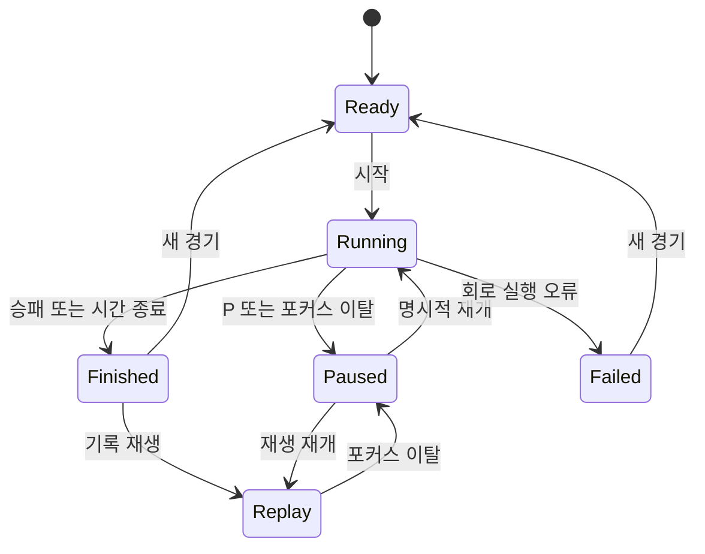

# 업데이트 사례 · 클릭형 실험을 실시간 게임으로

첫 구현이 동작해도 사용 경험은 개선할 수 있습니다. FlyBlock의 초기 버전은 열과 방향을 고르고 ‘놓기’를 누르는 라운드 실험이었습니다. 사용자는 “인터페이스가 불편하니 키보드와 실시간성을 부여해 달라”고 요청했습니다.

**[최신 게임 실행](https://themagictower.github.io/korean-ai-dev-course/projects/flyblock/)** · **[실제 수정 프롬프트·응답·시간·전후 화면](https://themagictower.github.io/korean-ai-dev-course/projects/flyblock/updates/keyboard-realtime-01/)**

## 불편을 구현 계약으로 바꾸기

“게임처럼 만들어 주세요”를 그대로 넘기면 무엇이 완성인지 알기 어렵습니다. 사용자가 하고 싶은 행동과 관찰 가능한 결과로 바꿉니다.

| 상황 | 기대하는 경험 | 확인할 증거 |
|---|---|---|
| 게임 시작 | 블록이 자동으로 내려오고 상대도 움직임 | 입력 없이 두 보드 진행 |
| 떨어지는 블록 조작 | ←/→ 이동, ↑ 회전, ↓ 빠른 낙하, Space 즉시 낙하 | 벽·충돌·착지와 실제 키보드 확인 |
| 잠깐 다른 창 보기 | 경기가 멈추고 복귀 후 직접 재개 | 포커스 이탈 후 시간 정지 |
| 같은 경기 다시 보기 | 같은 시드와 입력으로 같은 결과 | 틱별 기록의 결정적 재생 |
| 휴대폰에서 실행 | 화면 버튼으로 같은 조작 | 좁은 화면 배치와 터치 버튼 |

단순한 단축키 추가가 아닙니다. 두 보드가 서로 다른 시점에 잠기므로 상대에게 보내는 방해 블록, 종료 조건, 재생 기록의 의미까지 다시 정의해야 합니다. 이번 계약은 고정 틱·독립 낙하·다음 잠금 시 공격 반영을 선택했습니다. 정확한 규칙은 [업데이트 계약 원문](https://themagictower.github.io/korean-ai-dev-course/projects/flyblock/updates/keyboard-realtime-01/README.md)을 확인하세요.

## 상태와 실행을 나누기



경기 진행에서는 고정된 게임 규칙으로 상태를 갱신합니다. Jev는 개발 작업의 복잡도를 분류하는 데 사용했습니다. 매 프레임 네트워크 모델로 게임 상태를 판정하지 않습니다. 상태머신을 어디에 적용하고, 어떤 판단을 모델에 맡길지 구분하는 사례입니다.

## 업데이트와 디버깅을 구분하기

이번 최초 요청은 사용성 **업데이트**입니다. 기존 계약을 지키던 프로그램에 새로운 계약을 추가합니다. 변경 후 “시드 입력 중 Space를 누르면 블록이 떨어진다” 같은 현상이 실제로 재현되면 그때 **버그 수정**으로 기록합니다. 발견하지 않은 오류를 디버깅 실적으로 만들지 않습니다.

이번 검증에서는 실제로 다른 문제가 발견됐습니다. 기존 테스트를 다시 실행하면 최초 `evidence/evaluation.json`을 덮어써, 과거 측정이 새 측정처럼 바뀌었습니다. 테스트의 기본 파일 쓰기를 제거하고 명시한 별도 출력 경로에만 기록하도록 수정했으며, 최초 파일은 기준 커밋에서 복원하고 새 측정도 업데이트 폴더에 보존했습니다. 반면 동시 종료 검사의 첫 실패는 시험 보드 높이를 잘못 잡은 fixture 오류였으므로 게임 로직 결함과 구분했습니다. 명령과 실패·재실행 결과는 보고서의 `tests.txt` 원문에 있습니다.

다음 문장은 수강생용 **디버그 프롬프트 서식**이며, 실제로 발생했다고 주장하는 기록이 아닙니다.

```text
재현 환경, 입력 순서, 기대 결과, 실제 결과를 먼저 정리하세요.
가장 작은 재현 검사를 만든 뒤 입력 처리/시간 진행/상태 전이 중
어느 경계가 계약을 어겼는지 확인하고 수정하세요.
수정한 경계와 인접한 회귀 검사 결과를 기록하세요.
기존 성공 증거를 지우지 말고 추가 실행 시각을 남기세요.
```

## 시간 기록도 버전이 있습니다

최초 제작 시간은 그대로 두고, 이번 개선의 관찰 시작→인계→로컬 검증→첫 공개 확인을 별도로 측정합니다. 보고 사이의 경과에는 조사·검사·대기가 섞여 있으므로 ‘순수 구현 시간’이라고 부르지 않습니다. 전후 화면은 실제 브라우저 캡처이며, 원문 프롬프트와 공개 응답은 별도 기록에 있습니다.

기존 40경기 기준선은 **이전 라운드 규칙**의 결과입니다. 새로운 실시간 게임의 승률로 옮겨 쓰지 않습니다. 또한 실제 연결지도의 부분회로를 사용하지만 인간이 설계한 입출력과 단순화된 시뮬레이터이므로, 초파리 전체 뇌가 게임을 이해한다고 해석하지 않습니다.

수강생은 자기 프로젝트에서 하나의 불편을 골라 같은 흐름으로 개선하세요. 완료 기준은 ‘변경 후 사용자가 할 수 있는 행동’, ‘확인 증거’, ‘변경 비용’의 세 가지입니다.
