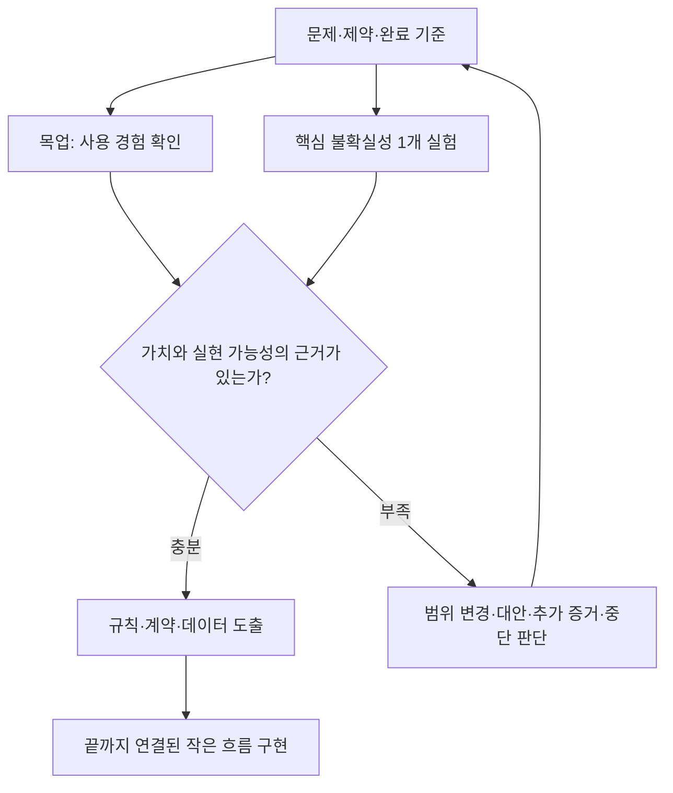

# 필요한 만큼만 엄격한 AI 개발 프로세스

2026-09-23 · 사용자와 합의한 고도화 방향 · 실제 자동화 구현과는 구분합니다.

18단계의 사고 흐름은 유지하되 프로젝트마다 적용할 절차를 선택합니다. 좋은 프로세스는 문서 개수보다 실제 사용까지의 재작업을 줄입니다. 아래 취업 준비 서비스 사례는 가상의 교육 예시입니다.

## 1. 시작할 때 절차의 깊이를 정합니다

사용 범위(개인·팀·외부)와 제품 단계(PoC·MVP·운영)를 별도로 기록하고 실제 위험을 확인합니다. 개인용과 PoC를 하나의 등급 사다리로 취급하지 않습니다.

| 계약 | 필요한 기본 증거 | 기본적으로 강제하지 않는 형식 | 다시 판단할 조건 |
|---|---|---|---|
| 격리 PoC | 가설·실험 입력·결과·진행/중단 판정 | 로그인·운영 배포·다층 작업 계층 | 실제 고객 데이터·외부 부작용이 생김 |
| 개인용 완성품 | 핵심 흐름·필요한 저장·재실행·사용법 | 조직 관리·서버·복잡한 CI/CD | 공유 사용·원본 삭제·비용 발생 |
| 제한 사용자 MVP | 실제 사용자 문제 해결·접근 경계·대표 실패·피드백 | 대규모 확장·항상 가동하는 자동 에이전트 | 사용자·데이터·장애 영향 증가 |
| 운영 서비스 | 위 증거와 위험에 맞는 복구·관찰·운영 책임 | 업무와 무관한 일률적 인프라 | 계약·보안·규모·규제 요구 변경 |

작은 프로젝트는 개요·Spec·ADR·계획을 README 한 장에 모을 수 있습니다. 생략한 절차와 이유를 짧게 적고, 위험이 바뀌면 필요한 항목만 다시 엽니다.

**일상 비유:** 혼자 먹을 도시락과 여러 사람에게 판매할 도시락은 준비 체계가 다릅니다. 다만 혼자 먹는다고 상한 재료를 써도 되는 것은 아닙니다. 프로젝트도 절차의 크기는 줄이되 실제 위험은 확인합니다.

## 2. 목업과 핵심 기술 검증을 함께 진행합니다

목업은 ‘이런 사용 경험이 필요한가’를, 기술 실험은 ‘가장 중요한 동작이 실제 환경에서 가능한가’를 확인합니다. 독립적으로 진행 가능한 두 검증을 작게 병행합니다. 모든 기술을 미리 조사하는 단계는 아닙니다.



취업 준비 서비스에서는 ‘지원할 공고를 쉽게 찾는가’를 목업으로 확인하면서 ‘선택한 브라우저에서 공고 내용이 재실행 후 남는가’를 샘플로 실험합니다. OCR 제품이라면 화면 완성 전에 실제 샘플 문서의 인식 결과부터 확인할 수 있습니다. 화면 없는 자동화는 입력 파일과 출력 예시가 목업입니다.

실험마다 **질문·입력·환경·시간 상한·합격 조건·결과·다음 결정**을 남깁니다. 실패하면 목업을 더 꾸미기 전에 핵심 가정부터 바꿉니다.

## 3. Task를 사용자 결과로 묶습니다

‘화면 완료, API 완료, DB 완료’만으로는 사용자 흐름이 완성되지 않습니다. 내부 구현 작업은 필요하지만 상위 완료 단위는 사용자가 얻는 결과로 정의합니다.

| 취업 준비 서비스 작업 묶음 | 끝까지 연결된 결과 | 실제 확인 |
|---|---|---|
| 첫 공고 저장 | 회사·직무 입력 → 유효성 확인 → 저장 → 목록 표시 | 새로고침 후 공고 유지 |
| 진행 관리 | 관심·지원·면접·합격·종료로 변경 | 허용 상태·오입력 수정·재실행 확인 |
| 지원할 공고 | 관심 공고 필터 → 남은 건 확인 | 합격·종료 공고 제외·빈 결과 안내 |

각 작업에 입력·기대 결과·대표 실패·검증 환경·범위 제외를 붙입니다. 큰 작업은 더 작게 나누되 매번 실행 가능한 범위를 늘립니다.

## 4. 통과한 검토에는 유효 범위가 있습니다

검토 기록은 ‘검토 완료’ 스티커가 아니라 특정 조건에서 유효한 증거입니다.

| 기록할 것 | 취업 준비 서비스 예시 |
|---|---|
| 기준 버전·조건 | 커밋 A, 샘플 공고, 로컬 브라우저 |
| 통과 범위·증거 | 공고 저장 후 새로고침, 상태 유지 확인 |
| 다시 열 조건 | 저장 형식·상태 전이·접근 조건·관련 의존 변경 |
| 변경 영향 판단 | 버튼 색상만 변경: 저장 계약 유지, 화면·클릭 확인 |
| 재검증 범위 | 상태 이름 변경: 저장 호환과 전이·필터를 함께 확인 |

이전 증거를 그대로 새 버전의 실행 결과라고 기록하지 않습니다. **과거 확인 + 변경 영향 판단 + 필요한 현재 재검증**을 구분합니다. 블로커가 없으면 종료하고 비차단 개선은 후속으로 남깁니다. 같은 지적을 반복하면 새 증거·가설 변경·사람의 결정 중 필요한 것을 선택합니다. 자동 통과시키지 않습니다.

## 5. 난이도와 실패 영향을 별도로 분류합니다

| 작업 | 불확실성 | 실패 영향·복구 | 배정 판단 예시 |
|---|---|---|---|
| 버튼 문구 변경 | 낮음 | 낮음·되돌리기 쉬움 | 충분한 소형 모델, 화면 확인 |
| 저장 데이터 이전 | 중간 | 데이터 손실·복구 어려움 | 샘플·복구 계획·강한 검토 |
| 원인 미상의 간헐 오류 | 높음 | 환경에 따라 다름 | 증거 수집 후 심층 추론 |
| 격리된 시안 탐색 | 높을 수 있음 | 낮음·폐기 가능 | 시간·안 개수 상한으로 자율 탐색 |

작업 종류·불확실성·실패 영향·되돌릴 수 있는 정도·예산을 함께 봅니다. Jev 등 분류기의 답과 confidence는 참고 입력입니다. 호출 실패·낮은 확신이면 미확인으로 남기고 사람이 좁은 범위를 판정합니다. 분류는 새 권한을 부여하지 않습니다.

## 6. 첫 결과와 실제 전달을 따로 측정합니다

기록값은 실제 관찰로 채우고 미측정은 빈칸 또는 미확인으로 남깁니다. 아래 서식에는 가상의 성능 수치를 넣지 않았습니다.

```text
작업·범위·완료 수준·시작 버전:
작업 시작 / 첫 실행 / 검증된 전달 시각:
사람의 실제 작업시간 / 수정시간 / 대기시간:
모델·도구 비용 / 인프라 비용 / 비용 미확인 항목:
시도 횟수 / 완료 조건 통과 / 남은 필수:
전달 후 관찰 기간 / 재개된 결함 수:
비교 대상과 동일한 조건 / 다른 조건:
```

최초 생성이 빠르더라도 전달까지 수정이 많이 필요할 수 있습니다. 속도 비교는 같은 범위·완료 수준·품질 조건에서만 해석합니다. 강사의 약6배 경험은 독립 검증된 보장값이 아닙니다.

## 내 프로젝트에 적용하는 한 줄

```text
현재 계약을 기준으로 필요한 절차와 생략 이유를 정하고, 목업과 가장 불확실한 기술 동작 하나를 작게 검증해 주세요. 사용자 행동 하나가 끝까지 연결되도록 작업을 나누고, 모델·검토·권한은 난이도와 실제 실패 영향에 맞춰 선택해 주세요. 통과한 검토의 버전·유효 범위·재검토 조건을 보존하고 첫 실행부터 실제 전달까지의 시간·비용·재작업을 측정 가능한 만큼만 기록해 주세요.
```
