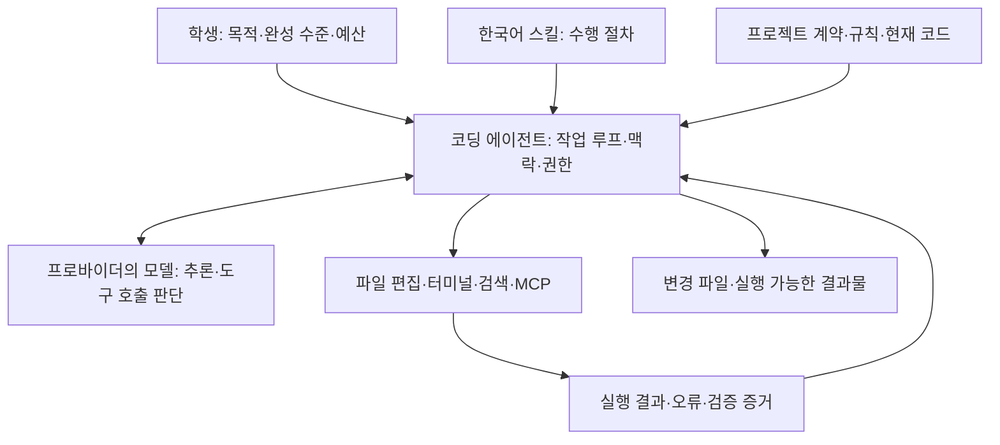

# 부록: 주요 코딩 에이전트 조사 리포트

조사일: 2026-09-22 · 공개 공식 문서 기반 · 설치·실행 비교 미실시

## 이 부록에서 판단할 것

학생은 주력 에이전트 하나를 선택하고, 모델·사고 수준·스킬·권한을 구분해 설정할 수 있으면 됩니다. 여덟 도구를 모두 설치하는 과정이 아닙니다. 아래 추천은 공개 기능에 근거한 교육 설계 판단이며 성능 순위나 실측 결과가 아닙니다.

| 사용자가 언급한 이름 | 이번 조사 대상 | 혼동하지 않을 것 |
|---|---|---|
| 클로드 코드 | Anthropic Claude Code | Claude 모델 자체와 구분 |
| 그록 코드 | xAI Grok Build | Grok Code Fast 1 같은 모델명과 구분 |
| 온디맨드 | 사용자가 확인한 on-demand.io의 OnDemand | 플랫폼 전체와 특정 코딩 실행 환경을 구분 |
| 코덱스 | OpenAI Codex | 모델명과 앱·CLI·IDE·클라우드 실행 환경을 구분 |
| 파이 | Pi, 현재 earendil-works/pi | 기존 badlogic/pi-mono 주소는 현재 저장소로 이동 |
| 오마이파이 | can1357/oh-my-pi | 동명 플러그인 및 다른 포크와 구분 |
| 리플릿 | Replit Agent | 클라우드 개발 플랫폼과 그 안의 Agent를 구분 |
| 오픈코드 | opencode.ai 공식 안정판 문서 | dev.opencode.ai의 v2 베타 문서와 혼합하지 않음 |

## 모델과 실행 도구의 관계

모델이 같아도 전달하는 맥락, 편집 방식, 도구 응답, 재시도 정책이 달라 결과가 달라집니다. MCP는 외부 도구 연결, 스킬은 수행 지침, ACP는 에디터와 에이전트의 연결 역할입니다. 어느 하나를 지원한다고 나머지까지 지원하는 것은 아닙니다. 모델 교체 비교와 에이전트 교체 비교를 따로 설계합니다.

## 한눈에 비교

‘기본’은 공식 문서가 해당 기능을 설명한다는 뜻입니다. 모든 OS·버전·계정에서 직접 시험했다는 뜻은 아닙니다.

| 도구 | 중심 사용 방식 | 모델 선택 방향 | 스킬·확장 | 수업에서 적합한 용도 |
|---|---|---|---|---|
| Claude Code | 터미널·IDE·데스크톱·웹 | Claude 생태계, 지원 클라우드 경로 | Skills, MCP, hooks, subagents | 저장소 작업과 검토 흐름 입문 |
| Codex | 앱·CLI·IDE·클라우드 | OpenAI 중심, 실행 환경별 설정 확인 | Skills, MCP, 프로젝트 지침 | 구현·검증·작업 인계의 연결 |
| Grok Build | TUI·headless·ACP | Grok 중심, 공개 하네스 설정 확장 | Skills, plugins, MCP, hooks, subagents | Grok 기반 코딩과 실행 모드 비교 |
| OnDemand | 웹 플랫폼·에이전트·워크플로우 | 모델 선택·BYOM·BYOI | 플랫폼 Skills·MCP·connectors | 제품 안의 에이전트 구성·운영 비교 |
| Pi | 최소 터미널 하네스·RPC·SDK | 여러 프로바이더·사용자 모델 | Skills·TypeScript 확장, MCP는 확장 | 맥락과 하네스 구조를 배우는 심화 |
| Oh My Pi | IDE 기능을 통합한 터미널·ACP | 여러 프로바이더·역할별 모델 | LSP·디버깅·subagents·스킬 상속 | 개발 도구가 모델 작업을 돕는 방식 |
| Replit Agent | 브라우저에서 디자인·개발·게시 | Free·Power·Max, 유료 작업의 Auto 라우팅 | 프로젝트·워크스페이스 Skills | 환경 준비를 줄인 목업→실행 실습 |
| OpenCode | 터미널·IDE·웹 | 여러 프로바이더·사용자 endpoint | Skills, MCP, plugins, agents | 같은 도구에서 모델을 바꾸는 실습 |

각 행의 근거와 적용 한계는 아래 개별 항목에 연결했습니다.

## Claude Code

공식 소개는 코드 읽기·편집·명령 실행을 터미널, IDE, 데스크톱, 브라우저에서 제공한다고 설명합니다. `CLAUDE.md` 등 프로젝트 지침과 스킬, hooks, MCP, subagents를 연결할 수 있습니다. 대부분의 환경은 Claude 구독 또는 Anthropic Console을 사용하며, 일부 환경은 별도 프로바이더 경로도 지원합니다. [공식 개요](https://code.claude.com/docs/en/overview)

프로젝트 스킬은 `.claude/skills/<name>/SKILL.md`가 명확한 출발점입니다. 권한은 allow/ask/deny 규칙과 실행 모드로 제어합니다. 스킬을 읽게 하는 것과 명령 실행을 허용하는 것은 별개입니다. [Skills](https://code.claude.com/docs/en/skills), [Permissions](https://code.claude.com/docs/en/permissions)

**교육적 판단:** 한 저장소에서 요구사항 → 변경 → 실행 확인을 가르치기 좋습니다. 다만 “Claude Code를 쓰면 디자인이 우수하다”는 보장은 아닙니다. 선택 모델, 참조 화면, 디자인 기준, 브라우저 검증을 별도로 기록합니다. 구독 이용과 API 이용의 비용을 혼합하지 않습니다.

## Codex

CLI는 로컬 코드 작업의 실행 도구이며, 앱·IDE·클라우드는 작업을 시작하고 관찰하는 다른 환경입니다. 로컬과 클라우드에서 파일·네트워크·승인 조건이 같다고 가정하지 않습니다. 샌드박스는 실행 가능한 범위를, 승인은 특정 행동의 허용 여부를 다룹니다. [CLI](https://learn.chatgpt.com/docs/codex/cli), [보안·실행 경계](https://learn.chatgpt.com/docs/security)

저장소의 `.agents/skills/<name>/SKILL.md`를 한국어 패키지의 프로젝트 경로로 사용합니다. 요금은 계정 플랜·포함 사용량·추가 사용량과 API 경로를 구분해 확인합니다. 학생의 화면에 실제 표시되는 모델과 사용량이 기준입니다. [Skills](https://learn.chatgpt.com/docs/build-skills), [요금](https://learn.chatgpt.com/docs/pricing)

**교육적 판단:** 사용자의 기존 문서·검증·인계 방식을 수업 흐름에 연결할 후보입니다. 현재 수업용 패키지의 호출 성공이나 다른 도구 대비 성능은 아직 실측하지 않았습니다. “GPT 모델이 지원된다”와 “이 Codex 실행 환경에서 선택할 수 있다”를 구분합니다.

## Grok Build

공식 도구 이름은 Grok Build입니다. 대화형 TUI, 스크립트용 headless, 에디터 연결용 ACP를 설명합니다. 공개 하네스는 파일 작업·명령 실행과 함께 스킬·플러그인·MCP·hooks·subagents 확장을 제공합니다. [시작 안내](https://docs.x.ai/build/overview), [오픈소스 발표](https://x.ai/news/grok-build-open-source)

프로젝트 스킬은 `.grok/skills/`에서 발견하며 Claude Code 자산과의 호환 경로도 문서화되어 있습니다. Ask, Auto, Always-approve 모드와 deny 규칙이 있고, 샌드박스는 별도입니다. `allowed-tools` 스킬 메타데이터가 실제 도구 권한을 부여·제한하지 않는다는 점이 특히 중요합니다. [스킬·플러그인](https://docs.x.ai/build/features/skills-plugins-marketplaces), [권한](https://docs.x.ai/build/features/permissions)

**교육적 판단:** Grok 모델 사용 경험을 저장소 개발까지 확장하는 후보입니다. 다른 도구와 같은 이름의 옵션이 같은 동작을 한다고 가정하지 않습니다. 자동 승인 모드를 초보자 공통 기본값으로 배포하지 않고 수업 환경에서 필요한 작업만 허용합니다.

## OnDemand — on-demand.io

공식 홈페이지는 모델·에이전트·도구·워크플로우를 구성하는 플랫폼을 소개합니다. BYOM은 자체 모델 배포, BYOI는 외부 추론 endpoint 연결의 관점에서 구분해 살펴볼 수 있습니다. Python·JS·cURL 코드 내보내기 기능을 곧바로 로컬 저장소 편집 에이전트와 동일시하지 않습니다. [공식 홈페이지](https://on-demand.io/)

공식 릴리스에서 2026년 7월 Skills, Projects, terminal logs, effort controls, memory, Chrome MCP, Plan Mode를 확인했습니다. 3월에는 human-in-the-loop 기능이 발표되었습니다. 따라서 단순 API 코드 생성 서비스로만 분류하는 것도 부정확합니다. 다만 공개 릴리스만으로 `SKILL.md`의 로컬 자동 탐색 경로, 셸 샌드박스 규칙, 제품별 Git PR 처리까지 확인되지는 않습니다. [공식 릴리스](https://on-demand.io/release-notes)

공식 조직의 Harness Arena는 동일 과제·모델에서 하네스를 비교하는 프로젝트이며 OnDemand를 포함합니다. 이 사실은 특정 버전의 성능 우위나 학생 계정의 기능 접근을 입증하지 않습니다. [공식 저장소](https://github.com/Ondemand-OSS/harness-arena)

**교육적 판단:** 에이전트가 포함된 제품이나 자동화가 학생 아이디어일 때 플랫폼 구성·실행 기록을 비교하는 선택 부록에 적합합니다. 한국어 패키지는 플랫폼의 Skills 가져오기 형식이 확인될 때까지 자동 호환으로 표시하지 않습니다. 공개 문서 화면 일부에서 본문을 읽지 못했으며, 인증 계정의 유료 기능·저장소 편집·export 후 재실행은 이번에 시험하지 않았습니다.

## Pi

Pi는 작은 핵심을 확장하는 하네스입니다. interactive, print/JSON, RPC, SDK를 제공하며 여러 프로바이더를 사용할 수 있습니다. 공식 사이트는 MCP·subagents·permission popups·plan mode를 기본 내장하지 않고 확장으로 구성하는 설계를 명시합니다. “기능이 전혀 불가능하다”가 아니라 설치 구성이 달라진다는 뜻입니다. [공식 사이트](https://pi.dev/)

스킬은 `.pi/skills/`와 프로젝트 `.agents/skills/` 등을 탐색하며 `/skill:name`으로 명시적으로 호출할 수 있습니다. 기존 `badlogic/pi-mono` 링크는 현재 `earendil-works/pi`로 연결됩니다. 배포 가이드에서는 실제 고정 버전과 패키지명을 다시 확인합니다. [공식 Skills 문서](https://github.com/earendil-works/pi/blob/main/packages/coding-agent/docs/skills.md), [현재 저장소](https://github.com/earendil-works/pi)

**교육적 판단:** 하네스의 작은 구조와 확장 원리를 배우기 좋지만, 승인·격리를 학생이 이미 갖춘 것으로 가정할 수 없습니다. 초급 공통 설치안에 포함하려면 격리된 실습 환경이나 검증한 권한 확장을 함께 마련해야 합니다. 패키지를 추가해 비교한다면 이름·버전도 실험 조건입니다.

## Oh My Pi

이 보고서의 대상은 `can1357/oh-my-pi`입니다. Pi 계열의 확장된 코딩 환경으로, 공식 README는 LSP·디버깅 도구와 역할별 모델 설정, subagents, ACP를 설명합니다. 기존 여러 에이전트 디렉터리의 규칙·스킬·MCP 설정을 상속하는 기능도 설명합니다. ACP에서 edit/bash가 에디터의 permission 요청을 사용하는 사실을 모든 터미널 실행 모드의 동일한 승인 정책으로 확대하지 않습니다. [공식 저장소·README](https://github.com/can1357/oh-my-pi)

**교육적 판단:** 모델의 추측과 언어 서버의 진단·심볼 정보를 결합하는 사례로 적합합니다. 기능 수가 많다는 이유로 초급 과정에 모두 켜지 않습니다. 스킬 패키지는 README의 상속 설명만으로 호환 판정을 내리지 않고, 선택한 버전에서 발견·명시적 호출·파일 참조를 확인해야 합니다. Pi와 이름·계열이 비슷해도 설정을 그대로 덮어쓰지 않습니다.

## OpenCode

안정판 공식 문서는 여러 모델 프로바이더 및 사용자 endpoint 연결을 설명합니다. 자체 키 연결과 OpenCode Zen 같은 제공 경로를 구분해야 비용과 장애 책임을 이해할 수 있습니다. [Providers](https://opencode.ai/docs/providers/), [Zen](https://opencode.ai/docs/zen/)

프로젝트 스킬은 `.opencode/skills/`, `.claude/skills/`, `.agents/skills/` 경로를 지원합니다. `name`은 소문자·숫자·하이픈이고 폴더명과 일치해야 하므로 한국어 표시명과 영문 식별자를 분리한 패키지 설계와 맞습니다. 권한은 allow/ask/deny로 제어하며 스킬 접근도 별도로 제한할 수 있습니다. [Skills](https://opencode.ai/docs/skills/), [Permissions](https://opencode.ai/docs/permissions/)

**교육적 판단:** 같은 실행 도구에서 모델을 교체해 비교하는 후보입니다. endpoint가 연결되더라도 도구 호출·이미지 입력·사고 설정이 같은 수준으로 지원되는지는 작은 과제로 확인합니다. 안정판과 v2 베타의 옵션을 혼용하지 않습니다.

## Replit Agent

Replit은 브라우저 기반 개발 환경이며 Agent는 그 안에서 계획·코드 작성·테스트·게시를 돕는 기능입니다. 특정 기초 모델의 이름이 아닙니다. 공식 문서는 자동 테스트와 체크포인트를 설명하지만, 이것만으로 프로젝트의 완료 조건이나 운영 안전성이 검증되는 것은 아닙니다. [Agent 개요](https://docs.replit.com/features/agent/overview)

Design Canvas에서 여러 시안을 만들고 주석·선택한 프레임을 Agent에 전달하며 반복할 수 있습니다. Design과 실행 앱의 Build 화면을 오갈 수 있어 이 과정의 **목업 → 피드백 → 규칙·API·데이터 도출** 실습 후보입니다. 이는 기능에 근거한 교육적 판단입니다. 디자인 프레임에서 새 앱을 만드는 기능은 조사 시점 Core 또는 Pro가 필요합니다. [Canvas](https://docs.replit.com/design/canvas)

Free Mode와 유료 Power·Max를 구분하며, 유료 경로의 Auto는 모델을 선택합니다. 이 모드명을 다른 프로바이더의 사고 수준과 일대일로 대응시키지 않습니다. 유료 Plan Mode는 코드를 바꾸지 않아도 과금될 수 있으며 크레딧은 Agent 외에 게시 앱·저장소·DB에도 쓰입니다. 따라서 수업 전 플랜의 빌드 가능 범위와 예산 한도를 확인합니다. [AI 과금·플랜별 기능](https://docs.replit.com/billing/ai-billing)

프로젝트 루트의 `.agents/skills/<name>/SKILL.md`를 지원합니다. Agent의 **Use a skill → 공개 GitHub URL → Preview skills → Import** 흐름도 문서화되어 있습니다. 가져오기 미리보기는 구조 탐색이며 지침 내용이나 품질을 검토하는 절차가 아닙니다. 공개 저장소만 지원하므로 수업 패키지를 후보로 삼을 수 있지만, 이 한국어 패키지의 Replit 발견·호출·참고 파일 동작은 아직 실행 검증하지 않았습니다. [Agent Skills](https://docs.replit.com/features/agent/skills)

**교육적 판단:** 로컬 도구 설치 부담을 줄이고 빠르게 시안을 실행해 보려는 학생에게 선택지입니다. 1주차에는 계정·비용·완료 범위, 2주차에는 가짜 데이터와 실제 저장의 구분, 4주차에는 게시 후 재실행·접근·데이터 유지와 전달 방법을 확인합니다. 사용 환경이 클라우드여도 개인용·PoC·MVP·운영형의 완료 기준은 동일한 원칙으로 적용합니다. 이번 조사는 문헌 조사이며 유료 계정 빌드·배포·복구·내보내기를 실측하지 않았습니다.

## 한국어 패키지 호환 계획

| 도구 | 프로젝트 설치 출발점 | 배포 전 필요한 확인 |
|---|---|---|
| Claude Code | `.claude/skills/<name>/SKILL.md` | 발견·호출·참고 파일·한국어 출력 |
| Codex | `.agents/skills/<name>/SKILL.md` | 동일 |
| Grok Build | `.grok/skills/<name>/SKILL.md` | 동일, 메타데이터와 실제 권한의 차이 |
| Pi | `.pi/skills/<name>/SKILL.md` | 동일, `/skill:name` 호출 |
| OpenCode | `.opencode/skills/<name>/SKILL.md` | 동일, 이름 규칙·skill 권한 |
| Oh My Pi | 공식 상속 지원 경로를 버전별로 선정 | 최종 경로·호출법·상속 중복 검증 |
| Replit Agent | `.agents/skills/<name>/SKILL.md` 또는 공개 GitHub 가져오기 | 발견·호출·참고 파일·플랜별 접근, 실제 패키지 미검증 |
| OnDemand | 플랫폼 Skills 형식 확인 후 선정 | import/export·참고 파일·실제 실행 검증 |

문서상 경로 확인과 실제 패키지 지원 선언은 별개입니다. 한 도구에서 같은 스킬을 여러 호환 경로에 중복 설치하지 않습니다. 상세 배포 설계는 [한국어 스킬 패키지](korean-skill-package.md)를 따릅니다.

## 비용·선택·비교 방법

수업의 예산은 **도구 이용료 + 모델 사용량 + 실행 인프라 + 외부 도구 호출 + 실패 재시도**로 봅니다. 오픈소스 하네스를 무료로 내려받을 수 있어도 추론 비용이 무료라는 뜻은 아닙니다. 이 보고서는 동일 조건의 최신 견적을 확보하지 않았으므로 숫자 가격 순위를 제시하지 않습니다. 학생별 계정·지역·세금·사용량을 확인한 뒤 실제 예산을 기록합니다.

| 조건 | 선택 출발점 — 교육 제안 |
|---|---|
| 이미 정상 동작하는 도구와 계정이 있음 | 그 도구로 핵심 흐름을 먼저 완성 |
| 모델별 차이를 같은 환경에서 비교 | OpenCode 또는 Pi 등 다중 프로바이더 도구 중 사전 검증한 하나 |
| 저장소 개발 흐름 입문 | Claude Code·Codex·Grok Build 중 강사가 지원 가능한 하나 |
| 하네스·LSP·확장 구조 탐구 | Pi와 Oh My Pi를 선택 심화로 비교 |
| 브라우저에서 목업부터 실행·게시까지 진행 | Replit Agent, 플랜별 빌드 범위·사용량을 사전 확인 |
| 에이전트 서비스 자체를 만들고 싶음 | OnDemand의 플랫폼 구성·전달 경로 검토 |

비교 실습은 동일 시작 커밋, 동일 요구·완료 수준, 시간·비용 상한, 도구 권한을 기록합니다. 모델만 바꾸는 실험과 하네스만 바꾸는 실험을 분리합니다. 통제가 안 되면 ‘제품 조합 비교’라고 표시합니다. 핵심 흐름 통과, 오류, 사람 개입 횟수, 시간, 표시된 사용량을 남깁니다. 측정되지 않은 비용은 추정값으로 채우지 않습니다.

완료 수준은 [프로젝트 완성 기준](project-completion-levels.md)을 먼저 선택합니다. 개인용 도구 비교에서 기업용 운영 기능을 많이 만든 에이전트에 가산점을 주지 않습니다. 계약한 결과를 적은 재작업으로 전달했는지가 기준입니다.

## HTML 부록 배치와 갱신

HTML 교재에서는 비교표 → 도구별 카드 → 스킬 경로 → 선택·실험 서식 순서로 배치합니다. 1주차에는 주력 도구를 하나 고르고, 3주차에 필요한 조합 하나만 비교합니다. 별도 설치 과제를 추가해 480분을 늘리지 않습니다.

갱신 시에는 제품 정체성·버전, 공식 문서, 모델 접근·요금 경로, 스킬 경로·호출, 권한 기본값, 최소 과제의 실제 결과를 확인합니다. 현재 출처는 위 본문에 연결한 공식 페이지·공식 저장소이며 모두 2026-09-22 열람 기준입니다. OnDemand 릴리스는 브라우저 렌더링 화면에서 확인했습니다. 향후 실제 설치 검증 결과는 이 문헌 조사와 별도 날짜·버전으로 기록합니다.
