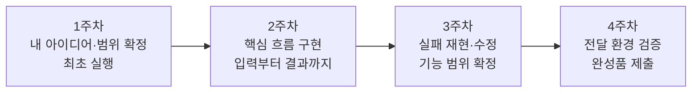

# 4주 자유 주제 프로젝트 과정

상태: 강의 설계 초안 v0.5 · 2026-09-22

## 목표와 진행 방식

수강생은 자신의 아이디어 하나를 골라 4주 동안 발전시키고, 합의한 사용자가 실행·사용할 수 있는 작은 완성품을 전달합니다. 매주 별도 연습 프로젝트로 교체하지 않습니다. 모델 선택, 설계, 구현, 디버깅, 검증은 모두 같은 프로젝트에서 배웁니다.

주 1회 120분, 총 480분입니다. 기본안은 필수 개발이 수업 안에서 끝나는 범위이며, 수업 밖 고도화는 선택입니다. 수강생 경험과 인원이 미확정이므로 아래 시간표의 실제 달성 가능성은 파일럿으로 확인해야 합니다.

## 사용자 개발 체계의 교육 적용

[사용자 기본 운영 기준](project-operating-standard.md)의 18단계를 학습의 기준으로 삼습니다. 사용자를 조사하고 시나리오·입출력·대체재를 분석한 뒤 방향·제약을 담은 개요·가이드라인·초기 ADR·Spec 개요를 작성합니다. 통상 Claude로 시안을 산출·검토하고 그 경험에서 상세 기능·API·데이터·DB 설계를 도출한 뒤, 마일스톤→작업 스테이지→스프린트→Task로 분해합니다. 수업의 작은 프로젝트는 한 문서의 짧은 절로 통합할 수 있습니다.

| 주차 | 적용하는 사용자 체계 | 수업 안에서 만들 증거 |
|---|---|---|
| 1주 | 1–8 분석·개요·가이드라인·ADR·Spec 개요 | 핵심 사용자·시나리오·입출력 표, 대체재 판단, 짧은 프로젝트 계약과 결정 |
| 2주 | 9 시안 확정, 10–15 작업 분해·이슈·워크트리, 16 구현 시작 | 수준에 맞춘 작업 계획·추적 기록, 스펙·계획 리뷰와 핵심 흐름 |
| 3주 | 16 구현 리뷰 수렴·검증, 17 피드백 접수 | 블로커 수정 증거, 피드백 이슈·후속 개선 구분 |
| 4주 | 16 전달·배포·스모크, 17–18 피드백과 다음 계획 | 제출 버전·사용 확인·제한·다음 업데이트 |

강의의 핵심 변화는 ‘DB부터 설계’와 ‘사용 경험을 먼저 구체화하고 내부 설계를 도출’의 대비입니다. 디자인을 코딩 전 장식 단계로 설명하지 않습니다. AI가 만든 목업을 직접 조작하고, 화면의 행동 하나에서 업무 규칙·권한·API·데이터를 역으로 도출하는 시연을 기존 2주차 계획·구현 시연 안에 포함합니다.

시안은 1주차 실행물과 작성 문서를 바탕으로 2주차 작업 분해 전에 확정합니다. 1주차 실행물은 환경 확인용이며 본 구현의 설계 확정을 뜻하지 않습니다. 수업에서는 핵심 화면·흐름 하나로 시안 범위를 제한하고, 2주차 계획·시연 시간 안에서 다룹니다. 기본 시연은 Claude를 활용하되 학생의 접근 가능한 도구를 대안으로 허용합니다.

매일 프리릴리즈·매주 릴리즈와 분리된 디버그 스케줄러는 운영형 확장 사례로 설명합니다. 모든 학생이 8시간 안에 자동화 시스템까지 만드는 것을 졸업 조건으로 추가하지 않습니다. 연구의 깊이가 수업 시간을 초과하면 미확인 가정을 표시하고 검증할 핵심 가설을 좁힙니다. 1주차 계약 시간에 핵심 질문을 요약하고 2주차 계획 시간에 필요한 명세를 구체화합니다.

강사의 통상 약 6배 속도 향상 경험은 조건이 붙은 사례로 소개합니다. 수강생의 기능 목표·시간표는 그 수치로 확대하지 않습니다.

## 한국어 스킬 패키지와 함께 진행합니다

학생에게 [한국어 스킬 패키지](korean-skill-package.md)를 GitHub Release로 제공하는 것을 강의 산출물에 포함합니다. 기존 영문 스킬 전체를 전제하지 않고, 수업 단계별 한국어 지침·실행 예시·템플릿을 제공합니다. 로컬 패키지 0.1.0은 제작했으며 v0.1.0 다운로드 링크를 HTML 교재에 연결했습니다. 두 제품의 실제 호출 확인은 추가로 수행합니다.

| 주차 | 사용하는 스킬 | 학생이 확인할 것 |
|---|---|---|
| 1주 | 프로젝트 시작·모델 선택·작업 인계 | 패키지 인식과 첫 실제 호출, 개인 프로젝트 계약 |
| 2주 | 설계와 작업 계획·기능 구현·작업 인계 | 구현 범위와 완료 기준을 AI에게 전달하는 방법 |
| 3주 | 오류 진단·변경 검토·모델 선택 | 원인과 리뷰 근거를 확인하는 방법 |
| 4주 | 완성품 확인·작업 인계 | 실제 동작 증거와 사용 설명서 |

초기 설치는 사전 안내로 제공하고 1주차 최초 실행 시간에 인식·호출을 확인합니다. 각 스킬 사용법은 기존 시연·실습 안에서 다루므로 총 수업 시간은 480분을 유지합니다.

[최신 주요 모델 부록](frontier-models.md)에는 GPT-6 Astra와 TypeSafe Jev의 소개·특징·활용 분석을 담습니다. 1주차 기초 시간에는 모델·도구 구분 5분, 사고 수준·선택 기준 5분, Astra·Jev의 대비와 평가 읽기 5분, 디자인·이미지 생성 구분 5분으로 핵심만 다룹니다. 상세 내용은 부록으로 제공하고 3주차에는 개인 프로젝트와 관련된 비교 하나만 수행합니다. 두 모델의 유료 접근이나 제품 내 통합을 필수로 요구하지 않습니다.

[코딩 에이전트 부록](coding-agents-report.md)은 Claude Code·Grok Build·OnDemand·Codex·Pi·Oh My Pi·OpenCode·Replit을 비교합니다. 수업에서는 사전 검증한 주력 도구 하나를 사용하며 8개 설치를 요구하지 않습니다.

## 1주차 프로젝트 계약

[프로젝트 수준별 완성 기준](project-completion-levels.md)에 따라 사용 범위(개인·팀·외부), 목표 단계(PoC·MVP·프로덕션), 실제 위험, 세션 예산·종료 조건을 함께 정합니다. 기본 목표는 개인용 완성 도구 또는 제한 사용자 MVP입니다. PoC 완료와 제품 완성을 구분하며, 기업용 운영 기준을 전원에게 적용하지 않습니다.

자유 주제를 유지하되 사용자가 누구인지, 어떤 문제를 해결하는지, 핵심 흐름이 무엇인지 합의합니다. 필수 기능은 최대 세 개로 제한하고, 핵심 사용자 흐름 하나를 끝까지 구현합니다. 화면 수나 코드량은 완성 기준으로 사용하지 않습니다.

예: 문의 관리 도구라면 문의 등록 → 목록에서 찾기 → 처리 상태 변경, 독서 기록 앱이라면 기록 작성 → 검색 → 수정입니다. 자동화 도구라면 파일 입력 → 변환 → 결과 저장처럼 같은 기준으로 평가합니다. 예시는 주제 강제가 아닙니다.

로그인·결제·외부 서비스 연동·실시간 협업 등 작업량이 큰 기능은 핵심 가치에 꼭 필요한지 판단합니다. 필수로 선택했다면 관련 동작과 실패 처리까지 완료 기준에 포함합니다. 8시간에 맞지 않으면 사용자 문제는 유지하면서 범위를 줄입니다. 모형·샘플·수동 대체를 사용한 부분은 분명하게 표시합니다.

## 공통 완성 기준

다음 항목을 프로젝트 계약에 맞게 적용해 필수 항목을 모두 충족하면 이 과정의 완성품으로 인정합니다. 사업용 서비스의 전체 운영 준비를 의미하지는 않습니다.

| 필수 기준 | 제출 증거 |
|---|---|
| 합의한 핵심 흐름과 기능이 실제 동작합니다. | 사용 시연과 단계별 확인 기록 |
| 필요한 데이터·결과가 계약한 방식으로 유지됩니다. | 재실행·새로고침 또는 결과 파일 확인 |
| 핵심 흐름의 대표 실패 입력을 처리합니다. | 실패 입력, 기대 결과, 실제 결과 |
| 계약한 사용자가 안내에 따라 실행할 수 있습니다. | 개인용은 본인의 새 세션 재실행, 타인용은 목표 사용자의 실행·피드백 |
| 제출한 버전이 검증한 버전과 같습니다. | 커밋 또는 제출 버전, 검증 일시·환경 |
| 실제 키·불필요한 개인정보가 결과물에 포함되지 않습니다. | 제출물 점검 기록 |
| 제한사항과 다음 개선이 구분되어 있습니다. | 알려진 제한, 후속 작업 목록 |

웹앱은 배포 주소를 우선 고려하되 로컬 앱·자동화는 실행 패키지나 재현 가능한 명령으로 전달할 수 있습니다. API 연동 제품은 키 설정 안내와 실패 시 동작도 확인합니다. 수강생 각자의 1주차 계약에 전달 방식을 명시합니다.

저장하지 않는 결과, 로컬 전용 전달 등 계약상 적용되지 않는 조건은 이유와 대체 증거를 기록합니다. 개인용 동료 확인은 교육 활동이며 기업용 독립 QA를 요구하는 것은 아닙니다. 권한·개인정보·결제·원본 삭제 등 실제 위험이 있으면 수준 문서의 해당 조건을 추가합니다.

## 주차별 도달 상태

### 1주차 — 내 프로젝트를 시작하고 AI 조합을 고릅니다

학습 목표: 사용자 문제와 완료 기준을 설명하고, 모델·프로바이더·에이전트·사고 수준을 구분합니다. 개인 프로젝트의 첫 실행 결과를 만듭니다.

| 시간 | 활동 | 누적 결과 |
|---|---|---|
| 0–10분 | 개인·MVP·운영의 완성 기준과 전체 과정 소개 | 목적·위험에 비례한 기준 |
| 10–30분 | 모델·프로바이더·사고 수준, 디자인과 이미지 생성의 구분 | 능력·도구·선택 기준 |
| 30–45분 | 같은 화면의 두 조합 비교와 이미지 도구 분담 시연 | 품질·비용·시간 읽기 |
| 45–55분 | 휴식 | — |
| 55–75분 | 각자의 프로젝트 계약·수준·위험·예산 검토 | 필수 기능·전달 방식 |
| 75–110분 | 한국어 스킬 인식·호출 확인, 첫 화면 또는 최소 입출력 실행 | 패키지 적용·실행 가능한 시작점 |
| 110–120분 | 결과 확인과 다음 세션 인계 | 실제 상태 기록 |

### 2주차 — 목업에서 규칙을 도출하고 핵심 흐름을 연결합니다

학습 목표: 작업을 작은 단위로 나누고, AI가 필요한 맥락을 읽게 하며, 기능을 검증 가능한 변경으로 구현합니다.

| 시간 | 활동 | 누적 결과 |
|---|---|---|
| 0–10분 | 실제 상태 복원·범위 재확인 | 시작 상태 |
| 10–25분 | 문제·제약 기반 AI 목업 조작·선택, 규칙·기능·API·데이터 도출 | 목업에서 상세 설계 도출·개인 작업 계획 |
| 25–40분 | 목업의 임시 동작을 실제 API·저장·검증으로 연결하는 시연 | 작업 분할·구현·검증 방법 |
| 40–50분 | 휴식 | — |
| 50–105분 | 개인 프로젝트 핵심 흐름 구현 | 입력부터 결과까지 동작 |
| 105–120분 | 직접 실행 확인·인계 | 기능 증거와 남은 문제 |

### 3주차 — 오류를 해결하고 모델 선택을 검증합니다

학습 목표: 추측으로 재시도하지 않고 오류를 재현합니다. 자기 프로젝트의 작은 과제로 두 조합을 비교하고, 리뷰의 차단 항목을 구분합니다.

| 시간 | 활동 | 누적 결과 |
|---|---|---|
| 0–10분 | 핵심 흐름 점검 | 결함 목록 |
| 10–25분 | 재현·원인 분석·리뷰 시연 | 수정과 검증 방식 |
| 25–45분 | 개인 과제로 모델 또는 사고 수준 비교, UI 프로젝트는 화면 비교 선택 | 근거를 갖춘 선택 기록 |
| 45–55분 | 휴식 | — |
| 55–105분 | 대표 실패 처리·리뷰·차단 문제 수정 | 필수 기능 확정 |
| 105–120분 | 전달 대상 환경에서 최초 실행·버전 기록 | 전달 문제 조기 발견·4주차 시작점 |

### 4주차 — 계약한 수준의 완성품을 전달합니다

학습 목표: 완료를 증거로 설명하고, 전달 환경에서 검증하며, 다음 작업을 이어갈 수 있는 기록을 남깁니다.

| 시간 | 활동 | 누적 결과 |
|---|---|---|
| 0–10분 | 공통 완성 기준 점검 | 남은 필수 작업 |
| 10–20분 | 전달·배포·버전 확인 시연 | 전달 방법 |
| 20–55분 | 최종 수정·패키징·배포·사용 설명 | 제출 후보 |
| 55–65분 | 휴식 | — |
| 65–85분 | 계약한 사용 환경에서 재실행·동료 확인 | 수준에 맞춘 사용 증거 |
| 85–105분 | 차단 문제 수정·재검증, 통과자는 시연 | 수정 후 전달 환경 증거 |
| 105–110분 | 결과 공유·피드백 | 결과와 제한사항 |
| 110–120분 | 최종 제출·개인 체계 회고 | 완성품 묶음 |

수강생 수가 많으면 전원 순차 발표 대신 소그룹 동시 시연과 제출 기록을 사용합니다. 인원과 지원 인력에 따라 운영 방식을 확정해야 합니다.

차단 문제가 남으면 발표보다 수정과 재검증을 우선합니다. 수정 후에는 제출 버전을 갱신하고 해당 흐름을 전달 환경에서 다시 확인합니다. 120분 시점에도 필수 기준이 충족되지 않으면 미완료로 기록하며, 시간표만으로 전원 완성을 보장하지 않습니다.

## 완주를 돕는 운영

- 수업 전 계정·도구·최초 실행 확인 안내를 제공합니다. 사전 준비가 안 된 경우 1주차 지원 시간을 배정하고 구현 범위를 더 줄입니다.
- 1주차 최초 실행, 2주차 핵심 흐름, 3주차 필수 기능 확정을 중간 기준으로 둡니다.
- 기준에 못 미치면 선택 기능을 줄입니다. 이미 합의한 필수 기능을 제거해야 한다면 프로젝트 계약과 평가 기준도 함께 갱신합니다.
- 4주차는 기능 추가보다 전달과 검증에 사용합니다. 완료 기준 미달은 미완료로 기록하고 남은 작업을 명시합니다.
- API 장애·사용량 소진에 대비해 접근 가능한 대체 조합을 정합니다. 제품의 핵심 API를 모의 결과로 대체했다면 실제 연동 완료로 평가하지 않습니다.

## 강의 자료 제작 시 남은 작업

1. 수강생 수준·인원·예산에 맞춰 지원할 프로젝트 유형과 사전 환경 안내를 확정합니다.
2. 주요 프로바이더별 가격·컨텍스트·정책·도구 지원 카드를 공식 자료로 보강합니다.
3. 강사용 시연 프로젝트, 오류 재현 예제, 모델 비교 실측 자료를 만듭니다.
4. 한국어 스킬 패키지를 제작하고 설치·행동을 검증한 후 GitHub Release로 제공합니다.
5. 위 구조를 HTML 교재와 인쇄 자료로 구현하고 화면·내비게이션·체크리스트·패키지 다운로드 연결을 검증합니다.
6. 파일럿에서 주차별 시간과 완성 기준을 검증한 뒤 교안을 조정합니다.
