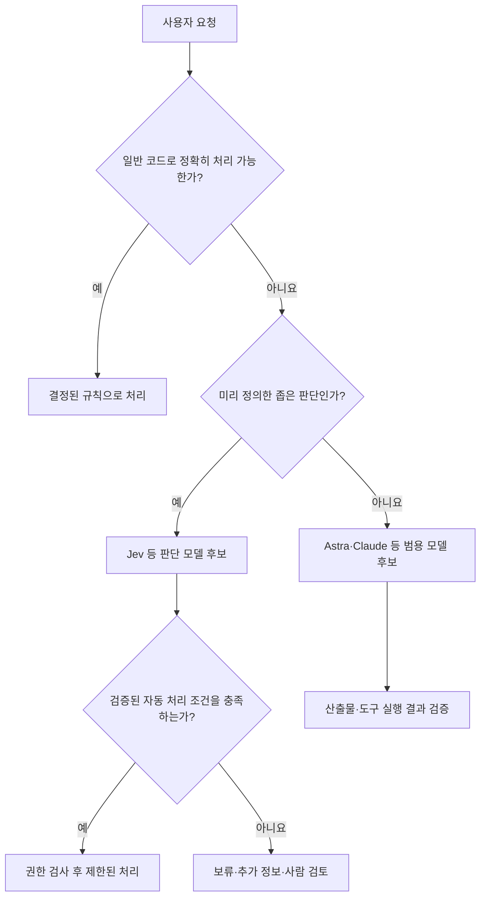

# 최신 주요 모델 읽기: GPT-6 Astra와 Jev

상태: 공식 자료와 평가 기관 자료에 근거한 교재 초안 · 확인일: 2026-09-22

사용자가 확인한 Jev는 TypeSafe AI의 모델입니다. 이 문서는 모델 소개와 활용 분석이며 실제 API 비교 실험은 수행하지 않았습니다. 유행의 정도를 수치로 측정한 자료도 아닙니다. 변동이 큰 모델 정보는 이 부록에서 관리합니다.

## 이번 단원의 질문

‘가장 강력한 모델은 무엇인가’와 함께 ‘내 작업에는 어떤 종류의 지능이 필요한가’를 묻습니다. 큰 모델의 장시간 작업 수행, 작은 단위의 판단, 이미지 생성은 서로 다른 결과를 목표로 합니다.

| 비교 축 | GPT-6 Astra | TypeSafe Jev |
|---|---|---|
| 공식적으로 소개하는 역할 | 복잡한 추론·코딩·컴퓨터 사용·조사·문서 작업 | 소프트웨어가 사용하는 구조화된 판단 |
| 결과 형태 | 텍스트·코드·지원 도구 호출 | 정의한 질문에 대한 값·확률 등 |
| 교육용 적용 예 | 여러 파일에 걸친 기능 설계·구현·검증 | 문의 분류·우선순위 평가·다음 처리 경로 선택 |
| 주의할 비교 오류 | 높은 벤치마크 점수를 모든 업무의 자율 완성으로 확대 | 정해진 형식의 응답을 내용상 정답 보장으로 확대 |
| 실습에서 볼 것 | 과제 완료율·수정 횟수·시간·총비용 | 판단 정확도·불확실성·잘못된 자동 처리·지연 |

공식 역할의 출처: [Astra 모델 명세](https://developers.openai.com/api/docs/models/gpt-6-astra), [Jev 개발 문서](https://docs.typesafe.ai/introduction). 활용 예와 평가 항목은 이를 바탕으로 한 교육 설계입니다.

## GPT-6 Astra: 복잡한 작업을 수행하는 모델

OpenAI는 Astra를 복잡한 추론, 코딩, 컴퓨터 사용, 연구와 문서 생성용 모델로 소개합니다. 공식 API 명세의 사고 수준은 `low`, `medium`, `high`, `xhigh`, `max`이며, 컨텍스트 한도는 1,050,000토큰, 최대 출력은 128,000토큰입니다. 이미지 입력과 이미지 생성 도구 지원은 구분되어 있습니다. [공식 명세](https://developers.openai.com/api/docs/models/gpt-6-astra)

**활용 분석:** 요구사항을 읽고 여러 도구로 구현·검증까지 이어가는 과제의 후보로 평가할 수 있습니다. 간단한 분류나 문구 수정에도 항상 같은 모델과 최고 사고 수준을 쓰는 것은 별도 비용·시간 비교가 필요합니다. 넓은 컨텍스트 한도가 주어진 자료 전체의 정확한 기억을 보장하지는 않으므로, 필요한 문맥과 검증 기준을 정리하는 기존 체계를 유지합니다.

학생은 자신의 계정·도구에서 해당 모델을 사용할 수 있는지 먼저 확인합니다. 수업은 Astra 구독이나 API 접근을 필수로 요구하지 않습니다. 사용 가능하지 않다면 같은 과제를 접근 가능한 조합으로 실행하고 Astra 사례는 강사 자료로 분석합니다.

## ‘AGI에 근접했다’는 표현을 읽는 방법

OpenAI의 출시 발표는 Astra의 높은 성능을 강조합니다. 강의에서는 개발사의 발표와 별도 평가 기관의 결과를 나누어 읽습니다. [OpenAI 출시 발표](https://openai.com/index/gpt-6-astra/)

ARC Prize가 공개한 ARC-AGI-3 Semi-Private 결과는 다음과 같습니다.

| 평가 설정 | 사고 수준 | 점수 |
|---|---|---|
| Standard harness | max | 62.7% |
| Standard harness | high | 54.8% |
| Provider Adapter harness | high | 99.9% |

Provider Adapter는 요청 사이의 내부 추론 상태 보존과 긴 대화 관리를 활용하는 환경입니다. 같은 `high` 수준의 두 행도 환경 조건이 다릅니다. 점수를 인용할 때 모델 이름 외에 평가 설정을 함께 표시해야 합니다. ARC Prize는 이 성과를 일반화 능력의 진전으로 보면서도, 벤치마크 포화가 AGI 달성의 증명은 아니라고 명시합니다. [ARC Prize의 평가와 해석](https://arcprize.org/blog/astra)

따라서 교재에는 ‘AGI에 근접했다는 평가를 낳는 성과와 아직 검증되지 않은 범위’라는 질문으로 담습니다. ‘AGI 달성’, ‘인간의 모든 작업을 대체’, ‘검증 없이 맡겨도 됨’을 확정 결론으로 가르치지 않습니다. AGI의 정의, 측정한 과제, 현실 작업으로 일반화할 근거를 따로 확인합니다.

## Jev: 코드 안에서 판단을 처리하는 모델

TypeSafe는 Jev를 System One 모델로 소개합니다. 공식 문서는 상태와 형식이 지정된 질문을 입력받아 자유로운 문장 생성 없이 결과를 반환한다고 설명합니다. `Choice`는 선택지, `Score`는 평가 기준에 따른 점수, `Noul`은 명제에 대한 0–1 값을 다룹니다. Choice와 Score에는 확률 분포와 confidence가 포함됩니다. 복잡한 질문은 작고 독립적인 질문으로 분리하도록 안내합니다. [Jev 개발 문서](https://docs.typesafe.ai/introduction)

**활용 분석:** 독서 기록 앱의 전체 코드를 작성하는 일을 Jev에 맡기기보다는, 입력된 기록의 분류나 정해진 기준에 따른 처리 경로 선택을 후보 과제로 삼을 수 있습니다. 정확한 규칙으로 해결할 수 있다면 일반 코드를 먼저 사용합니다. 자연어의 의미에 따른 판단이 반복될 때 모델 도입의 이점을 측정합니다.

이것은 개발용 코딩 에이전트를 고르는 문제와 제품 안에 판단 기능을 넣는 문제의 차이를 보여 줍니다. 한국어 스킬을 내려받았다고 Jev가 그 스킬을 읽고 파일·터미널을 조작하는 코딩 에이전트가 되는 것은 아닙니다.

### 주목할 특징과 검증할 주장

TypeSafe의 2026-09-15 소개 글은 RLCD라는 학습 방식, 병렬 출력 방식, 초기 접근 제공을 설명합니다. 또한 빠른 응답과 비용 절감을 주장하지만, 자사 워크플로우 평가가 Astra와 Claude Fable 5.1의 평균 응답을 참조한다는 조건도 공개합니다. [TypeSafe 소개와 평가 조건](https://typesafe.ai/blog/introducing-system-one-models-and-jev)

이 비교는 실제 정답을 사람이 확정한 테스트와 같지 않습니다. 짧은 입력, 선택지 수, 질문 분해 방식, 확률 출력 요구와 네트워크 환경에 따라 결과가 달라질 수 있으므로 ‘항상 몇백 배 빠르고 저렴하다’는 일반 규칙으로 바꾸지 않습니다.

‘환각 없음’이라는 홍보 표현도 형식 준수와 의미상 정확성을 구별해 읽습니다. 잘못된 선택지를 고르는 판단 오류까지 사라졌다고 결론 내릴 수 없습니다. 공식 문서의 `confidence`는 확률 분포의 모양에서 계산한 통계량이며, 선택한 답의 정답 확률과 동일한 값이 아닙니다. 확률의 보정 상태와 confidence에 따른 실제 정확도를 자기 데이터에서 평가해야 합니다. 0.9라는 값 하나를 해당 사례의 정답 보장으로 해석하지 않습니다. [TypeSafe의 confidence 설명](https://docs.typesafe.ai/confidence)

교육용 평가에서는 한국어 표현·모호한 입력·분포가 바뀐 입력을 포함합니다. 자동 처리 기준은 샘플로 검증한 뒤 정하며, 판단이 불확실하거나 처리 조건을 충족하지 않으면 보류·재검토 경로를 둡니다. 외부 상태를 바꾸는 작업에는 별도의 애플리케이션 권한 검사가 필요합니다.

## 다른 주요 모델과 함께 읽기

기존 [프로바이더·모델 선택 자료](model-selection.md)를 다음 질문과 연결합니다. 표는 모델별 성능 순위나 고정 역할 배정이 아닙니다.

| 대상 | 강의에서 분석할 질문 |
|---|---|
| GPT-6 Astra | 긴 작업에서 모델·도구·맥락 관리가 어떻게 결과에 영향을 주는가 |
| Claude | 디자인·코딩 결과와 스킬·참고 자료·수정 절차를 어떻게 분리 평가하는가 |
| Gemini | 선택한 버전의 입력 유형·사고 설정이 실제 작업에 맞는가 |
| Grok | 추론 설정과 검색 등 도구 사용을 어떻게 확인하는가 |
| GLM | 모델과 코딩 구독·엔드포인트·에이전트 연결의 차이는 무엇인가 |
| DeepSeek | 호환 API에서 실제 적용되는 설정과 작업당 비용은 무엇인가 |
| Jev | 정해진 판단을 자동화할 때 정확도·confidence·비용을 어떻게 검증하는가 |
| GPT Image 계열 | 이미지 생성·편집과 화면 디자인을 어떻게 분담하는가 |

## 함께 사용하는 구조의 예

이 다이어그램은 교육용 구조 제안입니다. 실제 앱에 모든 분기나 두 모델을 넣으라는 요구는 아닙니다. 개인 프로젝트가 일반 앱이면 모델 비교를 개발 과정에만 사용하고 제품에는 AI API를 넣지 않아도 됩니다.

## 4주 과정에 넣는 방법

- 1주차 기초 설명에서 Astra와 Jev를 서로 다른 모델 유형의 대표 사례로 짧게 소개합니다.
- 상세 모델 카드는 교재 부록으로 제공합니다. 프로바이더 소개가 개인 프로젝트 실습 시간을 잠식하지 않게 합니다.
- 3주차 기존 비교 시간에는 자기 과제와 관련된 비교 하나만 선택합니다. Astra·Jev 모두의 가입·구현을 요구하지 않습니다.
- Jev 실험을 선택하면 규칙 기반 처리 또는 접근 가능한 LLM의 구조화 출력과 같은 판단 과제로 비교합니다. 정확도뿐 아니라 보류율·자동 처리 오류·시간·비용을 기록합니다.
- API 접근이 없으면 미리 준비한 시연 기록을 분석하며 직접 실행 결과와 구분합니다.

## 강의 전 갱신과 검토

모델 카드에는 확인일, 정확한 모델·버전, 제공 사업자, 접근 경로, 기능, 가격 출처, 개발사 주장, 별도 평가, 실측 여부를 유지합니다. 공개 평가의 데이터·사고 수준·도구·비용 조건을 함께 읽고 주요 주장을 교차 확인합니다. 이 초안에는 Astra·Jev API 실측, 학생 계정 접근성, 한국어 판단 정확도 검증이 포함되지 않았습니다.
