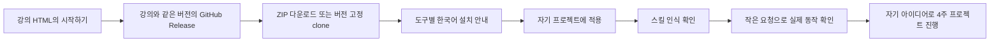

# 한국어 AI 개발 스킬 패키지

상태: 배포 패키지 설계 초안 v0.1 · 2026-09-22

## 목적

학생들이 GitHub에서 강의 버전에 맞는 패키지를 내려받아 자신의 프로젝트에 적용하고, 4주 이후에도 재사용할 수 있게 합니다. 한국어 설명·실행 예시·산출물 템플릿을 함께 제공합니다. 현재 설계를 바탕으로 SKILL.md 8개·설치 안내·한 줄 프롬프트·ZIP 0.2.0을 제작했습니다. 자동 설치 프로그램은 포함하지 않으며 공식 저장소는 TheMagicTower/korean-ai-dev-course입니다. 실제 범위는 [설치 안내](../INSTALL.md)와 [검증 기록](../VALIDATION.md)을 따릅니다.

강의는 왜 이 절차가 필요한지와 결과를 판단하는 방법을 설명합니다. 스킬은 AI가 작업할 때 참고할 수행 지침입니다. 학생이 읽는 긴 강의 내용을 모두 스킬에 넣지 않습니다.

## 구성 방식

| 방식 | 장점 | 고려할 점 |
|---|---|---|
| **수업 흐름에 맞춘 한국어 패키지** | 단계와 산출물이 일치하고 처음 쓰기 쉽습니다. | 원래 스킬과의 대응·차이를 기록해야 합니다. |
| 기존 스킬 전체 번역 | 기존 구성을 그대로 익힐 수 있습니다. | 중복·도구 의존·수업 밖 절차까지 따라옵니다. |
| 도구별 개별 패키지 | 도구 고유 기능을 활용하기 쉽습니다. | 같은 지침을 여러 곳에서 유지해야 합니다. |

첫 번째 방식을 기본안으로 합니다. 공통 지침은 한 곳에서 관리하고 도구별 설치 경로·호출법만 나눕니다. 패키지는 스킬 모음부터 시작하며, MCP 서버나 자동 에이전트 실행 시스템은 필수 구성에 포함하지 않습니다.

## 한국어 작성 원칙

- 학생용 제목, 설명, 본문, 예시와 템플릿을 자연스러운 한국어 존댓말로 작성합니다.
- 폴더와 `name`에는 `kdev-start`처럼 영문 소문자·하이픈 식별자를 사용합니다. 학생에게는 ‘프로젝트 시작’이라는 한국어 이름을 함께 보여줍니다.
- 각 스킬에는 사용 시점, 필요한 입력, 핵심 절차, 산출물, 완료 확인을 담습니다.
- API 키·파라미터·파일명 등 도구가 해석하는 표기는 원문을 유지하고 한국어로 설명합니다.
- 처음에는 한국어 실행 예시를 복사해 사용하고, 익숙해지면 자신의 제약을 추가하도록 안내합니다.
- 특정 모델·유료 구독·리뷰어를 필수로 고정하지 않습니다. 없는 도구를 사용했다고 가정하지 않습니다.
- 일반 개발 절차와 4주 수업의 범위 제한을 구분합니다. ‘필수 기능 최대 세 개’는 강의 계약에 적용하며 스킬의 영구 규칙으로 강제하지 않습니다.
- 기존 프로젝트 규칙과 사용자의 요구를 존중합니다. 스킬 사용이 외부 게시·배포 등의 추가 권한을 의미하지는 않습니다.

## 기본 스킬 8개

아래 이름과 구성은 제안입니다. 기존 스킬 원문을 그대로 번역한 목록이 아닙니다.

| 한국어 이름 / 식별자 | 사용 시점 | 핵심 산출물 | 첫 사용 주차 |
|---|---|---|---|
| 프로젝트 시작 / `kdev-start` | 아이디어를 실제 작업으로 정의할 때 | 사용자 문제·범위·완료 기준 | 1주 |
| 모델 선택 / `kdev-model` | 모델·사고 수준·프로바이더 조합을 고를 때 | 접근 가능한 후보·비교 기록 | 1주 |
| 설계와 작업 계획 / `kdev-plan` | 구현 범위와 작업 순서를 정할 때 | 선택 이유·작업별 검증 방법 | 2주 |
| 기능 구현 / `kdev-build` | 합의한 작은 기능을 만들 때 | 범위 안의 변경·검증 결과 | 2주 |
| 오류 진단 / `kdev-debug` | 오류·실패·예상 밖 결과를 조사할 때 | 재현·원인·수정·재검증 | 3주 |
| 변경 검토 / `kdev-review` | 변경이 요구사항을 충족하는지 검토할 때 | 차단 문제·후속 개선·근거 | 3주 |
| 완성품 확인 / `kdev-deliver` | 제출·전달 가능 여부를 판단할 때 | 실제 사용 흐름·전달 환경 검증표 | 4주 |
| 작업 인계 / `kdev-handoff` | 세션·수업 종료 또는 작업 재개 시 | 실제 상태·유지할 결정·다음 작업 | 매주 |

`kdev-plan`은 문제 정의를 처음부터 반복하지 않고 기존 계약을 읽습니다. `kdev-build`는 기능을 임의로 늘리지 않습니다. `kdev-review`는 검토 요청을 자동 수정 요청으로 해석하지 않습니다. `kdev-deliver`는 확인 결과와 실제 배포 실행을 구분합니다. `kdev-handoff`는 계획을 완료 사실로 기록하지 않습니다.

`kdev-model`은 시각적 이해·디자인 판단·화면 구현·이미지 생성을 구분해 필요한 조합을 고릅니다. ‘Claude는 디자인, GPT는 이미지’라는 고정 규칙을 넣지 않습니다. `kdev-plan`과 `kdev-build`의 UI 작업 참고 자료에는 정보 위계·한국어 가독성·반응형·실제 화면 검증을 담고, 이미지 도구가 없으면 생성했다고 보고하지 않도록 합니다. 학생용 근거와 비교 방법은 [모델 선택 문서](model-selection.md)의 디자인 단원을 따릅니다. 패키지 제작 시 필요한 실행 지침은 각 스킬 내부에 포함합니다.

`kdev-model`의 선택 기준에는 [Astra·Jev 분석](frontier-models.md)의 범용 작업·좁은 판단 구분도 반영합니다. 벤치마크 점수나 confidence만으로 작업의 정확성을 보장하지 않으며, 개발용 에이전트 모델과 제품 안에 넣는 판단 API를 별도로 선택합니다.

기초 학생에게 매번 8개를 외우도록 요구하지 않습니다. HTML 교재에서 해당 단계에 필요한 스킬과 한국어 예시 하나를 보여줍니다.

## 사용자 18단계 체계와의 대응

[사용자 기본 운영 기준](project-operating-standard.md)을 실행 지침의 원형으로 사용합니다. 스킬이 임의의 다른 작업 계층이나 리뷰 순서를 강제하지 않도록 합니다.

| 스킬 | 반영할 사용자 기준 |
|---|---|
| `kdev-start` | 사용자·사용 난이도·보안/접근·비즈니스/사용성 조사, 시나리오·입출력·시장, 개요 |
| `kdev-model` | 프로젝트 수준·작업별 모델·프로바이더·사고 수준과 비용 선택 |
| `kdev-plan` | 기술 가이드라인·ADR·Spec, Claude 활용 시안 산출·검토·문서 갱신, 마일스톤→스테이지→스프린트→Task, 이슈·워크트리, 스펙 리뷰 후 계획 리뷰 |
| `kdev-build` | 이슈 분석·ADR 점검·통과한 스펙/계획을 읽고 워크트리별 구현 |
| `kdev-debug` | 피드백 재현·디버그 이슈, 반려·사용자 ADR 판단·고복잡도 인계 |
| `kdev-review` | 스펙·계획·구현 대상을 구분하고 블로커가 없어지면 단계 종료 |
| `kdev-deliver` | PR·CI·스쿼시 머지·스모크, 정기 CD의 후보·배포·실행 증거 구분 |
| `kdev-handoff` | 작업 계층·현재 단계·판정·기준 버전·남은 예산·다음 업데이트 보존 |

시안 산출은 `kdev-plan`의 방향 문서화와 작업 분해 사이에 포함합니다. 상세 DB·API 설계를 먼저 완료하도록 강제하지 않고, AI 목업·프로토타입을 조작하며 행동·상태에서 업무 규칙·권한·기능·API·데이터를 역으로 도출하도록 합니다. 임시 데이터·항상 성공하는 처리·미구현 권한을 명시하고, 목업 코드의 재사용과 제품 수준의 구현 완료를 별도로 판단합니다. 입력 문서·시안 버전·선택 이유·반영할 Spec/ADR·확정 조건을 남깁니다. Claude 활용을 기본 사례로 제공하되 사용할 수 없는 도구가 시안을 만들었다고 보고하지 않습니다.

기본 8개 스킬에 정기 실행기 자체를 포함하지 않습니다. 스케줄러·프로세스의 상태 전이와 GitHub 자동 처리는 운영 심화 패키지의 별도 구현 대상으로 둡니다. 스킬에 머지·배포 절차가 있다고 실제 실행 권한이 자동으로 부여되는 것은 아닙니다.

## 수준에 비례한 실행 규칙

모든 스킬은 [프로젝트 수준별 완성 기준](project-completion-levels.md)의 계약을 이어받습니다. `kdev-start`는 사용 범위·단계·실제 위험·예산을 정하고, `kdev-plan`은 필수와 제외를 나눕니다. `kdev-build`는 요구되지 않은 로그인·관리자·인프라를 추가하지 않습니다. `kdev-review`는 선택한 수준의 차단 문제만 완료를 막으며, `kdev-deliver`는 해당 수준의 증거로 판정합니다. `kdev-handoff`는 수준·남은 예산·미완료 조건을 보존합니다.

낮은 위험의 개인용은 자체 확인을 기본으로 하고 위험 경계에만 독립 검토를 추가합니다. 필수 조건 통과 후 선택 개선 때문에 리뷰를 재시작하지 않습니다. 예산 소진은 완료가 아니라 중단·인계 조건입니다. 실제 패키지 제작 시 이 규칙을 필요한 스킬 안의 짧은 실행 지침과 참고 자료로 포함합니다.

## 학생의 사용 흐름



첫 실습 예시:

> ‘프로젝트 시작’ 스킬을 사용해 제가 만들 독서 기록 도구의 사용자 문제와 완료 기준을 정리해 주세요. 이번 과정은 4주이고, 핵심 기능은 책 기록·검색·수정입니다. 아직 코드는 작성하지 말고 프로젝트 계약 초안을 만들어 주세요.

설치 확인은 파일 복사 → 도구에서 발견 → 명시적 호출 → 요구한 산출물 생성의 네 단계로 구분합니다. ‘스킬을 사용할 수 있습니다’라는 답변만으로 적용 성공을 판정하지 않습니다.

## 도구 호환과 설치

Codex 공식 안내는 저장소의 `.agents/skills`를, Claude Code 공식 안내는 프로젝트의 `.claude/skills`를 설명합니다. 도구별 가이드는 이 차이를 반영해야 합니다. 이 문서에서 경로를 확인한 사실은 두 제품의 새 세션에서 패키지를 실제 호출한 호환성 검증을 뜻하지 않습니다. [Codex 공식 스킬 안내](https://learn.chatgpt.com/docs/build-skills), [Claude Code 공식 스킬 안내](https://code.claude.com/docs/en/skills)

| 환경 | 제공할 안내 | 현재 상태 |
|---|---|---|
| Codex | 프로젝트 범위 설치·명시적 호출·인식 확인 | 공식 경로·임시 복사 확인, 실제 제품 호출 검증 전 |
| Claude Code | 프로젝트 범위 설치·명시적 호출·인식 확인 | 공식 경로·임시 복사 확인, 실제 제품 호출 검증 전 |
| Grok Build·Pi·OpenCode | 공식 프로젝트 스킬 경로에 맞춘 안내 | [부록](coding-agents-report.md)에서 경로 확인, 패키지 실측 전 |
| Oh My Pi·OnDemand | 상속 또는 플랫폼 가져오기 방식 확인 후 안내 | 최종 설치·호출 경로와 패키지 검증 필요 |
| 일반 채팅 도구 | 필요한 지침을 직접 제공하는 수동 실습 | 스킬 자동 인식과 별개로 표시 |

Grok·GLM 모델 자체는 설치 대상 에이전트가 아닙니다. Grok Build는 별도 에이전트입니다. 연결할 에이전트가 해당 모델과 필요한 도구를 지원하는지를 별도로 확인합니다. 패키지만 설치하면 어느 모델에서나 동일하게 동작한다고 약속하지 않습니다.

기본 설치 범위는 학생의 프로젝트로 제한합니다. 원본 `skills/`에서 선택 도구가 읽는 위치로 복사하는 방식으로 설계하고, 초보자가 기존 규칙 파일이나 전역 설정을 덮어쓰지 않도록 합니다. Windows·macOS에서 각각 검증할 수 있도록 수동 복사를 기본 경로로 제공하며, 설치 자동화는 그다음 편의 기능입니다.

자동 설치 도구를 추가한다면 대상 경로 미리보기, 이름 충돌 시 중단, 설치 파일 목록 기록, 변경된 파일을 보존하는 제거·업데이트 절차를 포함합니다. 학생이 고친 스킬은 자동 덮어쓰지 않습니다.

## GitHub 배포 구조 제안

아래는 전체 배포 목표 구조입니다. 현재 첫 묶음은 skills, guides, examples와 루트 설치·검증·라이선스 안내를 포함합니다. 아래 모든 확장 디렉터리를 이미 구현했다는 뜻은 아닙니다.

```text
<한국어 스킬 패키지 저장소>/
  README.md                 한국어 시작 안내·강의 버전·다운로드
  LICENSE                   새 작성물의 배포 조건
  THIRD_PARTY_NOTICES.md     실제 재사용한 자료의 출처·고지
  CHANGELOG.md              학생이 알아야 할 변경과 호환성
  skills/
    kdev-start/SKILL.md
    kdev-model/SKILL.md
    kdev-plan/SKILL.md
    kdev-build/SKILL.md
    kdev-debug/SKILL.md
    kdev-review/SKILL.md
    kdev-deliver/SKILL.md
    kdev-handoff/SKILL.md
  guides/                   도구별 설치·확인·문제 해결
  examples/                 한국어 요청과 관찰 가능한 결과 예시
  templates/                학생이 복사할 프로젝트·검증·인계 서식
  checks/                   패키지 구조·설치·행동 검증 사례
```

스킬 실행에 필요한 참고 자료는 해당 스킬 폴더 안에 둡니다. 예를 들어 `kdev-model/references/`에 모델 선택 자료를 넣어 스킬만 설치해도 링크가 깨지지 않게 합니다. 루트의 템플릿은 학생용 배포 자료이며 스킬의 필수 의존 파일을 대신하지 않습니다.

강의 본문과 패키지는 별도 산출물이지만 첫 버전은 한 GitHub 저장소에서 함께 관리하는 구성을 권장합니다. 기존 프로젝트에 적용할 때는 스킬 묶음만 내려받을 수 있게 Release ZIP을 제공합니다. 저장소는 TheMagicTower/korean-ai-dev-course이며 공개 배포합니다.

## 버전과 수업 연결

- HTML 교재마다 사용한 패키지 버전과 다운로드 링크를 표시합니다.
- 수업 중에는 검증한 Release 버전을 유지합니다. 최신 브랜치를 자동으로 따라가지 않습니다.
- Release에는 ZIP, 변경 내역, 지원 도구·운영체제·검증 날짜, 알려진 제한을 포함합니다.
- 수업에서 사용하는 다운로드 파일에 필요한 숨김 폴더·상대 경로·라이선스 파일이 빠지지 않는지 확인합니다.
- 학생은 4주차에 스킬 하나를 자신의 프로젝트에 맞게 수정하고, 변경 이유와 결과를 선택 회고 과제로 남길 수 있습니다.

## 기존 스킬과 출처

현재 로컬에서 확인한 설계·계획·디버깅·리뷰·검증 스킬의 원칙을 참고합니다. 각 파일이 직접 작성, 번역, 수정 중 어느 방식으로 만들어졌는지 출처 기록에 남깁니다. 도구 전용 규칙이나 긴 승인 루프를 교육 패키지에 무조건 복제하지 않습니다.

로컬 Superpowers 6.3.0의 `LICENSE`에는 MIT License와 Jesse Vincent의 저작권 고지가 있습니다. 이것이 다른 설치 스킬 전체의 배포 조건까지 확인해 주는 것은 아닙니다. 실제 포함할 원문별 출처·버전·고지 파일을 확인하고 번역·수정한 자료의 고지를 함께 보존합니다. 배포 조건을 확인하지 못한 원문은 패키지에 그대로 포함하지 않습니다.

새 작성한 패키지의 배포 조건은 루트 LICENSE의 MIT License입니다. 기존 스킬 원문은 이 패키지에 포함하지 않았으며, 출처 처리 범위는 THIRD_PARTY_NOTICES.md에 기록했습니다.

## 배포 완료 기준

| 확인 영역 | 합격 기준 |
|---|---|
| 한국어 품질 | 용어와 존댓말이 일관되고 예시를 바로 사용할 수 있습니다. |
| 구조 | 각 스킬의 메타데이터·이름·참조 경로가 유효합니다. |
| 설치 | 지원한다고 표시한 OS·도구에서 새 프로젝트에 적용됩니다. |
| 기존 작업 보존 | 이름 충돌을 알리고 학생 파일과 설정을 덮어쓰지 않습니다. |
| 실제 행동 | 각 스킬이 자기 역할의 산출물을 만들고 요청 범위를 지킵니다. |
| 모델 변경 | 지원을 명시할 도구·모델 조합을 실제로 확인합니다. |
| 출처 | 재사용한 자료의 원본·버전·고지가 포함됩니다. |
| 배포 | 실제 GitHub Release를 새 환경에서 내려받아 설치·호출합니다. |
| 강의 연계 | 교재 링크·버전·예시가 다운로드 패키지와 일치합니다. |

행동 검증에는 모호한 아이디어, 예산 미정 모델 선택, 기존 작업이 있는 구현, 재현되지 않는 오류, 검토만 요청한 변경, 테스트 실패 상태의 완료 보고, 중단 후 인계를 포함합니다. 수준별 검증에는 개인용 도구에 기업 인프라를 추가하지 않는 사례, 원본 삭제 위험에는 복구 검증을 추가하는 사례, 필수 통과 후 리뷰를 종료하는 사례, 예산 소진 시 미완료를 정확히 기록하는 사례를 포함합니다. 구조 검사 통과만으로 스킬의 품질이나 학생의 완주를 보장하지 않습니다.

## 제작 순서

1. 기본 스킬 8개의 한국어 초안과 산출물 템플릿을 작성합니다.
2. 설치 안내와 도구별 인식·호출 예시를 만듭니다.
3. 작은 독립 과제로 행동을 검증하고 필요한 부분만 수정합니다.
4. 지원 OS·도구·모델 조합과 출처·라이선스를 확정합니다.
5. GitHub Release를 만들고 실제 다운로드 경로부터 검증합니다.
6. HTML 교재의 각 주차에 정확한 버전과 실행 예시를 연결합니다.
