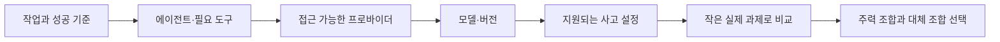
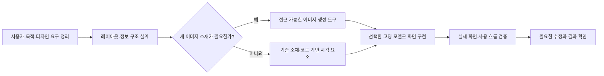

# 모델·사고 수준·프로바이더 선택

상태: 공식 문서 기반 기초 자료 초안 · 확인일: 2026-09-22

이 문서는 성능 순위표가 아닙니다. 공식적으로 지원하는 기능과 수강생이 자기 작업에서 측정해야 하는 품질을 구분합니다. 실제 모델 호출·벤치마크·가격 측정은 아직 수행하지 않았습니다.

최신 모델의 소개와 근거를 읽는 방법은 [GPT-6 Astra와 TypeSafe Jev 분석](frontier-models.md)에서 다룹니다. 범용 코딩 모델, 이미지 모델, 좁은 판단용 모델을 같은 척도 하나로 순위화하지 않습니다.

<!-- visual:routing -->

## 먼저 구분할 개념

| 개념 | 의미 | 선택할 때 확인할 것 |
|---|---|---|
| 모델 개발사 | 모델을 개발한 조직 | 모델 계열과 공개 문서 |
| 모델·버전 | 실제 추론을 수행하는 특정 모델 | 정확한 모델 ID, 지원 기능, 버전 고정 여부 |
| 사고 수준 | 한 요청에 적용하는 추론 설정 | 지원 값, 기본값, 지연과 사용량 |
| 서비스 프로바이더 | 모델을 제공하는 API·호스팅 사업자 | 엔드포인트, 지역, 정책, 가용성, 과금 |
| 에이전트 도구 | 파일·터미널 등과 모델을 연결하는 실행 환경 | 도구 지원, 권한, 문맥 관리, 재시도 동작 |
| 이용 상품 | 채팅 구독·코딩 구독·API 종량제 등의 계약 | 적용되는 도구와 사용량 한도 |

개발에 AI를 사용하는 것과 완성품에 AI API 기능을 탑재하는 것은 별개입니다. 수강생은 AI로 일반 앱을 완성해도 됩니다. 제품에 AI를 넣는 경우에만 제품 실행 비용·응답 실패·키 관리까지 완성 기준에 포함합니다.

## 주요 프로바이더의 구체적인 차이

아래 사양은 열람 시점의 공식 문서에 한정됩니다. 같은 이름의 사고 단계가 서로 같은 연산량이나 품질이라는 뜻은 아닙니다. 모델 교체 시 선택한 버전의 명세를 다시 확인합니다.

### OpenAI · GPT 계열

공식 API는 `reasoning.effort`로 추론 노력을 조절하며, 지원 값과 기본값은 모델마다 다릅니다. 현재 문서는 GPT-6 Astra에서 `none`이 허용되지 않으며, 해당 모델의 함수 호출에는 Responses API를 사용하도록 명시합니다. 따라서 다른 모델의 설정이나 Chat Completions 예제를 그대로 옮기면 안 됩니다. [공식 추론 가이드](https://developers.openai.com/api/docs/guides/reasoning)

교육에서는 모델과 사고 설정을 분리해 선택하고, 코딩 도구의 UI에서 선택한 값이 실제 지원되는지 확인하는 사례로 사용합니다. 도구를 포함한 작업 완료율은 별도 실습으로 평가합니다.

### Anthropic · Claude 계열

`thinking`은 사고 모드, `effort`는 응답에 투입하는 노력의 설정입니다. `adaptive`는 effort 값이 아닙니다. 수동 사고 예산과 적응형 사고의 지원은 모델마다 다르며, 도구 결과를 돌려줄 때 사고 블록 보존 규칙이 있습니다. [공식 Thinking 문서](https://platform.claude.com/docs/en/build-with-claude/thinking)

교육에서는 Claude 모델과 이를 실행하는 코딩 도구를 구분하고, 긴 작업을 여러 도구 호출로 수행할 때 연결 도구가 대화 상태를 올바르게 처리하는지 확인합니다. 설계나 코드 리뷰의 품질은 이름만으로 단정하지 않고 동일 과제로 비교합니다.

### Google · Gemini 계열

현재 Interactions API 문서는 동적 사고와 `thinking_level` 제어를 설명합니다. `max_output_tokens`는 사고 토큰도 포함하는 한도이므로 너무 작게 설정하면 결과가 잘릴 수 있습니다. 사고 제어와 출력 한도를 구분해야 합니다. [공식 Thinking 문서](https://ai.google.dev/gemini-api/docs/thinking)

교육에서는 선택한 API·SDK와 모델 버전에 맞는 설정을 확인하는 사례로 사용합니다. 이미지나 긴 자료를 쓰는 프로젝트에서는 그 입력 유형의 지원 여부와 실제 정보 누락을 별도 과제로 검증합니다. 여기서는 해당 모델들의 멀티모달 성능 순위를 주장하지 않습니다.

### xAI · Grok 계열

공식 문서상 Grok 4.5·4.6·4.7은 사고 수준을 조정할 수 있고 사고 자체를 끌 수는 없습니다. `xhigh`의 동작도 버전에 따라 다릅니다. 일부 멀티에이전트 모델의 같은 이름 설정은 추론 깊이 대신 에이전트 수를 제어합니다. [공식 Reasoning 문서](https://docs.x.ai/developers/model-capabilities/text/reasoning)

교육에서는 파라미터 이름이 같아도 의미가 다를 수 있음을 설명하는 사례로 사용합니다. 검색이 필요한 과제는 실제 검색 도구를 사용했는지와 출처가 결과를 뒷받침하는지를 함께 평가합니다. Grok을 선택했다는 사실만으로 최신 정보 검증이 끝났다고 보지 않습니다.

### Z.ai · GLM 계열

공식 문서는 GLM-5.3과 GLM-5.3-FLASH의 사고가 강제로 활성화되며 끌 수 없다고 명시합니다. Preserved Thinking은 Coding Plan 엔드포인트와 일반 API에서 기본값이 다릅니다. 이를 사용하는 도구는 대화의 `reasoning_content`를 명세에 맞게 유지해야 합니다. [공식 Thinking Mode 문서](https://docs.z.ai/guides/capabilities/thinking-mode)

GLM Coding Plan은 코딩 도구용 구독 상품이며 Claude Code, Cline, OpenCode 등의 연결을 안내합니다. 도구 이름과 실제 사용하는 모델이 다를 수 있음을 설명하는 좋은 사례입니다. 가입·연결·정상 작업 완료는 각각 확인합니다. [공식 Coding Plan 개요](https://docs.z.ai/devpack/overview)

### DeepSeek

공식 Thinking Mode 문서는 해당 모드에서 `temperature`, `presence_penalty`, `frequency_penalty` 설정이 오류 없이 무시될 수 있다고 설명합니다. API가 요청을 받았다는 사실과 설정이 실제 적용됐다는 사실을 구분해야 합니다. [공식 Thinking Mode 문서](https://api-docs.deepseek.com/guides/thinking_mode/)

교육에서는 호환 API의 차이를 확인하는 보조 사례로 사용합니다. 저렴하다는 인식만으로 선정하지 않고 실제 재시도와 수정 비용을 기록합니다.

## 디자인과 이미지 생성은 어떤 차이가 있나요?

이 단원은 ‘Claude의 디자인 결과가 더 좋았는데, 이미지 생성은 GPT 쪽에서 할 수 있었다’는 사용 경험을 분석하는 데서 출발합니다. 관찰된 사례와 모델 계열 전체에 대한 결론을 구분합니다.

### 서로 다른 네 가지 능력

| 능력 | 하는 일 | 확인할 결과 |
|---|---|---|
| 시각적 이해 | 스크린샷·사진의 내용과 문제를 읽습니다. | 실제 이미지와 분석이 일치하는가 |
| 디자인 판단 | 정보 순서·배치·글꼴·색·사용 흐름을 정합니다. | 목적과 사용자가 분명하고 읽기 쉬운가 |
| 화면 구현 | HTML·CSS·SVG 등으로 화면과 도형을 만듭니다. | 렌더링·반응형·상호작용이 동작하는가 |
| 이미지 생성·편집 | 전용 이미지 모델로 사진·일러스트 등의 픽셀 결과를 만듭니다. | 요구한 구도·내용·편집 조건을 충족하는가 |

이미지를 읽을 수 있다는 사실이 이미지 생성 기능을 뜻하지는 않습니다. 코드를 작성해 SVG를 그리거나 화면을 PNG로 저장하는 것과, 이미지 생성 모델로 그림을 합성하는 것도 구분합니다.

### Claude가 디자인을 더 잘한다고 느끼는 이유는 무엇인가요?

가능한 설명은 모델 버전의 차이, 요청 해석, 기본 스타일 선택, 적용한 디자인 스킬, 제공한 참고 화면, 브라우저 검토와 수정 기회입니다. 이는 비교에서 확인할 가설이며, 해당 경험의 원인이 이미 입증됐다는 뜻은 아닙니다.

Anthropic은 프롬프트·프런트엔드 스킬·평가와 수정 절차로 Claude의 결과를 개선한 실험을 공개했습니다. 이는 실행 환경과 지침이 품질에 영향을 줄 수 있다는 근거입니다. Claude가 모든 GPT 모델보다 디자인을 잘한다는 비교 증거는 아닙니다. [Anthropic의 설계·검증 환경 실험](https://www.anthropic.com/engineering/harness-design-long-running-apps)

강의에서는 ‘Claude는 미적 학습을 많이 했고 GPT는 하지 않았다’처럼 공개되지 않은 학습 데이터·내부 구조를 차이의 확정 원인으로 설명하지 않습니다. 실제 사용한 모델·도구·스킬·조건을 기록한 뒤 결과를 비교합니다. 첫 화면의 취향과 제품 전체의 사용성도 별도 평가합니다.

### GPT는 이미지를 만들고 Claude는 못 만든다는 말은 정확한가요?

OpenAI는 GPT Image 계열의 이미지 생성·편집 기능을 제공합니다. 공식 API에는 이미지 모델을 직접 호출하는 방식과, 대화 모델이 이미지 생성 도구를 호출하는 방식이 구분되어 있습니다. 따라서 대화·코딩용 GPT 모델의 능력과 연결된 이미지 모델의 능력을 구별해야 합니다. [OpenAI 이미지 생성 안내](https://developers.openai.com/api/docs/guides/image-generation)

Claude 공식 도움말은 사진·일러스트를 이미지 생성 도구처럼 생성하지 않으며, HTML·SVG 기반 도표·시각 자료 제작과 업로드 이미지 분석은 가능하다고 설명합니다. 이것은 현재 제공 기능의 차이입니다. Claude가 어떤 종류의 시각 결과도 만들 수 없거나, 외부 이미지 도구와 연결할 수 없다는 뜻은 아닙니다. [Claude 이미지 기능 안내](https://support.claude.com/en/articles/9002504-can-claude-produce-images)

이미지 생성 기능을 제공하지 않는 사업적·내부 기술적 이유는 위 자료만으로 확정할 수 없습니다. 외부 도구를 붙인 워크플로우도 별도의 API·권한·비용·연결 검증이 필요합니다. ‘이미지 생성 지원’과 ‘다른 이미지 모델보다 품질이 우수함’은 서로 다른 주장입니다.

### 학생이 배울 작업 분담

예를 들어 비교에서 Claude의 화면 설계가 더 적합했다면 설계에 사용하고, 이미지 소재는 GPT Image로 만든 뒤 선택한 코딩 도구에서 통합할 수 있습니다. 이는 선택 가능한 조합의 예이며 강의의 고정 모델 배정이나 자동 연결 지원을 의미하지 않습니다. 다른 도구나 모델도 같은 기준으로 평가합니다.

### 디자인 비교 실습

개인 프로젝트의 화면 하나로 기존 모델 비교 실습을 진행할 수 있습니다. UI가 없는 프로젝트는 강사의 공통 시연으로 이 개념을 배웁니다.

1. 동일한 콘텐츠·사용자·참고 화면·이미지 소재·화면 크기·시간·수정 기회를 제공합니다.
2. 모델만 비교하려면 가능한 한 같은 실행 도구와 스킬을 유지합니다. 조건을 맞출 수 없으면 제품·워크플로우 비교라고 표시합니다.
3. 결과의 모델 이름을 가리고 정보 위계, 한국어 가독성, 일관성, 좁은 화면 대응, 핵심 동작을 평가합니다. 취향 점수는 별도로 기록합니다.
4. 각 결과에 같은 수준의 피드백과 수정 기회를 준 뒤 다시 평가합니다. 실제로 사용한 모델 버전과 비용·시간도 남깁니다.
5. 한 화면에서의 선호를 모델 전체 순위로 확대하지 않습니다. 직접 생성 실습을 하지 못하면 시연 자료라는 점을 표시합니다.

학생용 판정은 항목별 통과 / 부분 충족 / 미충족과 화면·동작 근거로 기록합니다. 이미지 생성 비교는 별도 과제로 다루며 화면 디자인 점수와 합산해 하나의 모델 순위를 만들지 않습니다.

## 사고 수준의 교육용 출발점

아래는 모델에 공통으로 적용되는 API 값이 아닌, 과제별 선택 가설입니다. 각 도구가 지원하는 실제 값으로 대응한 뒤 결과를 측정합니다.

| 작업 | 시작 가설 | 상향 전에 확인할 것 |
|---|---|---|
| 문구·명확한 형식 변경 | 낮은 사고 수준 | 요구 형식이 명확한가 |
| 작은 기능 구현 | 기본 또는 중간 수준 | 파일·명령·완료 기준이 충분한가 |
| 원인 불명의 오류 | 중간 이상 | 재현과 로그가 있는가 |
| 여러 제약의 설계 | 높은 수준 후보 | 선택 기준과 제약을 제공했는가 |
| 최종 검토 | 기본 이상, 필요 시 상향 | 원본 요구와 전체 변경을 검토했는가 |

긴 답변, 오래 걸린 응답, 높은 사고 설정을 품질의 대리 지표로 삼지 않습니다. 정답 여부, 범위 준수, 실제 실행 결과로 평가합니다.

## 프로바이더 평가 카드

모델별 카드는 아래 필드를 채웁니다. 가격·보안 정책·컨텍스트 수치는 이번 초안에서 조사 완료된 값으로 제시하지 않습니다. 강의 전 공식 가격·정책·모델 명세를 열어 확인 날짜와 링크를 함께 기록해야 합니다.

| 영역 | 기록할 세부 항목 |
|---|---|
| 기능 | 정확한 모델 ID, 컨텍스트·출력 한도, 입력 유형, 도구 호출, 구조화 출력 |
| 사고 | 설정 이름, 지원 값, 기본값, 비활성화 가능 여부 |
| 연결 | 제공 사업자, 엔드포인트, 에이전트 도구·버전, SDK, 지원하지 않는 기능 |
| 비용 | 구독료와 API 비용 구분, 입력·출력·추론 토큰의 과금 분류, 캐시, 도구 비용, 재시도 |
| 운영 | 지연, 동시 요청·사용량 제한, 장애 시 대안, 모델 종료·변경 안내 |
| 데이터 | 학습 사용·보존 조건, 처리 지역, 조직 요구사항과의 적합성 |
| 품질 | 자기 프로젝트에서의 성공률, 수정 횟수, 범위 이탈, 한국어 요구 이해 |

직접 API, 중개 프로바이더, 자체 호스팅은 같은 모델 계열이어도 설정·운영 조건을 별도로 확인합니다. 오픈 가중치와 자유로운 상업 이용을 동일시하지 않고, 선택 모델의 라이선스를 확인합니다.

## 비교 실습

필수 실습에서는 접근 가능한 조합 두 개만 비교합니다. 프로바이더가 하나뿐이면 같은 모델의 지원되는 사고 수준 두 개로 비교하고, 다른 프로바이더 사례는 강사 시연으로 보완합니다. 모든 서비스 가입을 요구하지 않습니다.

1. 프로젝트의 작은 과제 하나와 완료 조건 세 개를 정합니다.
2. 같은 시작 코드·요구사항·도구 권한으로 두 조합을 실행합니다. 결과가 서로 섞이지 않게 별도 복사본을 사용합니다.
3. 모델 비교 시 도구와 사고 정책을 기록하고, 사고 수준 비교 시 모델과 나머지 조건을 유지합니다.
4. 실행 성공, 범위 준수, 수정 횟수, 총 소요 시간, 표시되는 사용량과 비용을 기록합니다.
5. 한 번의 비교는 탐색 결과라고 명시합니다. 중요한 선택은 추가 과제로 반복합니다.

API 실습의 총비용은 프로바이더의 실제 과금 분류에 따라 합산합니다. 추론 토큰이 출력 비용에 포함되는 경우 중복 합산하지 않습니다. 구독 사용량을 임의로 API 달러 비용으로 바꾸지 않습니다. **성공한 과제당 비용 = 실패·재시도를 포함한 측정 총비용 ÷ 성공 과제 수**이며 성공이 0이면 미산정으로 표시합니다.

주력 모델 하나, 막힐 때 비교할 대안 하나를 선택하고 이유를 남깁니다. 공개 벤치마크나 공식 홍보 문구는 과제별 실측을 대체하지 않습니다.
