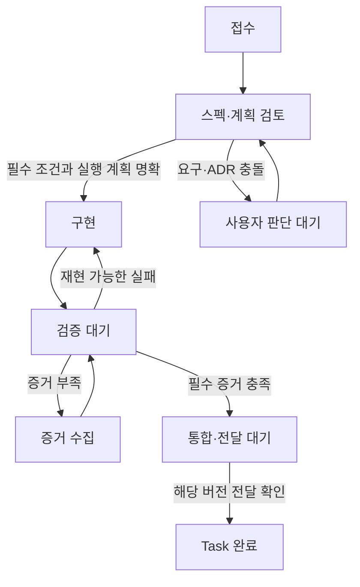

# ApplyFlow 프로젝트 실행 매뉴얼

아이디어를 한 번 설명하고 기다리는 대신, **계약 → 온보딩 → 작업 분해 → 작은 실행 → 증거에 따른 상태 판단 → 인계**를 반복합니다. 이 문서는 가상의 취업 준비 서비스를 실제 코드와 연결한 교육용 사례입니다.

[실행 예제](https://themagictower.github.io/korean-ai-dev-course/course/examples/applyflow/) · [예제 소스](https://github.com/TheMagicTower/korean-ai-dev-course/tree/main/course/examples/applyflow) · [실제 수행 기록 AF-104](applyflow-af104-record.md)

**읽는 기준:** 프롬프트는 학생이 복사해 사용할 수 있도록 재구성한 예시이며 과거 대화 원문이 아닙니다. AF-104의 코드·테스트·검증은 실제 수행이고, 서버 인증을 포함한 서비스 MVP와 자동 상태 머신은 이후 구현 계획입니다. 문서의 AF 번호는 내부 작업 식별자이며 GitHub에 발급된 이슈 번호가 아닙니다.

## 1. 사용자 이야기에서 시작합니다

취업 준비생 지민은 채용 사이트의 북마크, 메신저, 스프레드시트에 지원 정보를 나눠 보관합니다. 면접 연락을 받으면 해당 회사와 직무를 다시 찾습니다. 첫 가설은 ‘공고와 지원 상태를 한곳에 모으면 다음 행동을 찾기 쉬워진다’입니다. 실제 시장 검증 결과는 아직 없습니다.

서비스의 흐름은 **소개 → 가입 → 첫 공고 저장 → 지원·면접 관리 → 재방문 → 피드백**입니다. 현재 제공한 데모는 로그인 없이 브라우저에 공고를 저장하는 프로토타입입니다. 이 차이를 작업 계약에 먼저 적습니다.

### 프로젝트 계약 예시

| 항목 | 결정 |
|---|---|
| 첫 사용자 | 채용 공고를 여러 곳에 저장하는 취업 준비생 |
| 핵심 가치 | 저장한 공고와 지원 진행 상황을 빠르게 찾음 |
| 이번 실행 수준 | 개인 검증용 브라우저 프로토타입, 가상 데이터 |
| 목표 서비스 수준 | 소수 실제 사용자의 제한 사용자 MVP |
| 현재 필수 | 공고 저장·상태 변경·조회·같은 브라우저 재실행 |
| 현재 제외 | 인증·서버·알림·자동 수집·AI 합격 예측·결제 |
| MVP 추가 필수 | 인증·서버의 본인 데이터 접근 제한·배포·실사용 피드백 |
| 적용 절차 | 짧은 계약·작업별 스펙/계획·필수 검증·변경 기록 |
| 합치는 문서 | 작은 Task는 스펙·계획·증거·인계를 한 작업 카드에 통합 |
| 재판단 조건 | 실제 개인정보, 다중 사용자, 외부 알림, 데이터 이전 |
| 예산 | 학생이 시간·도구 비용 상한을 직접 적음. 예산 소진은 자동 통과가 아님 |

### 시작 프롬프트

```text
프로젝트 시작 스킬을 사용해 ApplyFlow 계약을 작성해 주세요. 취업 준비생이 회사·직무를 저장하고 지원 상태를 관리하는 서비스입니다. 먼저 가상 데이터로 개인 검증용 프로토타입을 만들고, 이후 실제 사용자 MVP로 확장합니다. 이번에는 공고 저장·상태 변경·조회·재실행만 필수입니다. 대상 사용자·시나리오·입출력·대체재·사용 난이도·실제 위험·포함/제외·완료 증거를 한 문서로 정리해 주세요. 목업과 기술 실험을 제안하되 상세 DB를 먼저 확정하지 마세요. 계약 작성까지만 진행해 주세요.
```

**기대 응답:** 짧은 계약, 확인된 사실과 가정, 제외 범위, 다음 실험. 요청하지 않은 구현·계정 생성·과금·배포를 시작하지 않습니다.

## 2. 사람과 에이전트를 온보딩합니다

### 사람의 준비

1. 저장소를 내려받아 작업 폴더를 엽니다. `main`보다 수업에 사용한 커밋을 기록하면 결과를 재현하기 쉽습니다.
2. README와 실행 예제의 범위·한계를 읽습니다. 기존 변경은 `git status --short`로 확인합니다.
3. Python과 Node가 있는 환경에서 아래 명령으로 서버와 계약 검사를 실행합니다. 도구가 없으면 강사의 환경 안내를 따르고 설치 완료를 가정하지 않습니다.
4. 브라우저 예제에서 가상 공고로 첫 흐름을 확인합니다. 개인 연락처·이력서는 입력하지 않습니다.

```bash
# 처음 내려받을 때만 실행
git clone https://github.com/TheMagicTower/korean-ai-dev-course.git
cd korean-ai-dev-course
# 현재 버전 기록
git rev-parse HEAD
# 저장소 루트에서 실행
python3 -m http.server 8765
# 별도 터미널에서 실행
node course/examples/applyflow/test-model.cjs
```

브라우저 주소: `http://localhost:8765/course/examples/applyflow/`. 정적 예제 실행에는 API 키와 유료 모델 호출이 필요하지 않습니다. 에이전트로 개발하는 도구의 이용 조건은 별개입니다.

### 에이전트가 읽을 최소 맥락

| 순서 | 자료 | 읽는 이유 |
|---|---|---|
| 1 | 저장소의 AGENTS.md 등 실제 지침·현재 Git 상태 | 작업 범위와 기존 변경 보존 |
| 2 | 프로젝트 계약·이번 Task 카드 | 무엇을 완료해야 하는지 확인 |
| 3 | 관련 ADR·이전 검증과 인계 | 이미 한 결정을 반복하지 않음 |
| 4 | 관련 코드·테스트 | 실제 구현과 문서의 차이 확인 |
| 5 | 지금 단계의 스킬 | 시작·계획·구현·검토·인계 절차 선택 |

전체 저장소와 모든 스킬을 매번 읽게 하지 않습니다. 이번 Task의 근거부터 읽고 영향 범위가 넓어질 때 추가 맥락을 읽습니다.

### 온보딩 프롬프트

```text
현재 폴더를 먼저 확인하고 저장소 지침·Git 상태·ApplyFlow README와 이번 작업 카드를 읽어 주세요. 기존 수정은 보존하고 현재 구현·미구현·실행 명령·관련 파일·유지할 결정을 요약해 주세요. 문서와 코드가 다르면 차이를 표시하세요. 이번에는 온보딩과 실행 준비 확인까지만 진행하고, 코드를 바꾸거나 외부 서비스를 생성하지 마세요.
```

한국어 스킬 설치는 [설치 안내](https://github.com/TheMagicTower/korean-ai-dev-course/blob/v0.2.0/INSTALL.md)를 따릅니다. 자동 발견이 안 되면 실제로 읽은 SKILL.md 경로와 수동 사용 여부를 기록합니다.

## 3. 목업과 가장 불확실한 기술 동작을 확인합니다

**목업 질문:** 관심 공고를 저장하고 지원한 공고와 구분할 수 있나요? 면접 연락을 받았을 때 해당 공고를 찾을 수 있나요?

**현재 프로토타입의 기술 실험:** 샘플 공고 저장 → 상태 변경 → 새로고침 → 값 유지. **실제 MVP의 기술 실험:** 두 테스트 계정 A/B를 만들고 A의 공고를 B가 조회·변경할 수 없는지 서버에서 확인. 후자는 현재 구현되지 않았습니다.

```text
목업과 설계·작업 계획 스킬로 계약을 읽고 ApplyFlow의 핵심 화면 하나를 제안해 주세요. 공고 저장→상태 변경→다시 찾기의 흐름을 우선합니다. 가짜 데이터·미구현 권한·저장 범위를 표시하고, 현재 수준에서 가장 불확실한 기술 동작 하나의 샘플·환경·합격 조건·시간 상한을 정해 주세요. 제안된 흐름에서 업무 규칙·함수/API 계약·데이터를 도출해 주세요.
```

### 유지할 결정의 예

- **ADR-A:** 프로토타입은 localStorage를 사용합니다. 같은 브라우저의 흐름 검증이 목적이며 서버 운영을 대신하지 않습니다. 실제 사용자 MVP로 바뀌면 다시 판단합니다.
- **ADR-B:** 지원 상태는 관심·지원·면접·합격·종료이며 이전 단계로 수정할 수 있습니다. 과거 지원 입력과 오입력 수정 때문입니다.
- **ADR-C:** 검색은 화면에서 적용하고 저장 데이터를 수정하지 않습니다. 최대 200개라는 현재 제약에서 시작합니다. 서버 전환·규모 증가 시 검색 위치와 권한 조건을 다시 판단합니다.

위 ADR 식별자는 교육용 문서화입니다. 실제 운영 이력에 과거부터 존재한 별도 ADR 파일이라고 주장하지 않습니다.

## 4. 결과부터 작업을 분해합니다

아래 계층은 상위 결과와 작은 실행을 연결하기 위한 예시입니다. 모든 행에 별도 문서나 GitHub 객체를 만들 필요는 없습니다.

| 마일스톤 | 작업 스테이지 | 스프린트 | Task와 완료 증거 | 상태 |
|---|---|---|---|---|
| M1: 개인 핵심 흐름 검증 | S1: 계약·경험 | SP1: 시작점 | AF-101 계약·목업·저장 실험 | 기존 사례·구현 있음, 과거 프롬프트 원문 없음 |
| M1 | S2: 끝까지 연결 | SP2: 저장·관리 | AF-102 저장→목록→재실행, AF-103 상태→필터 | 기존 구현, 이번 검색 회귀 검사에 포함 |
| M1 | S2 | SP3: 다시 찾기 | **AF-104 회사·직무 검색 + 상태 필터** | 이번에 실제 수행 |
| M2: 제한 사용자 MVP | S3: 사용자 경계 | SP4: 인증·소유권 | AF-201 가입/로그인, AF-202 본인 공고 저장·조회·변경 | 미구현 계획 |
| M2 | S4: 실제 전달 | SP5: 배포·사용 | AF-203 배포·새 세션·실사용·피드백 | 미구현 계획 |

의존 관계: AF-104는 기존 공고 목록을 사용합니다. AF-202는 인증된 사용자의 신원을 필요로 하고, AF-203은 접근 분리 검증이 끝난 후보를 사용합니다. 날짜가 왔다고 의존 작업이 자동 완료되지는 않습니다.

**GitHub에 옮길 때:** Task 제목·상위 작업·범위·제외·수용 조건·관련 결정·의존·검증을 이슈 본문에 적습니다. 실제 등록은 프로젝트의 권한 범위에서 수행합니다. 이 교재의 AF 번호를 GitHub 이슈 번호처럼 링크하지 않습니다.

## 5. AF-104 작업 카드 — 검색으로 공고를 다시 찾습니다

**사용자 요청:** “공고가 쌓이니 회사 이름이나 직무 일부로 찾고 싶어요. 면접 중인 공고만 검색할 수도 있으면 좋겠어요.”

| 항목 | 작업 계약 |
|---|---|
| 입력 | 검색어, 선택 상태, 기존 공고 목록 |
| 출력 | 회사 또는 직무가 검색어를 포함하고 상태 조건도 만족하는 목록 |
| 검색 규칙 | 앞뒤 공백 제거, 영문 대소문자 무시, 부분 문자열 |
| 빈 검색 | 상태 필터 결과를 그대로 표시 |
| 결과 없음 | 검색어·상태 변경 안내 |
| 지우기 | 검색어만 제거하고 상태 선택은 유지 |
| 저장 | 공고 저장 형식은 변경하지 않음, 검색어는 재실행 시 초기화 |
| 제외 | 외부 공고 검색·추천·검색 기록 저장·서버 API |
| 완료 증거 | 계약 테스트 + 브라우저 검색/필터/지우기/빈 결과 |

### 스펙·계획 프롬프트

```text
AF-104 작업 카드를 기준으로 kdev-plan을 사용해 스펙과 변경 계획을 한 문서로 작성해 주세요. 기존 model.js·app.js·index.html·test-model.cjs와 관련 결정을 읽으세요. 회사 또는 직무 부분 검색을 상태 필터와 AND로 적용합니다. 공백·대소문자·빈 검색·결과 없음·검색 지우기·데이터 불변을 수용 조건으로 만드세요. 저장 형식·인증·외부 검색은 바꾸지 마세요. 블로커가 없다면 설계 대안을 반복 생성하지 말고 구현 가능한 계획으로 종료하세요.
```

**이번에 선택한 계획:** 순수 검색 함수와 계약 검사 → 검색 입력·지우기 버튼 → 목록에 함수 연결 → 사용자 흐름 확인. 데이터 저장과 기존 상태 변경 로직은 재사용합니다.

### 구현 프롬프트

```text
kdev-build로 합의한 AF-104 계획을 수행해 주세요. 현재 변경을 보존하고 시작 버전을 기록하세요. 검색 계약 검사를 먼저 추가해 미구현 실패를 확인하고, 최소한의 검색 함수와 UI 연결을 구현하세요. 관련 계약 테스트와 브라우저의 검색·상태 교차·지우기·빈 결과를 확인하세요. 구현한 것·실행한 증거·미확인·남은 필수를 나눠 보고하세요. 테스트할 수 없는 항목을 통과로 기록하지 마세요.
```

### 실제 수행과 증거

이번 변경에서는 검사 추가 후 `selectJobs is not a function` 실패를 확인했습니다. 검색 함수를 구현하고 기존 모델 검사와 검색 계약 검사를 통과시켰습니다. 파일·브라우저 확인·현재 제한의 상세 기록은 [AF-104 수행 기록](applyflow-af104-record.md)에 있습니다. 실제 시간·토큰·비용은 측정하지 않았으므로 수치를 만들어 넣지 않았습니다.

## 6. 상태 판단 — 작업자의 주장과 전이 증거를 구분합니다

이 문서의 FSM은 개발 Task의 상태입니다. ApplyFlow 공고의 ‘관심·지원·면접·합격·종료’ 상태와는 다른 계층입니다.



상태 판단에는 현재 상태·계약·기준 버전·산출물·실행 결과·예산을 전달합니다. 판단기는 Jev 같은 도구로 교체할 수 있습니다. 이번에는 환경변수 `TYPESAFE_API_KEY`로 공식 API를 호출해 작업 분류에 성공했습니다(jev-1.13.0). 앞선 호출은 HTTP403이었고, 이후 curl 호출은 HTTP200이었습니다. 키 누락이 원인이라고 확인된 것은 아닙니다. 이 성공은 작업 복잡도 분류이며 AF-104 상태 전이를 실제로 자동 판정한 결과는 아닙니다. 이번 검증 판정은 주 에이전트가 수행했습니다.

### 판단 프롬프트

```text
당신은 AF-104의 다음 상태를 판단합니다. 제공된 계약·현재 버전·변경 요약·테스트/브라우저 증거만 근거로 사용하세요. 선택지는 구현, 증거 수집, 사용자 판단 대기, 통합·전달 대기입니다. 필수 실패가 있으면 구현, 필수 증거가 없으면 증거 수집, 요구·권한 결정이 필요하면 사용자 판단 대기를 선택하세요. 근거·부족한 증거·판단 대상 버전을 함께 반환하세요. 작성자의 완료 선언이나 confidence만으로 통과시키지 마세요. 코드를 수정하거나 머지하지 마세요.
```

**교육용 응답 형식 — 실제 Jev 응답이 아닙니다.**

```json
{
  "task_id": "AF-104",
  "evaluated_revision": "판단한 실제 커밋 또는 변경 지문",
  "from": "검증 대기",
  "proposed_next": "증거 수집",
  "reason": "계약 검사는 통과했지만 검색과 상태 필터의 브라우저 결합 증거가 없습니다.",
  "missing_evidence": ["브라우저 교차 필터 결과"],
  "requires_user_decision": false
}
```

전이를 확정하는 실행기는 허용 상태·판단 대상 버전·실행 권한·중복 처리 여부를 확인해야 합니다. 판단 중 코드가 바뀌면 이전 판단을 새 버전에 적용하지 않습니다. 그 실행기나 스케줄러는 이번 문서에서 구현된 것이 아닙니다. 호출 실패는 성공·완료 전이가 아니라 판단 대기 또는 정해진 수동 판단 경로로 기록합니다.

## 7. 검토·종료·다음 세션 인계

```text
kdev-review로 AF-104의 스펙과 변경·실행 근거를 비교해 주세요. 검색 결과 오류·저장 데이터 변경·필수 증거 누락은 완료를 막는 문제입니다. 추천 기능이나 서버가 없다는 이유는 이번 계약의 블로커가 아닙니다. 이전 저장 검증·이번 변경 영향·현재 재검증을 구분하고, 블로커가 없으면 종료하세요. 검토만 수행하세요.
```

```text
kdev-handoff로 현재 프로젝트 수준·Task·기준 버전·변경 파일·실행 결과·통과한 검토의 유효 범위·재검토 조건·남은 필수와 선택 개선을 정리해 주세요. 다음 실행은 인계만 믿지 말고 Git 상태와 현재 코드를 확인하도록 적어 주세요. AF-104 완료를 다중 사용자 MVP 전체 완료로 바꾸지 마세요. 미측정 시간·비용은 미확인으로 남겨 주세요.
```

**다시 검토할 조건:** 검색 규칙·필드 이름·상태 필터 계약·저장 형식 변경. CSS 간격만 바뀌면 영향받는 화면을 확인하며 전체 프로젝트 분석을 다시 시작하지 않습니다.

**다음 실제 서비스 작업:** AF-201/202의 인증·본인 데이터 접근 분리. 프로바이더·호스팅·사용자 데이터 처리 조건을 결정한 뒤 독립 스펙으로 수행합니다. 오늘의 프로토타입 검증이 이 작업을 대신하지 않습니다.

## 8. 학생 프로젝트로 옮기는 연습

ApplyFlow의 이름만 바꾸는 대신 자신의 사용자 이야기로 첫 작업 카드를 작성합니다. 입력→사용자 행동→유지할 결과→대표 실패→실행 증거를 적고 한 번 수행합니다. 복잡한 계층은 필요한 만큼만 쓰되 현재 상태와 다음으로 넘어갈 근거는 남깁니다.

**제출할 최소 묶음:** 프로젝트 계약, 작업 카드1개, 실제 변경, 실행 증거, 상태 판단과 인계. 문서 분량이나 프롬프트 횟수가 아니라 이 여섯 가지가 서로 일치하는지 평가합니다.
