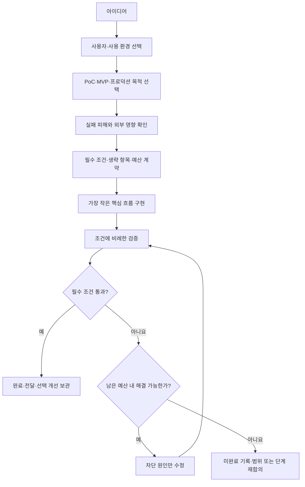

# 프로젝트 목적에 맞는 완성 기준

상태: 범용 운영·강의 설계 v0.1 · 2026-09-22

## 완성은 더 만들 수 없는 상태가 아닙니다

완성이란 **합의한 사용자·환경·위험 범위에서 목적을 달성하고, 그 사실을 필요한 증거로 확인한 상태**입니다. 더 많은 테스트·리뷰·문서·인프라를 추가할 수 있다는 이유만으로 작업을 계속하지 않습니다. 반대로 시간과 토큰을 다 썼다는 이유로 충족하지 못한 조건을 완료라고 부르지도 않습니다.

이 문서의 기준과 예산은 교육·운영 제안입니다. 업계의 단일 공인 등급이나 법적 인증 기준이 아닙니다. 기존 프로젝트의 명시적 의무는 유지하되 필요하지 않은 기업용 절차를 새로 추가하지 않습니다.

[사용자 기본 운영 기준](project-operating-standard.md)의 18단계를 적용할 때 이 문서로 깊이와 실행 형식을 정합니다. 전체 운영형은 이슈별 스펙·계획·구현 리뷰, PR·CI·스쿼시 머지·스모크, 정기 CD와 피드백 루프를 사용합니다. 축약형은 필요한 판단과 검증을 유지하면서 문서·계층·자동화를 통합하거나 생략합니다.

## 두 축과 하나의 보정 조건

‘개인용·팀용·기업용’은 **누가 어떤 책임 아래 사용하는가**, ‘PoC·MVP·프로덕션’은 **무엇을 검증하고 어느 단계까지 전달하는가**입니다. 하나의 일렬 등급으로 취급하지 않습니다.

| 축 | 선택 | 결정하는 것 |
|---|---|---|
| 사용 범위 | 개인 / 제한된 팀 / 외부 사용자·고객 | 사용자·접근 경계·지원 책임 |
| 목표 단계 | PoC / MVP / 프로덕션 | 검증할 가설·가치·지속 운영 조건 |
| 위험 보정 | 데이터 유실·민감정보·금전·공개 접근·외부 부작용 | 반드시 추가할 검증과 통제 |

개인용 완성품도 오래 실제 사용하면 개인용 프로덕션일 수 있습니다. 기업 PoC도 격리된 샘플 실험이면 기업 운영 서비스의 모든 조건을 갖출 필요는 없습니다. MVP가 실제 고객에게 공개되면 작은 기능 범위와 별개로 해당 공개 범위의 운영 안전 조건이 필요합니다.



## 단계별 완료 조건과 이유

| 목표 단계 | 답해야 할 질문 | 최소 완료 조건 | 왜 필요한가 | 기본적으로 요구하지 않을 것 |
|---|---|---|---|---|
| PoC | 중요한 기술·사업 가정이 성립하는가? | 가설·판정 기준, 대표 입력, 실행 가능한 실험, 결과·제약, 다음 진행/중단 결정 | 작동하는 데모 하나와 가설 검증을 구분하기 위해서입니다. | 완성된 UI, 범용 구조, 공개 배포, 고가용성, 전체 기능 구현 |
| MVP | 최소 기능으로 실제 사용자의 문제를 해결하는가? | 목표 사용자·핵심 흐름, 실제 사용 가능한 결과, 필요한 저장·실패 처리, 전달 안내, 피드백 수집·다음 판단 | 기능 목록을 만들었다는 사실보다 사용자 가치가 중요하기 때문입니다. | 대규모 확장, 여러 요금제, 조직 관리, 다중 리전, 미래 기능을 위한 추상화 |
| 프로덕션 | 합의한 사용 조건에서 계속 운영하고 실패를 감당할 수 있는가? | MVP 가치 조건에 더해 운영 책임자, 실제 환경 검증, 해당 위험의 접근 통제·복구·오류 관찰·릴리스 복구, 지원 가능한 제한 | 출시 이후 장애·데이터·운영 책임이 생기기 때문입니다. | 모든 서비스에 동일한 SLA, Kubernetes, 24시간 당직, 전사 인증 체계 |

PoC는 가설이 기각되어도 실험과 결론이 충분하면 **검증 과제로서 완료**입니다. 다만 이를 사용자 제품의 완성이라고 표현하지 않습니다. 이번 4주 과정의 기본 졸업 목표는 실행 가능한 개인 도구 또는 제한된 사용자의 MVP입니다. PoC만으로 제품 졸업 조건을 대체하려면 계약 변경과 별도 평가가 필요합니다.

## 자주 쓰는 네 가지 프로필

| 프로필 | 필수 결과·증거 | 생략 가능한 기본 항목 | 조건을 높이는 계기 |
|---|---|---|---|
| 개인 로컬 도구 | 본인이 핵심 흐름 실행, 필요한 결과 유지, 대표 오류 안내, 재실행 방법, 알려진 제한 | 로그인·RBAC, PR 의무, CI/CD, 별도 리뷰어, 서버 모니터링 | 중요한 원본 수정, 계정·키 사용, 자동 외부 전송 |
| 격리 PoC | 가설과 합격선, 재현 절차, 대표 결과·실패 사례, 판단 기록 | 디자인 완성, 운영 배포, 사용자 관리, 모든 예외 대응 | 실제 개인정보·고객 계정 사용, 외부 환경 연결 |
| 제한 사용자 MVP | 핵심 흐름 완주, 대표 사용자 피드백, 필요한 저장·오류 처리, 전달·지원 방법 | 대규모 부하 시험, 고가용성, 포괄적 관리 콘솔 | 공개 인터넷, 다중 사용자 데이터, 유료 결제 |
| 운영 서비스 | 계약한 규모·환경의 사용 검증, 접근 경계, 복구·롤백, 관찰·대응 책임, 출시 기록 | 요구되지 않은 인증·미래 규모·복잡한 조직 기능 | 사용량·데이터 민감도·업무 중요도·계약 의무 증가 |

개인 도구의 사용 설명은 몇 줄이면 충분할 수 있습니다. 단순 문자열 변환 도구에 데이터베이스·백업 체계를 추가하지 않습니다. 결과를 저장하지 않는다고 계약한 일회성 계산 도구는 저장 테스트가 아니라 출력 정확성과 재실행을 확인합니다.

## 위험에 따라 꼭 추가할 것

규모가 작아도 아래 위험이 **실제로 존재하면** 관련 조건은 생략하지 않습니다. 존재하지 않는 위험을 상상해 모든 프로젝트에 전체 목록을 붙이지 않습니다.

| 실제 위험 | 추가할 최소 조건 | 필요한 이유 |
|---|---|---|
| 원본 데이터 변경·삭제 | 샘플에서 dry-run 또는 미리보기, 범위 제한, 복구 가능한 사본·복원 확인 | 작은 실수도 돌이킬 수 없는 손실을 만들 수 있습니다. |
| 여러 사용자의 비공개 데이터 | 사용자·권한 경계와 교차 접근 실패 확인 | 정상 로그인만으로 다른 사람의 데이터 보호가 입증되지 않습니다. |
| API 키·민감정보 취급 | 필요한 정보만 사용, 키 노출 방지, 로그·배포물 점검 | 개인 프로젝트라도 키가 외부로 나가면 비용·정보 피해가 생깁니다. |
| 금전·메일·게시 등 외부 부작용 | 대상·권한·금액 범위 확인, 중복 실행 방지 또는 재실행 통제 | 재시도 한 번이 중복 결제·발송으로 이어질 수 있습니다. |
| 공개 서비스·유료 모델 endpoint | 접근·호출량·비용 한도, 대표 실패와 운영 연락 경로 | 타인의 입력과 사용량을 개발자가 통제할 수 없기 때문입니다. |
| 지속 운영이 필요한 업무 | 관찰할 실패 신호, 담당자, 데이터가 있으면 복구, 배포 변경 시 되돌리기 | 실패를 발견하고 실제로 대응할 수 있어야 합니다. |

이는 법률·산업별 준수 요건의 전체 목록이 아닙니다. 그런 의무가 실제 프로젝트에 있으면 별도 요구사항으로 계약에 추가합니다.

## 동일한 아이디어에 적용하는 예

‘영수증 정리’를 예로 들면 다음처럼 범위가 달라집니다.

- **PoC:** 익명 샘플 20개에서 날짜·금액 추출을 시험하고, 계약한 정확도 기준과 실패 유형을 기록합니다. 결과가 기준에 미달해도 원인을 설명하고 도입 보류를 결정하면 PoC는 완료할 수 있습니다.
- **개인 도구:** 사용자가 영수증을 입력하고 추출 결과를 수정해 CSV로 저장할 수 있습니다. 원본은 보존하고 실패한 입력을 알립니다. 로그인·조직·결제는 만들지 않습니다.
- **팀 MVP:** 정해진 팀원이 실제 업무에서 사용하고 피드백을 남깁니다. 공유 데이터의 접근 범위와 중복 입력을 확인합니다. 모든 회사의 결재 체계를 구현하지 않습니다.
- **고객용 운영 서비스:** 고객 간 데이터 분리, 실제 저장·복구, 비용 제한, 장애 관찰·대응, 변경 배포의 복구를 해당 서비스 약속에 맞춰 검증합니다. 서버 수가 많다는 사실은 완료 증거가 아닙니다.

숫자 20은 설명용 예시이며 모든 PoC의 충분한 표본 수라는 뜻은 아닙니다. 가설의 변동성과 실패 비용에 따라 표본을 정합니다.

## 토큰·시간·리뷰 예산

예산은 다음 작업을 제한하기 위한 운영 기준입니다. 에이전트 도구가 토큰 상한을 자동 강제한다고 가정하지 않습니다. 정확한 토큰 표시가 없으면 비용·시간·호출 횟수를 기록하고 토큰은 ‘미확인’으로 둡니다.

1. **작업 전:** 필수 결과, 이번 세션 시간, 비용 또는 토큰 상한, 재시도 한도, 종료 조건을 기록합니다. 미정이면 선택 개선을 늘리지 않고 현재 작은 작업의 예상 범위를 제시합니다.
2. **배분 예시:** 세션 예산의 15%를 정의·조사, 55%를 구현, 25%를 검증·수정, 5%를 인계에 확보합니다. 성능 보장이나 강제 비율이 아닌 출발점입니다.
3. **단순 작업:** 충분한 모델·사고 수준으로 시작합니다. 이미 재현한 복잡한 원인 분석이나 위험한 변경에만 더 강한 조합을 검토합니다.
4. **같은 실패 두 번:** 세 번째 맹목적 생성 전에 새 증거를 확인합니다. 원인·입력·도구·환경·범위를 바꾸지 않는 재시도는 중단합니다. 두 번은 수업용 초기 정책이며 작업별로 조정합니다.
5. **리뷰:** 저위험 개인 도구는 자체 확인 한 번을 기본으로 합니다. 외부 사용자·권한·데이터 변경 등 위험 경계가 있으면 해당 부분의 독립 검토를 추가합니다. 모든 변경에 여러 모델의 전체 리뷰를 반복하지 않습니다.
6. **종료:** 필수 기준 통과 + 적용되는 차단 문제 없음 + 확인 기록이 있으면 완료합니다. 취향·미래 확장·필수 아닌 리팩터링은 후속 목록에 남깁니다.
7. **상한 도달:** 비용이 더 드는 선택 작업을 멈추고 실제 상태를 인계합니다. 필수 조건이 남으면 ‘미완료’입니다. 범위 축소는 계약에 이유와 영향을 남긴 뒤 합의하며, 위험 조건을 조용히 삭제하지 않습니다.

차단 문제는 ‘선택한 수준에서 핵심 목적을 막거나 실제 위험 경계를 깨는 문제’입니다. 리뷰어의 심각도 표기만으로 판단하지 않습니다. 개인 독서 기록 도구에 관리자 페이지가 없다는 지적은 요구가 없는 한 차단 문제가 아닙니다. 같은 도구가 다른 사람의 비공개 기록을 보여주는 문제는 실제 사용 범위에 따라 차단해야 합니다.

## 4주 과정에 적용

1주차에는 아이디어와 함께 **사용 범위·목표 단계·위험·예산**을 계약합니다. 기본은 개인 로컬 도구 또는 제한 사용자 MVP이며, 기업용 운영 출시를 8시간의 공통 요구로 삼지 않습니다. 기업용 아이디어도 핵심 가치를 검증하는 작은 범위를 선택합니다.

2주차에는 가장 작은 핵심 흐름을 연결하고, 3주차에는 계약한 위험과 실패만 우선 검증합니다. 4주차에는 그 수준의 완성품을 전달합니다. 공통 평가는 기능 수·인프라 수·토큰 사용량이 아닌 계약 충족·검증 증거·수준 선택의 타당성으로 합니다.

개인용은 본인이 새 세션에서 안내대로 재실행하는 증거를 기본으로 합니다. 수업의 동료 확인은 설명과 재현성을 배우는 활동이며 기업용 독립 QA 인증이 아닙니다. 타인 사용이 목표인 MVP는 목표 사용자의 실행·피드백을 완료 기준에 포함합니다.

## AI에게 전달하는 짧은 계약

```text
사용 범위: 개인 로컬
목표 단계: 실제 사용할 작은 완성품
핵심 흐름: 기록 작성 → 검색 → 수정
데이터·위험: 개인 메모, 로컬 저장, 외부 전송 없음
필수: 재실행 후 기록 유지, 빈 입력 처리, 실행 안내
제외: 로그인, 클라우드 동기화, 조직 관리, 결제, 고가용성
검증: 정상 흐름·재실행·대표 실패를 수동 확인
리뷰: 자체 확인 1회, 새로운 위험이 발견되면 해당 부분만 확대
예산: 이번 작업 40분, 비용 상한은 실행 전 계정에서 설정·기록
종료: 필수 조건 통과 시 결과와 제한을 기록하고 종료
상한 도달 시: 선택 개선 중단, 필수 미달이면 미완료 인계
```

이 계약은 도구의 실제 권한 설정을 대체하지 않습니다. 긴 규칙 전체를 매번 넣기보다 현재 계약과 필요한 스킬만 읽게 하고, 인계에는 변경된 결정·실제 증거·남은 필수 작업만 남깁니다.
