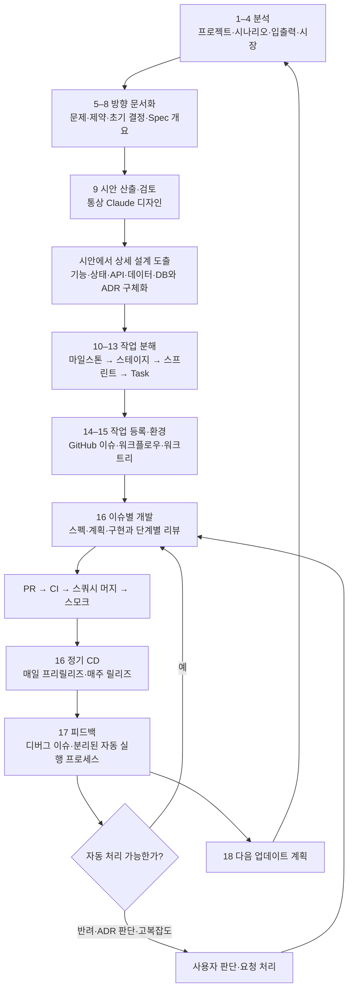
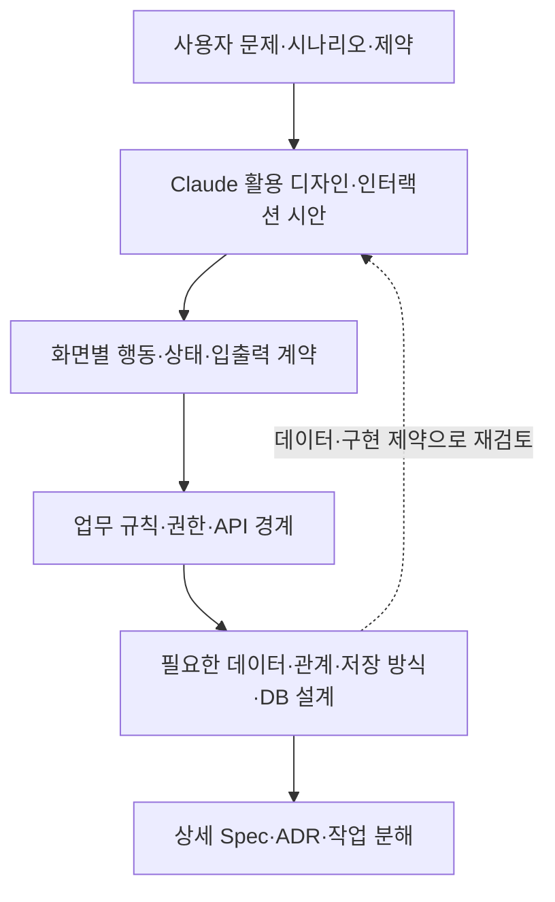
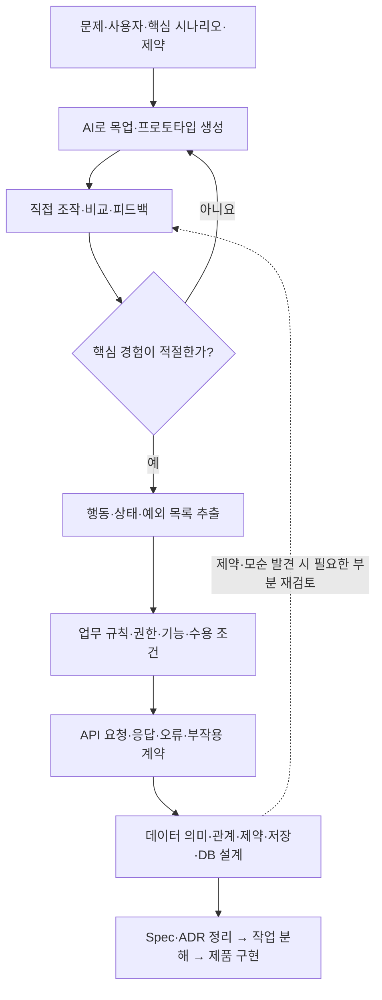
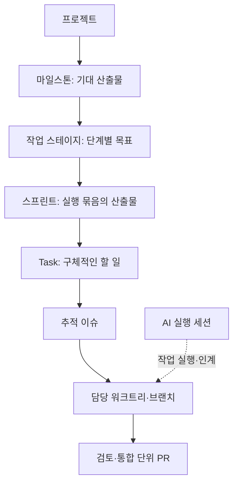
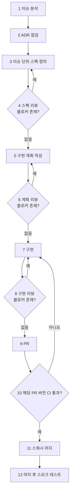
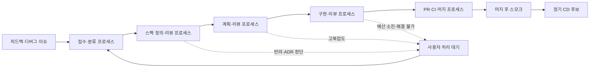

# 프로젝트 구성·개발·운영 기준

상태: 사용자 제공 운영 기준의 문서화 v0.3 · 2026-09-22

이 문서는 사용자가 직접 설명한 기존 17단계에 시안 산출을 추가한 18단계를 기본 체계로 보존합니다. 기존 스킬에서 추정한 방식보다 이 기준을 우선합니다. 각 단계의 산출물 형식, GitHub 표현 방식, 자동화의 상태·충돌 관리 등 구체적인 운영 장치는 **교육용 구체화 제안**이며 실제 시스템에 이미 구현되었다는 뜻이 아닙니다.

## 전체 구조

작업 분해의 ‘스테이지(Stage)’와 배포 환경의 ‘스테이징(staging)’은 다릅니다. 교재에서는 혼동을 줄이기 위해 각각 **작업 스테이지**, **스테이징 환경**으로 표기합니다.

## 18단계와 기대 산출물

| 단계 | 사용자 기준과 핵심 질문 | 정리할 산출물 | 다음 단계 판단 — 구체화 제안 |
|---|---|---|---|
| 1. 프로젝트 분석 | 누가 쓰는가? 적정 사용 난이도는? 보안·접근 수준은? 비즈니스·사용성 레이어를 깊이 조사했는가? | 대상 사용자, 현재 업무·사용 맥락, 숙련도·사용 장벽, 역할·접근 경계, 조사 근거와 미확인 사항 | 만들 기능보다 사용자의 문제와 환경을 설명할 수 있습니다. |
| 2. 시나리오 분석 | 어떤 사용 예제가 있고 무엇을 얻으려 하는가? | 대표 정상·실패·예외 시나리오, 시작 조건, 기대 결과 | 핵심 사용자 흐름의 시작과 끝이 명확합니다. |
| 3. 입출력 분석 | 무엇을 입력하며 각 입력에서 어떤 출력을 기대하는가? | 입력 형식·제약, 기대 출력, 검증 예시, 오류·부작용 | 성공 판정을 실행 가능한 예로 표현할 수 있습니다. |
| 4. 마켓 인사이트 | 시장성이 있는가? 유사 제품 대비 차이·독창성은? | 대체재·경쟁 제품, 사용자 선택 이유, 시장 가설·근거 | 확인한 사실과 희망·가설을 구분합니다. |
| 5. 프로젝트 개요 | 분석을 하나의 프로젝트로 정의 | 문제·목적·사용자·범위·완료 수준·성공 기준 | 무엇을 만들고 무엇을 제외하는지 합의합니다. |
| 6. 프로젝트 가이드라인 | 프레임워크·언어·인프라·솔루션·외부 상호작용 | 기술 선택·버전 정책, 실행·개발 규칙, 연동 경계 | 구현자가 기본 환경과 제한을 재현할 수 있습니다. |
| 7. ADR 정의 | 중요한 결정을 어떻게 남기고 유지하는가? | 결정 배경·대안·선택·이유·영향·변경 조건 | 이후 스펙·계획의 판단 기준이 남습니다. |
| 8. Spec 개요 | 시스템이 제공할 동작과 경계 | 사용자 관점 요구·입출력, 제약·수용 기준, 상세 설계를 위한 미결정점 | 이슈별 스펙으로 분해 가능한 전체 윤곽입니다. |
| 9. 시안 산출 | 통상 Claude를 활용해 디자인하고 작업 분해 전에 검토 | 핵심 화면·상태·사용 흐름 시안, 선택 이유·수정 사항 | 시안이 사용자·시나리오·입출력과 일치하고 변경 요구가 Spec·ADR에 반영됩니다. |
| 10. 마일스톤 지정 | 마일스톤의 기대 산출물은? | 결과 중심 목표와 완료 증거 | 날짜뿐 아니라 도달 결과를 설명합니다. |
| 11. 작업 스테이지 분할 | 마일스톤을 어떤 단계로 달성하는가? | 스테이지별 목표·의존 관계·진입 및 종료 조건 | 선후 관계와 단계별 목적이 분명합니다. |
| 12. 스프린트 분할 | 스테이지를 어떤 실행 묶음으로 진행하는가? | 스프린트별 기대 산출물·범위 | 묶음 종료 시 확인할 결과가 있습니다. |
| 13. Task 분할 | 각 작업에서 무엇을 해야 하는가? | 담당 역할·수정 범위·수용 조건·검증 방법 | 한 작업의 책임과 완료 조건을 판정할 수 있습니다. |
| 14. GitHub 이슈 등록 | 각 계층의 작업과 상태를 어떻게 연결하는가? | 마일스톤·스테이지·스프린트·Task 추적 이슈와 상하위 링크 | 상위 목표에서 작업·PR·증거를 추적할 수 있습니다. |
| 15. 워크플로우·워크트리 설정 | 작업을 어떻게 격리하고 합치는가? | 브랜치·워크트리 책임, 리뷰·CI·머지·스모크 규칙 | 작업자 간 충돌과 통합 경계가 명시됩니다. |
| 16. 구현·정기 배포 | 이슈별 수렴과 CI·머지·스모크, 정기 CD | 스펙·계획·변경·리뷰·PR·CI·배포·실행 기록 | 단계별 증거와 출시 대상 버전이 연결됩니다. |
| 17. 사용자 피드백 | 디버그 이슈·정기 자동 처리·반려와 사용자 요청 | 재현·영향·분류, 자동 실행 상태, 사용자 판단 요청 | 자동 처리와 판단이 필요한 일을 구분합니다. |
| 18. 다음 업데이트 루프 | 무엇을 유지·수정·추가할 것인가? | 피드백 기반 다음 계획·ADR/Spec 변경·새 작업 | 앞선 결정·증거를 보존하며 다음 반복을 시작합니다. |

비즈니스 레이어는 업무 목표·역할·규칙·예외·책임·성과를, 사용성 레이어는 사용자의 실제 행동·숙련도·환경·빈도·실수·회복 방법을 조사합니다. 인터뷰·현행 업무 관찰·기존 자료 등 근거를 붙이고 AI가 채운 추정을 조사 사실로 표시하지 않습니다. 깊이는 페이지 수보다 핵심 가정이 확인되었는지로 판단합니다.

시장 조사는 개인 도구에서도 기존 도구를 쓰는 대신 직접 만들 이유를 확인하는 데 유용합니다. 상업성이 목표가 아니면 시장 규모·매출 전망 대신 본인의 효용, 대체재의 부족한 점, 유지 비용을 기록할 수 있습니다. 차별성 자체보다 대상 사용자가 그 차이를 필요로 하는지가 중요합니다.

## 핵심 변화: 디자인에서 상세 설계를 도출하는 역피라미드 방식

사용자가 설명한 변화는 **과거의 DB 설계 중심 출발에서, 원하는 사용자 경험과 디자인을 먼저 구체화하는 출발로의 전환**입니다. 여기서 ‘역피라미드’는 사용자의 방법을 설명하는 표현이며, 모든 개발의 역사나 업계 전체의 표준을 단정하는 용어로 사용하지 않습니다.

| 비교 | 사용자께서 설명한 이전 방식 | 현재 강조하는 방식 |
|---|---|---|
| 출발점 | DB 구조·내부 설계 | 사용자 문제와 원하는 화면·사용 경험 |
| 구체화 방향 | 데이터·로직에서 화면으로 | 시안·사용 흐름에서 기능·상태·API·데이터로 |
| 초기 합의 대상 | 구조와 구현 방법 | 사용자가 실제로 보고 수행하고 얻을 결과 |
| 상세 설계 | 화면을 만들기 전에 선행 | 시안을 검토하며 필요한 구조를 도출·검증 |

디자인은 장식 작업이 아니라 요구를 눈에 보이는 형태로 확인하는 방법입니다. 예를 들어 문의 관리 시안에서 ‘담당자 지정’과 ‘처리 이력’이 필요하다는 것을 확인한 뒤, 담당자 변경 권한·상태 전이·이력 보존 규칙과 데이터 구조를 도출합니다. 화면마다 테이블을 하나씩 만드는 방식은 아닙니다. 화면 뒤의 업무 규칙과 데이터 관계를 검토해야 합니다.

18단계의 앞단 문서화는 유지합니다. 다만 5–8단계는 **문제·범위·제약·현재 확정된 결정·Spec 개요**를 정하는 단계이며 상세 DB 스키마와 API를 모두 확정하는 관문이 아닙니다. 9단계 시안을 통해 요구를 구체화하고, 필요한 상세 설계와 Spec·ADR을 갱신한 뒤 작업을 분해합니다. 데이터 유실·접근 경계·기존 시스템 계약 같은 핵심 제약은 디자인 전에도 확인합니다.

이 접근을 모든 과제에 강제하지는 않습니다. UI 없는 자동화는 결과 파일·리포트·입출력 예시를 먼저 구체화하고, 데이터 처리 자체가 핵심인 시스템은 데이터·알고리즘 검증을 일찍 수행합니다. 디자인과 기술 가능성을 짧게 왕복하되 개인용 시안을 불필요하게 완성도 높은 디자인 시스템까지 확장하지 않습니다.

## AI 목업을 먼저 만들고 제품의 계약을 역으로 도출합니다

사용자께서는 AI로 목업·프로토타입을 만드는 비용이 매우 낮아졌기 때문에, 추상적인 상세 설계부터 시작하기보다 **먼저 눈으로 보고 조작할 수 있는 결과를 만든 뒤 필요한 규칙과 구조를 도출하는 편이 쉽다**고 판단하십니다. 이 문서는 이를 사용자 방법론의 근거로 기록합니다. 생성 비용의 절대 가격이나 모든 프로젝트의 총개발비 절감을 실측한 주장으로 확대하지 않습니다.

여기서 목업은 정적 화면일 수도 있고 임시 데이터로 동작하는 프로토타입일 수도 있습니다. 전환·입력·실패를 확인하려는 경우에는 조작 가능한 프로토타입을 우선합니다. 최초 코드는 요구를 발견하기 위한 실험물이며 그대로 운영 코드로 채택할 의무는 없습니다.

프로토타입의 편의상 동작을 곧바로 요구사항으로 확정하지 않습니다. 사용자가 실제로 필요한 동작인지 확인한 후 계약으로 전환합니다. 특히 목업에서 생략하기 쉬운 권한·저장·실패·중복 요청·동시 변경을 실제 사용 범위에 맞게 점검합니다.

| 목업에서 관찰한 것 | 역으로 도출할 것 | 확인할 질문 |
|---|---|---|
| 화면·버튼·사용 경로 | 기능·사용 시나리오·수용 조건 | 누가 어떤 목적에서 실행하고 무엇을 얻습니까? |
| 상태 표시·버튼 활성 조건 | 상태 전이·업무 규칙 | 어떤 전환이 허용되며 취소·재실행은 가능합니까? |
| 사용자별 다른 화면·행동 | 역할·접근 권한 | 화면에서 숨기는 것 외에 서버에서도 권한을 확인해야 합니까? |
| 폼 입력·결과 표시 | API 요청·응답·검증·오류 | 필수 입력·실패 응답·외부 부작용은 무엇입니까? |
| 목록·상세·검색·이력 | 데이터 의미·관계·저장·조회 요구 | 무엇을 유지하고 어느 관계·제약을 보장해야 합니까? |
| 임시 데이터·즉시 성공 처리 | 미구현 계약·검증 과제 | 실제 저장·연동·오류 처리에서 아직 확인하지 않은 것은 무엇입니까? |

예를 들어 문의 카드의 ‘처리 완료’ 버튼을 눌러 보는 것으로 시작합니다. 이후 누가 완료할 수 있는지, 재개할 수 있는지, 완료 시각·담당자·이력을 남겨야 하는지 결정합니다. 그 결정에서 상태 변경 API와 데이터 제약을 도출합니다. 카드 모양을 그대로 DB 테이블로 옮기거나, 목업에 사용한 변수명을 그대로 도메인 모델로 확정하지 않습니다.

목업 검토의 종료 조건은 선택한 프로젝트 수준에서 핵심 경험을 판단했고, 필요한 규칙과 미확인 사항을 추출할 수 있는 상태입니다. 저렴하게 생성할 수 있어도 무한한 대안 생성·디자인 수정으로 이어가지 않습니다. 목업의 시간·안 개수 예산을 정하고, 이후에는 발견된 모순에 영향을 받는 부분만 재검토합니다. 코드 재사용 여부는 요구 적합성과 구조·검증 비용을 보고 결정합니다.

## 방향 문서화 이후의 시안 산출

사용자의 기본 방식은 **Claude를 활용한 디자인 시안 산출**입니다. 문제·제약을 담은 개요·가이드라인·초기 ADR·Spec 개요를 입력으로 삼습니다. 시안을 먼저 검토하고 여기서 필요한 상세 설계를 구체화한 후 마일스톤과 하위 작업을 분해합니다. 이는 사용자의 도구 선택 관행이며 특정 브랜드의 디자인 품질을 보장하는 주장이나 별도 제품명의 확정은 아닙니다.

시안은 색상·배치뿐 아니라 핵심 사용 흐름, 정보 위계, 주요 입력과 결과, 필요한 빈 화면·오류·로딩 상태를 확인하는 자료입니다. 시안에서 요구나 기술 결정이 바뀌면 해당 Spec·ADR을 갱신하고, 선택한 시안 버전을 작업·수용 조건에 연결합니다. 모든 시안 변경에 새 ADR을 만들지는 않고 중요한 결정 변경에 적용합니다.

작업 분해로 넘어갈 기준은 선택한 수준의 핵심 흐름을 시안으로 설명할 수 있고, 구현을 막는 미결정 사항이 해소된 상태입니다. 개인용은 핵심 화면 하나 또는 간단한 와이어프레임으로 충분할 수 있습니다. UI 없는 자동화는 입력·처리·결과 흐름과 예시 출력으로 대체할 수 있습니다. 시안의 모의 데이터·버튼을 실제 구현 완료로 기록하지 않습니다. 이미지 자산 생성은 필요한 경우 별도 도구를 선택합니다.

## 계층과 실행 단위

AI 세션은 실행 맥락의 단위이며 스프린트와 같지 않습니다. 워크트리는 작업 공간이고 마일스톤 자체가 아닙니다. 한 PR의 범위는 추적 가능한 변경으로 정하며, 여러 Task를 포함한다면 각 수용 조건과 연결합니다. 기존 session-driven-delivery 스킬의 계층 명칭을 이 사용자 체계 위에 강제로 덧씌우지 않습니다.

**GitHub 표현 제안:** 네 계층 모두 추적 이슈를 만들고 이슈 본문에 종류·상위 이슈·기대 산출물·자식 작업·상태를 명시합니다. GitHub milestone 기능은 필요할 때 마일스톤 추적 이슈와 함께 사용합니다. 스테이지·스프린트를 별도의 내장 객체인 것처럼 가정하지 않습니다. API·Projects·하위 이슈 기능의 실제 구성은 구현 시 공식 문서와 저장소 환경을 확인합니다. 이 문서 작성으로 이슈를 실제 등록하지는 않습니다.

## 이슈별 구현 워크플로우

사용자께서 정한 순서는 다음과 같습니다.

스펙은 ‘무엇이 맞는 동작인가’, 계획은 ‘어디를 어떤 순서로 바꿀 것인가’, 구현 리뷰는 ‘실제 변경이 요구와 결정을 지켰는가’를 확인합니다. 리뷰할 대상을 구분하면 동일한 문서 전체를 매번 다시 작성하는 비용을 줄일 수 있습니다.

**수렴 규칙의 구체화 제안:** 프로젝트 수준에서 정의한 블로커가 없고 필수 수용 조건을 충족하면 해당 단계는 종료합니다. 비차단 개선은 후속 작업으로 분리합니다. 블로커 등급 이름이 도구마다 다르면 영향과 수용 기준으로 대응시키며, 기존 문서의 Critical/Important 표기를 사용자 기준보다 우선하지 않습니다. 같은 지적은 원인·수정·재검증 결과를 연결해 반복 제기를 줄입니다.

블로커가 남은 채 예산이 소진되면 자동으로 통과시키지 않고 중단·인계합니다. 이미 통과한 스펙과 계획은 영향이 있는 변경이 생길 때 다시 검토합니다. 구현 변경만으로 매번 프로젝트 분석부터 재시작하지 않습니다.

워크트리별로 변경 범위·담당 이슈를 정하고, 겹치는 파일·공유 데이터 변경은 작업 순서를 조율합니다. 각 작업의 성공과 통합 후 성공은 구분합니다. CI 이후 변경되면 변경된 후보를 다시 확인하며, 머지 후 스모크 실패 시 후속 배포 후보에서 제외하고 원인·복구·회귀 확인을 기록하는 운영을 제안합니다.

## 정기 배포와 세 종류의 확인

| 시점 | 사용자 운영 기준 | 확인할 증거 — 구체화 제안 |
|---|---|---|
| 이슈 머지 후 | 스쿼시 머지 후 스모크 테스트 | 통합 버전·실행 환경·핵심 흐름 결과 |
| 1일 1회 | 프리릴리즈, 스테이징 환경 배포, 배포 내역 기반 중간 스모크 | 배포 변경 목록·버전·실제 스테이징의 핵심 흐름 |
| 주 1회 | 릴리즈, 프로덕션 배포 | 승격할 후보의 검증 증거·실제 배포 버전·운영 확인 |

일별·주별 배포는 CD의 스케줄 작업으로 구성한다는 것이 사용자 기준입니다. 정확한 시각·요일·시간대, 변경 없는 날의 처리, 실패 시 재실행·롤백 방식은 아직 지정하지 않았습니다. 지금은 정책 문서화이며 스케줄이나 배포를 실제 생성한 상태가 아닙니다.

**운영 제안:** 스케줄 시각이 되었다는 사실을 품질 통과로 취급하지 않습니다. 스테이징에서 확인한 후보와 운영에 승격하는 산출물·버전을 연결하고, 후보가 실패했으면 배포를 보류하며 사유를 남깁니다. 머지 후 스모크, 스테이징 스모크, 운영 확인은 서로를 대신하지 않습니다. 실제 운영 영향이 없는 개인 로컬 도구에는 이 정기 CD 전체를 의무 적용하지 않습니다.

## 피드백과 분리된 에이전트 자동 실행

사용자 기준은 피드백을 디버그 이슈로 등록하고, 프로그래매틱 에이전트 실행을 스케줄링하여 GitHub 이슈의 스펙 정의부터 머지까지 **서로 다른 스케줄러·프로세스**로 정기 수행하는 것입니다. 반려, 사용자 ADR 판단, 고도 복잡도, 별도의 사용자 요청은 사람이 처리하는 경로로 돌립니다.

다음은 이를 구현할 때 사용할 상태 계약 제안입니다. 실제 스케줄러 구성이나 운영 중인 시스템을 묘사한 것은 아닙니다.

프로세스 분리는 책임·상태 경계를 나누는 것이며 모두 동시에 실행한다는 뜻은 아닙니다. 다음 단계는 앞 단계의 완료 증거를 읽고 진행합니다. 구현 시 필요한 최소 장치는 다음과 같이 제안합니다.

- 실행 기록: 이슈 ID, 단계, 실행 ID, 기준 커밋, 산출물 위치, 판정, 다음 상태, 사용량·실패 이유.
- 중복 방지: 같은 이슈·단계를 한 실행이 담당하도록 작업 소유권·만료·재개 규칙을 둡니다. 재실행이 중복 PR·머지를 만들지 않도록 확인합니다.
- 변경 감지: 스펙·ADR·기준 커밋이 달라졌다면 영향받는 승인과 검증을 무효화하고 해당 단계부터 다시 확인합니다.
- 작업 경계: 코드 변경과 리뷰·CI·머지 권한을 필요한 범위로 나눕니다. 이슈의 문장이 자동으로 새 권한을 부여하지 않습니다.
- 예산: 단계별 시간·비용·재시도 한도를 두고, 해소되지 않은 블로커는 사용자 처리 대기로 보냅니다.
- 반려 기록: 이유·근거·이미 시도한 내용·필요한 결정·재개 조건을 남겨 다음 실행이 같은 조사를 반복하지 않게 합니다.

사용자는 새 ADR 선택, 범위·우선순위 변경, 복잡한 상충관계의 결정을 맡습니다. 결정 후 갱신된 문서와 재개 지점을 남겨 자동 루프에 복귀합니다. 실제 스케줄러 개발은 별도 스펙·구현 과제입니다.

## 프로젝트 수준에 맞춘 적용

18단계는 기본 사고 순서입니다. 단계마다 긴 문서·별도 이슈·자동화 시스템을 만들라는 뜻으로 일반화하지 않습니다. 사용자의 전체 운영 방식과 학생의 최소 적용안을 구분합니다.

| 적용 대상 | 유지할 핵심 | 합치거나 생략할 실행 형식 |
|---|---|---|
| 저위험 개인 도구 | 사용자·시나리오·입출력·대체재 판단, 핵심 결정, 실행·검증·인계 | 1–8을 짧은 개요에 통합, 작업 계층은 체크리스트로 표현, 작업 격리·PR·정기 CD·자동 디버그는 필요할 때 |
| 격리 PoC | 가설·입출력·판정 기준·실험 결과·진행/중단 결정 | UI·운영 기능·릴리즈 자동화 생략, 결론 중심 문서 |
| 제한 사용자 MVP | 핵심 가치·사용 시나리오·접근 경계·피드백, 위험에 필요한 리뷰·전달 | 계층별 별도 문서 대신 링크된 작은 계획, 배포 주기는 실제 사용자 필요에 맞게 선택 |
| 지속 운영·협업 프로젝트 | 추적 가능한 분석·ADR·Spec·작업 계층, 이슈별 수렴, 통합·배포·피드백 | 18단계 전체를 기본안으로 검토하되 스케줄·자동화 깊이는 규모와 위험에 맞게 확정 |

구체적인 합격 조건과 예산은 [프로젝트 완성 기준](project-completion-levels.md)을 따릅니다. 축약하더라도 실제 위험의 검증과 필수 결과를 제거하지 않으며, 적용하지 않는 절차와 이유를 계약에 남깁니다.

## ‘통상 약 6배 빠름’의 기록과 교육 활용

**사용자 경험 진술:** AI 에이전트를 활용한 개발에서 일반 개발 대비 통상 약 6배의 속도 향상을 기록했다고 설명하셨습니다. 이 수치는 사용자님의 운영 경험으로 소개하며, 이번 문서 작업에서 원시 기록·대조 조건·표본을 확인하거나 독립적으로 재계산하지 않았습니다. 모든 학생·프로젝트·단계의 기대 성능이나 보장값으로 사용하지 않습니다.

교재 표기 예: “강사의 운영 경험에서는 일반 개발 대비 통상 약 6배의 속도 향상을 기록했습니다. 작업 종류·완료 수준·도구·숙련도에 따라 달라지며, 본 과정은 개인 프로젝트의 실제 시간과 결과를 기록합니다.”

향후 근거를 보강할 때는 같은 범위·완료 수준·품질 조건에서 다음을 별도로 측정합니다.

| 측정 | 비교 기준 |
|---|---|
| 경과 시간 속도비 | 비교 가능한 일반 개발의 완료 경과 시간 ÷ AI 활용의 완료 경과 시간 |
| 사람 투입 시간비 | 일반 개발의 사람 작업시간 ÷ AI 활용 시 사람 작업시간 |
| 완료율·재작업 | 같은 수용 조건 통과 여부, 실패·중단 작업, 전달 후 결함·수정 시간 |
| 비용 | 모델·도구·인프라 사용료와 사람 투입 비용을 별도 기록 |

구현만 비교했으면 구현 속도라고 표시하고, 분석·리뷰·대기·배포·스모크까지 포함했으면 전체 전달 시간을 비교했다고 표시합니다. 병렬 에이전트의 경과 시간 감소와 총 계산량 감소는 다른 지표입니다. 6배라는 경험값을 근거로 수강생에게 6배의 기능을 요구하거나 검증 시간을 없애지 않습니다.
