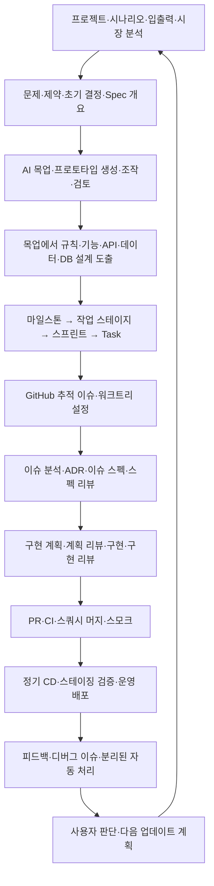
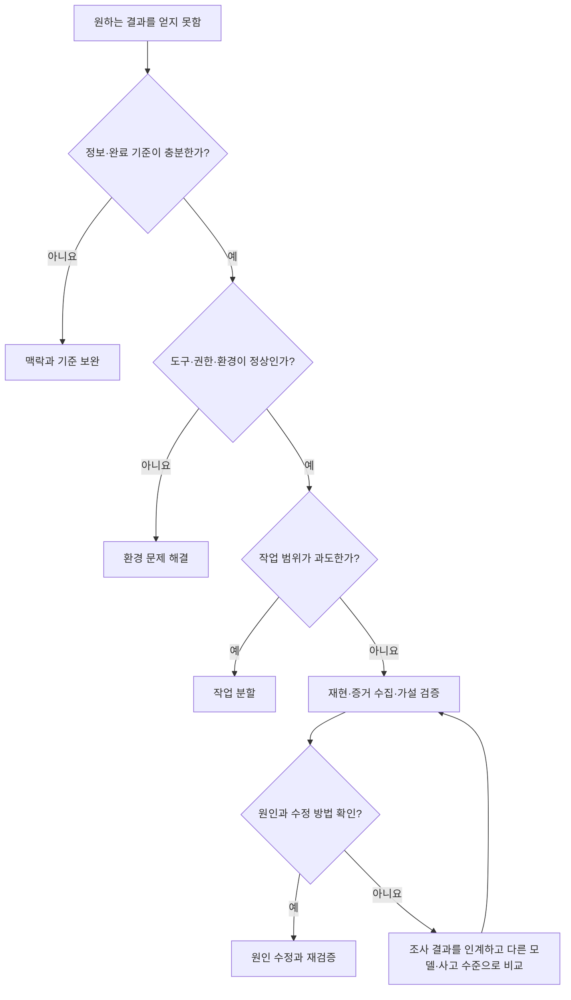

# AI 활용 개발 운영 체계

상태: 범용화 초안 · 2026-09-22

## 수준별 적용과 사례

[필요한 만큼만 엄격한 프로세스](adaptive-process.md)에서 절차 선택, 목업과 기술 실험, 사용자 흐름 단위 작업, 검토 근거 재사용, 위험 기반 배정, 전달까지의 측정을 적용합니다. [ApplyFlow 서비스 사례](../course/case-study.md)에서 같은 원칙이 실제 요구와 작업으로 바뀌는 과정을 따라갈 수 있습니다.

## 중심 원칙

사람은 문제, 우선순위와 완료 기준을 결정합니다. AI는 맥락을 조사하고 설계·구현·검증을 수행합니다. 결과는 실행 증거와 사용자 흐름으로 판단하고, 다음 작업에 필요한 맥락을 문서로 남깁니다.

규칙은 행동의 경계, 맥락은 판단의 재료, 스킬은 수행 절차, 도구는 실행 수단, 기록은 재현과 인계의 기반입니다. 모델을 바꿔도 이 다섯 요소를 이어갈 수 있어야 합니다.

프로젝트마다 [수준별 완성 기준](project-completion-levels.md)을 먼저 정합니다. 사용 범위·목표 단계·실제 위험에 맞춰 검증 깊이와 예산을 선택합니다. 개인용 저위험 도구에 PR·CI·독립 리뷰·운영 인프라를 일괄 요구하지 않습니다.

## 사용자 기본 체계

사용자께서 직접 정리한 [프로젝트 구성·개발·운영 기준](project-operating-standard.md)을 기준 문서로 사용합니다. 18단계의 분석·문서화·시안 산출·작업 분해·이슈 등록·워크트리·개발·정기 배포·자동 피드백 루프와 각 단계의 이유를 담았습니다. 아래는 그 체계를 요약한 지도이며, 이전에 스킬에서 추정한 계층을 대체합니다.

전체 운영형의 스펙·계획·구현 리뷰는 각각 블로커가 없어질 때까지 수렴합니다. 개인용·PoC·MVP는 기본 체계의 판단을 유지하면서 문서와 실행 절차를 목적에 맞게 축약합니다. 전체 운영형과 축약형의 적용 표는 기준 문서에 있습니다.

사용자께서 강조한 변화는 **AI 목업·프로토타입에서 상세 설계를 도출하는 역피라미드 방식**입니다. 앞단 문서는 방향과 제약을 정하고, 시안으로 사용 경험을 합의한 뒤 내부 구조를 구체화합니다. DB 설계를 끝내야 시안을 시작할 수 있다는 의미가 아닙니다.

## 단계별 산출물과 판단

| 단계 | AI에게 제공할 입력 | 남길 산출물 | 다음 단계로 넘어가는 기준 |
|---|---|---|---|
| 정의 | 사용자, 문제, 제약 | 프로젝트 계약 | 핵심 흐름과 성공·실패 조건을 설명할 수 있습니다. |
| 조사·설계 | 기존 코드, 문서, 실행 상태 | 문제·제약·초기 결정과 미확인 가정 | 중요한 가정과 변경 범위가 드러나 있습니다. |
| 시안 | 개요·가이드라인·ADR·Spec | 핵심 화면·상태·흐름, 선택한 시안 | 요구와 일치하고 작업 분해에 필요한 결정이 정리됩니다. |
| 상세 설계 | 검토한 시안·업무 규칙·기술 제약 | 상태·권한·API·데이터·DB, 갱신한 Spec·ADR | 사용자 경험과 내부 동작을 연결할 수 있습니다. |
| 계획 | 합의한 설계·시안 | 작업 목록, 검증 방법, 세션 목표 | 각 작업의 결과를 관찰할 수 있습니다. |
| 환경·모델 선택 | 작업 난이도, 도구, 비용 조건 | 선택 기록과 대안 | 접근 가능하고 필요한 도구를 실제 사용할 수 있습니다. |
| 구현 | 명확한 작업과 제한 범위 | 코드·설정·작업 결과 | 검토 가능한 변경 단위가 만들어집니다. |
| 검증·리뷰 | 변경 결과와 완료 기준 | 테스트·수동 검증·리뷰 기록 | 차단 문제가 해결되고 필수 조건이 충족됩니다. |
| 전달 | 검증된 변경 | 실행 가능한 패키지 또는 배포 주소 | 전달된 환경에서 핵심 흐름이 동작합니다. |
| 인계 | 실제 최종 상태 | 사용법, 제한사항, 다음 작업 | 다른 사람 또는 새 AI 세션이 이어갈 수 있습니다. |

## 작업 단위

프로젝트 → 마일스톤 → 작업 스테이지 → 스프린트 → Task 순서로 분해합니다. 각 계층에 기대 산출물 또는 목표를 두고 GitHub 이슈로 연결하는 것이 사용자 기본 규칙입니다. AI 세션은 이 작업을 실행하는 맥락, 워크트리는 격리 공간, PR은 검토·통합 단위입니다. 어느 것도 스프린트와 동일시하지 않습니다.

4주 수업의 주차는 시간표입니다. 반드시 마일스톤·스프린트 하나와 일대일이어야 하는 것은 아닙니다. 작은 프로젝트에서는 계층을 짧은 계획 안에 함께 표현하고, 협업·운영 필요가 있을 때 별도 추적 이슈와 자동화를 확장합니다.

## 스킬 지도

아래 스킬은 로컬 원문을 확인했습니다. 설치·문서 확인과 실제 사용 빈도는 구분합니다. 원문 위치는 로컬 출처이며 수강생에게 같은 경로를 요구하지 않습니다.

| 스킬 | 적용 시점 | 배우는 핵심 |
|---|---|---|
| brainstorming | 구현 전 | 질문, 대안 비교, 설계 결정 |
| writing-plans | 설계 이후 | 작업별 변경 대상과 검증 방법 |
| session-driven-delivery | 큰 작업 분할 | 실행 세션, PR, 이슈, 인계의 역할 |
| using-git-worktrees | 작업 격리가 필요할 때 | 독립 작업 공간과 시작 상태 확인 |
| karpathy-guidelines | 구현·수정 | 가정 공개, 최소 변경, 검증 가능한 목표 |
| systematic-debugging | 실패·오류 발생 시 | 재현 → 증거 → 가설 → 원인 수정 |
| requesting-code-review | 위험·사용 범위상 독립 검토가 필요한 변경 이후 | 요구사항과 실제 변경에 대한 독립 검토 |
| verification-before-completion | 완료 보고 전 | 최신 증거와 주장 범위 일치 |

출처: 작성 당시 확인한 로컬 스킬 원문. 사용자 운영 규칙의 기준은 연결된 18단계 문서입니다. 스킬 전체를 모든 과제에 의무 적용하지 않습니다. 작은 수정은 간단한 기록과 비례한 검증으로 처리하고, 데이터·권한 등 중요한 경계에는 필요한 검증을 추가합니다.

## 검증과 리뷰 종료

아래는 선택한 수준에서 필요한 검토의 종료 원칙입니다. 독립 리뷰 자체는 모든 프로젝트의 공통 의무가 아닙니다. 필수 기준을 통과한 뒤 새 근거 없이 전체 리뷰를 반복하지 않습니다. 예산이 소진되면 선택 작업을 중단하고 필수 미달 여부를 명시합니다.

사용자가 명시한 규칙은 스펙·계획·구현 각각의 리뷰에서 블로커를 해결하고 수렴하는 방식입니다. 차단 여부는 프로젝트 수준과 수용 조건에 근거합니다. 도구의 Critical/Important 등급은 그 기준에 대응시킨 뒤 사용합니다.

1. 합의한 완료 기준과 변경 결과를 비교합니다.
2. 필수 기능 실패, 데이터 손상, 노출 문제 등 차단 항목을 수정합니다.
3. 수정 부분을 다시 검증하고, 최종 변경 전체를 한 번 확인합니다.
4. 비차단 개선은 후속 목록에 남깁니다. 필수 기준은 후속으로 미루지 않습니다.
5. 리뷰 통과, CI 성공, 배포 성공, 실제 사용자 흐름 통과를 별도 상태로 기록합니다.

AI 리뷰는 누락을 찾는 보조 수단입니다. 다른 모델을 썼다는 사실만으로 독립성이 보장되지는 않습니다. 요구사항과 원본 변경을 제공하고 작성자의 결론을 그대로 따라가지 않게 한 뒤, 결과를 실행 증거로 확인합니다.

## 실패 시 의사결정

이 순서는 교육용 판단 틀입니다. 모델 변경 전에 입력·환경·범위를 확인하여 같은 실패를 반복하는 비용을 줄이는 데 목적이 있습니다.
